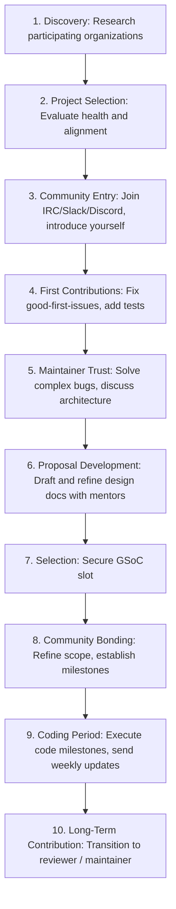

# Google Summer of Code Playbook

This playbook establishes the strategic roadmap, selection mechanics, and communication frameworks for successfully applying to, delivering, and leveraging the Google Summer of Code (GSoC) program within Govind-OS.

Selection is only the entry gate. The ultimate objective is to develop deep systems engineering expertise, build durable relationships with top open-source maintainers, and establish global technical credibility.

---

## Purpose

The purpose of Google Summer of Code is to accelerate engineering growth through meaningful open-source contributions while building long-term relationships within technical communities.

- **Selection is valuable.**
- **The skills, public contributions, mentor relationships, and professional reputation built through the process are significantly more valuable.**

---

## What GSoC Actually Is

GSoC is not an academic coding contest.

*   **A Trust-Based Mentorship Program:** Organizations select contributors they believe can understand complex systems, deliver milestones consistently, communicate professionally, learn independently, and work effectively within an existing community.
*   **The Proposal is Only a Contract:** The proposal is a document outlining the work, but demonstrated capability in the repository is what secures the slot.
*   *Mentors choose developers they trust to deliver software, not authors of polished documents who cannot compile the code.*

---

## Core Philosophy

→ See [core/ENGINEERING_PRINCIPLES.md](file:///c:/Users/govin/OneDrive/Documents/opensrc/govind-os/core/ENGINEERING_PRINCIPLES.md) for universal principles.

*   **Optimize for contribution quality:** One thorough, well-tested bug fix is worth more than ten minor typo corrections.
*   **Optimize for long-term participation:** Enter a project intending to remain active long after the official GSoC period ends.
*   **Prefer consistency over intensity:** Maintain a steady contribution cadence rather than bursts followed by silence.

---

## Understanding How Selection Really Works

Many students believe:
```
Proposal -> Selection
```

Reality is closer to:
```
Community Involvement + Contribution History + Mentor Confidence + Proposal Quality + Technical Capability = Selection
```

*   **Pre-Selection Certainty:** By proposal submission time, mentors should already know who you are. If you submit a proposal without having had any prior interactions or contributions in the project channels, your probability of selection drops close to zero.
*   *Selection is won in the community channels and repository commit logs before the final application deadline.*

---

## GSoC vs. LFX

Understanding the differences between the two premier open-source mentorship programs allows you to adapt your strategy:

| Metric | LFX Mentorship | Google Summer of Code |
| :--- | :--- | :--- |
| **Focus** | Highly contribution-heavy. Selection is often decided by raw merged code volume and early PRs. | Proposal-heavy. Requires a structured project timeline, deliverables definition, and community bonding period. |
| **Ecosystem** | Strictly CNCF / Linux Foundation systems (Kubernetes, containerd, Harbor). | Broad range of open-source organizations (Python, Apache, GNOME, CNCF, etc.). |
| **Structure** | Mentor-driven, lightweight milestones, flexible scheduling. | Formal midterm and final evaluations, structured coding periods, community bonding phases. |
| **Key Selector** | Maintainer trust established via merged code. | Technical depth of the proposal paired with contribution history. |

---

## The GSoC Funnel

GSoC success follows a structured pipeline:



---

## Organization Selection Framework

Do not choose organizations based solely on brand prestige. Use this framework to select targets that maximize your probability of success and technical growth:

*   **Mentor Quality:** Are the prospective mentors active core maintainers? Look at their recent commits and responsiveness on PRs.
*   **Organization Health:** Is the project active or is it decaying? Check issue closure rates and PR merge velocity.
*   **Technical Depth:** Does the codebase require deep engineering (e.g., compilers, database engines, OS modules) or is it a basic CRUD application?
*   **Mentorship History:** Has the organization participated in GSoC before? Do they have a track record of converting GSoC students into long-term maintainers?
*   *Preference: High Learning Potential × High Contribution Opportunity.*

---

## Community Integration

Open source is a collaborative culture. Integrate yourself smoothly:

*   **Observe First:** Join the communication channels (Discord, Slack, IRC, mailing lists). Spend a week observing how developers talk, how PRs are reviewed, and what topics dominate community meetings.
*   **Contribute Second:** Help with documentation updates, build fixes, or lint issues.
*   **Propose Third:** Never begin your interaction by suggesting a massive refactor or a replacement of a core system component. This signals arrogance and a lack of respect for the project's history.

---

## Contribution Strategy

Structure your contributions to build credibility systematically:

### Phase 1: Context Gathering (Weeks 1-2)
*   Fix documentation typos, add missing unit test coverage, and fix minor setup issues. This familiarizes you with the build system and PR review process.

### Phase 2: Feature & Bug Fixes (Weeks 3-6)
*   Address open bugs labeled `help wanted` or `good first issue`. Engage in the issue thread, present your planned fix, and ask to be assigned.

### Phase 3: Proposal Refinement (Weeks 7-8)
*   Once you understand the codebase, work with the mentors to refine your project proposal. Make contributions directly related to the modules you plan to modify during the summer.

---

## Organization Risk Assessment

Not all organizations provide equal learning opportunities.

Evaluate:

### Mentor Bus Factor
- Is there only one mentor?
- What happens if that mentor becomes unavailable?

### Review Latency
- How quickly are pull requests reviewed?
- How quickly are contributor questions answered?

### Project Stability
- Is the roadmap clear?
- Is the project actively maintained?

### Scope Risk
- Is the project realistically achievable during GSoC?
- Are dependencies outside your control?

Prefer projects with manageable technical risk and active mentorship.

This complements your existing Project Health section.

---

## Project Health Assessment

Before committing 100+ hours of preparation to an organization, verify its health:

### Activity Metrics
*   Are pull requests merged within a reasonable timeframe (3-7 days)?
*   Are core maintainers responsive to comments on issues and PRs?
*   Is the project roadmap active and updated?

### Mentorship History
*   Are previous GSoC students still active in the community? (A high retention rate indicates a welcoming and educational community).
*   Do mentors engage with student questions in public channels?

*Avoid inactive, unresponsive organizations. If maintainers are too busy to review PRs in March, they will not have time to mentor you in July.*

---

## Proposal Writing Framework

Your GSoC proposal is a technical design document. It must prove to the organization that you have a clear, feasible plan to deliver the project.

### Core Structure of a GSoC Proposal
1.  **Abstract:** A concise summary of the problem, the proposed solution, and its impact on the project.
2.  **The Problem:** Detailed analysis of the current limitation or bug. Why does this matter to the project's users?
3.  **Technical Design:** Explain *how* you will solve it. Include class diagrams, package layouts, database schema adjustments, and mock API signatures.
4.  **Week-by-Week Timeline:** Break the coding period down into weekly milestones. Be specific about what will be coded, what tests will be written, and what documentation will be delivered.
5.  **Testing Plan:** Detail how you will verify correctness (unit tests, integration tests, fuzzing, or manual validation benchmarks).
6.  **Risk Mitigation:** What technical dependencies could block you? (e.g., upstream API changes). How will you pivot if you get blocked?

*Avoid generic statements of enthusiasm (e.g., "I love this project"). Focus entirely on concrete engineering execution plans.*

---

## Mentor Interaction Framework

Refer to MAINTAINER_INTERACTION.md for communication guidelines.

*   **Respect Mentor Time:** Keep messages clear, concise, and structured.
*   **Ask Informed Questions:** Prove you have researched the codebase before asking for assistance.
*   **Incorporate Feedback Immediately:** If a mentor suggests a change to your PR or proposal, apply it immediately. Showing responsiveness builds massive confidence.

---

## Technical Preparation

Before the selection period ends, you must master the project's local execution environment:

*   **Build System:** You should be able to compile the project, run all tests, and execute linters locally without errors.
*   **Architecture Flow:** You should be able to explain the core data flows, component boundaries, and execution paths of the codebase, not just how to modify individual lines of code.

---

## Community Bonding Period

The Community Bonding Period is often underestimated by students, who treat it as a vacation before coding starts. **Treat this as the Project Planning Phase.**

*   **Refine the Project Scope:** Discuss the proposal with your mentors. Clarify any ambiguous requirements and adjust the milestones based on recent repository changes.
*   **Establish Communication Cadence:** Set up weekly sync calls or agree on written status report schedules.
*   **Set Up the Development Board:** Create a shared project board (GitHub Projects) to track issues, milestones, and blockers.

---

## Coding Period Strategy

During the coding phases, consistency is your primary metric of success.

*   **Ship Incrementally:** Never write code in isolation for three weeks and submit a massive PR at the end. Submit small, functional PRs regularly (e.g., weekly).
*   **Send Weekly Progress Reports:** Summarize your work:
    *   *Completed:* Milestones delivered this week.
    *   *Next Steps:* Priorities for the coming week.
    *   *Blockers/Risks:* Technical issues that require mentor input.
*   **Never Disappear:** If you are sick, have exams, or get stuck, notify your mentors immediately. Maintainers tolerate technical challenges; they do not tolerate silence or surprises.

---

## Evaluations

GSoC includes formal Midterm and Final evaluations.

*   **No Surprises:** Evaluations should never contain unexpected feedback. If you are communicating weekly and shipping code incrementally, your mentors already know exactly how you are performing.
*   **Focus on Passing Criteria:** Ensure that by evaluation time, your scheduled milestones are merged, documented, and fully covered by automated tests.

---

## Trust Signals

Mentors select and pass contributors based on the implicit signals their actions emit.

### Strong Trust Signals (Green Flags)
*   **Consistent Contributions:** The applicant regularly merges bug fixes and test cases over months.
*   **Thoughtful Proposal Revisions:** Receptive to mentor feedback on design documents, updating proposals rapidly.
*   **Reliable Communication:** Proactive updates on Slack/IRC; immediate notifications when blocked.
*   **Deep Project Understanding:** Design documents reflect a clear understanding of the codebase structure and execution flows.
*   **Helpful Community Participation:** Answering setup questions for other new contributors in public channels.

### Weak Trust Signals (Red Flags)
*   **Last-Minute Activity Spikes:** Disappearing for weeks and then scrambling to submit multiple PRs right before the application deadline.
*   **Generic Proposals:** Copy-pasting template proposals or generating them using AI without project-specific context.
*   **Superficial Contributions:** Submitting minor formatting or doc tweaks solely to inflate commit metrics.
*   **Poor Follow-Through:** Requesting assignment on an issue and then failing to submit code or respond to threads.
*   **Proposal-First Participation:** Applying to a project without having merged a single PR or interacted in community channels.

---

## Building Long-Term Leverage

The highest value of the GSoC program occurs after the official program ends:

*   **Maintain Your Code:** Continue fixing bugs that arise in your merged features and review PRs submitted by other developers.
*   **Participate in Reviews:** Help review incoming PRs. This offloads work from maintainers and builds your reputation as a trusted reviewer.
*   **Progress Up the Ladder:** Transition from contributor to trusted contributor, reviewer, and eventually maintainer.

*The goal is to convert a summer GSoC slot into a permanent role in the project's governance.*

---

## Common Failure Modes

Avoid these frequent GSoC mistakes:

*   **Prestige Chasing:** Applying to a project solely because of its brand name (e.g., TensorFlow) despite lacking interest or baseline skills in its domain.
*   **Proposal without Code:** Submitting a detailed proposal but having zero merged code or contributions in the repository.
*   **Scope Overestimation:** Attempting to build a massive, complex feature over the summer, leading to incomplete code, missed evaluations, and unmerged PRs.
*   **Ignoring Mentor Feedback:** Persisting with your original design ideas despite mentors requesting alignment with project patterns.
*   **Disappearing During the Coding Period:** Going silent when blocked, leading to missed milestones and failed evaluations.

---

## Rejection Framework

GSoC is highly competitive. Rejection must be treated as operational feedback.

*   **Perform a Post-Mortem:**
    *   Did I start contributing too late?
    *   Was my proposal lacking technical details or feasibility proofs?
    *   Did I select an inactive or highly competitive organization without adequate preparation?
*   **Keep Contributing:** If you enjoyed the project, continue contributing. Maintainers notice developers who stay active after being rejected, which drastically increases selection probability for the next cycle.
*   **Refine and Re-apply:** Use the lessons to select the next project, start earlier, and refine your proposal execution.

---

## GSoC Success Checklist

Use this checklist to track your GSoC trajectory:

### Before Applying
- [ ] Researched active organizations matching career goals.
- [ ] Joined community channels (Slack/Discord/IRC) and observed developers.
- [ ] Merged at least 2-3 initial bug fixes, test cases, or doc updates.
- [ ] Discussed project proposal design with mentors.
- [ ] Submitted a technically detailed proposal containing timelines and testing plans.

### Community Bonding
- [ ] Finalized project scope and weekly milestones with mentors.
- [ ] Set up a shared project board (GitHub Projects) to track issues.
- [ ] Agreed on weekly status report formats and sync meetings.

### Coding Period
- [ ] Submitted incremental, functional PRs regularly.
- [ ] Sent weekly progress reports detailing completions, next steps, and blockers.
- [ ] Wrote comprehensive unit/integration tests for all new code.
- [ ] Documented all new APIs, modules, and configurations.

### After GSoC
- [ ] Continued maintaining merged features and reviewing community PRs.
- [ ] Documented lessons learned and added project to portfolio.
- [ ] Maintained active contact with mentors for future opportunities.

---

## Continuous Improvement

*   **Audit Your Application Loops:** Review past applications. Identify where you dropped out of the funnel (e.g., proposal rejected, selected but failed to deliver) and adjust this handbook.
*   **Monitor Community Evolution:** Keep track of open-source project roadmaps to anticipate upcoming GSoC project requirements.
*   **Codify New Playbook Rules:** As you complete GSoC cycles, update this playbook to capture new lessons in developer relations.
