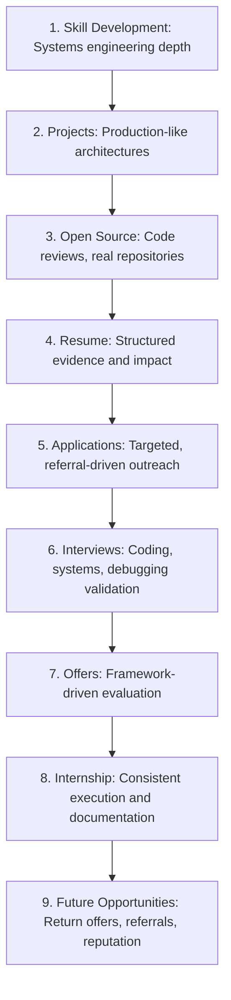
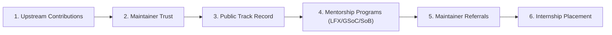
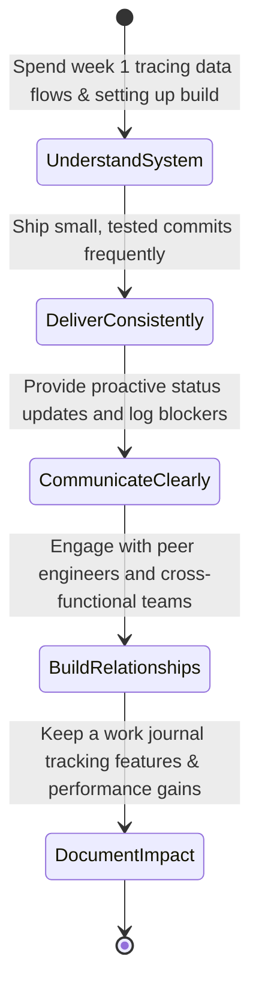
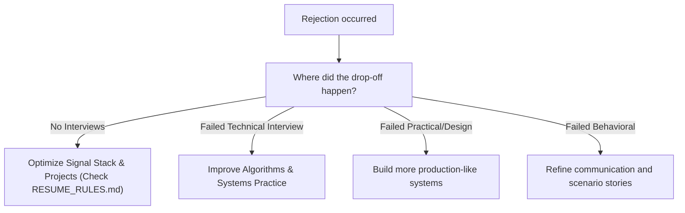

# Internship Playbook

This playbook establishes the strategic roadmap, preparation framework, selection mechanics, and execution protocols for securing high-impact systems and software engineering internships within Govind-OS.

Securing a premium role is not a lottery of mass applications. It is an engineering challenge of building a reputation, proving capability, and becoming hard to ignore.

---

## Purpose

The purpose of internships is not merely to obtain a temporary role.

The purpose is to:
*   **Accelerate engineering growth:** Gain hands-on exposure to massive production systems, telemetry stacks, and development practices.
*   **Build professional credibility:** Demonstrate that you can ship code within a real software team environment.
*   **Develop industry relationships:** Establish strong working connections with mentors, staff engineers, and managers.
*   **Gain exposure to production systems:** Understand scaling problems, database replication, and deployment systems first-hand.
*   **Create future career opportunities:** Pivot temporary roles into permanent, full-time engineering careers.

*The internship is a milestone. The long-term career trajectory matters more.*

---

## What Internships Actually Are

Companies are not hiring interns primarily for their existing knowledge. An internship is a prediction problem. 

Managers are evaluating your signal across:
*   **Learning Ability:** How fast can you absorb context, read docs, and become productive in a foreign codebase?
*   **Problem-Solving Ability:** Do you analyze issues systematically, or do you guess and pray?
*   **Communication:** Can you explain technical trade-offs, document design decisions, and summarize blockers?
*   **Execution & Drive:** Do you deliver consistently, showing proactive ownership of your tasks?
*   **Growth Potential:** Can you adapt to constructive code reviews and grow into a senior engineer over time?

*The ultimate question managers ask is: "Can we trust this person to become a strong, independent engineer on our team?"*

---

## Core Philosophy

→ See [core/ENGINEERING_PRINCIPLES.md](file:///c:/Users/govin/OneDrive/Documents/opensrc/govind-os/core/ENGINEERING_PRINCIPLES.md) for universal principles.

*   **Prefer capability over credentials:** Focus on demonstrating deep systems understanding rather than listing brand name certificates.
*   **Prefer real systems over toy projects:** Build software that handles real network traffic, uses persistent databases, and handles concurrency.
*   **Prefer compounding career assets over isolated achievements:** Build public assets (like Govind-OS, core libraries, community visibility) that continue to work for you over years.

---

## Internship Funnel

Most students focus exclusively on mass-submitting applications. In reality, the earlier stages are the highest-leverage components of the funnel:

---

## Internship Readiness Scorecard

Evaluate your readiness across five critical dimensions on a scale of 1 to 10:

### Technical Skills
- **Algorithms:** Proficient with core patterns (graphs, trees, sliding window, binary search).
- **Backend Engineering:** Experience building robust, concurrent services with clean APIs.
- **Databases:** Solid understanding of transactions, index design, and query planning.
- **Systems Fundamentals:** Familiarity with process models, memory management, and TCP/IP networking.

### Portfolio
- **Project Quality:** Complex personal backend systems rather than simple tutorial clones.
- **Technical Depth:** Real engineering problems solved (concurrency, caching, custom protocols).
- **Documentation:** Clear architecture designs, installation instructions, and API references.

### Open Source
- **Contributions:** History of merging clean, well-tested code in established repositories.
- **Review Experience:** Participating in reviewing PRs from other community developers.
- **Maintainer Relationships:** Trusted reputation and direct communication channels with maintainers.

### Interview Readiness
- **Technical Interviews:** Prepared to solve DSA, practical debugging, and system design challenges live.
- **Behavioral Interviews:** Structured stories written down demonstrating ownership and collaboration.
- **Communication:** Ability to explain technical choices, design trade-offs, and errors clearly.

### Professional Presence
- **Resume:** Metric-driven spec sheet emphasizing evidence, technical details, and impact.
- **GitHub:** Clean, organized profile showing active contribution graphs and pinned systems projects.
- **LinkedIn:** Updated, professional bio linking directly to your portfolio and resume assets.

**Total Score: /50**

#### Score Interpretation:
*   **45-50:** Highly Competitive — Ready for top-tier systems and cloud-native infrastructure roles.
*   **40-44:** Strong Candidate — Positioned well for competitive software development roles.
*   **35-39:** Developing — Focus on addressing targeted gaps in your signal stack or portfolio.
*   **<35:** Focus On Foundations — Prioritize building projects and gaining raw systems coding experience.

---

## Building Internship Readiness

Before entering the application pool, evaluate your readiness objectively:

*   **Can I build software independently?** You should be able to design, implement, and run a multi-component backend service from scratch.
*   **Can I read existing codebases?** You must be comfortable clone-searching through 10,000+ line codebases to understand execution paths.
*   **Can I debug unfamiliar systems?** When code fails, can you trace stack traces, read system logs, and identify bottlenecks systematically?
*   **Can I learn new tools quickly?** You must be able to adapt to new database wrappers, testing frameworks, and tooling pipelines using official documentation.
*   **Can I communicate technical decisions?** You should be able to explain *why* you chose a design pattern or database schema over its alternatives.

---

## The Internship Signal Stack

Recruiters and hiring managers process thousands of applications. Signals are ranked in tiers based on their credibility and technical depth:

| Tier | Signal Type | Examples | Evaluation Impact |
| :--- | :--- | :--- | :--- |
| **Tier 1 (Highest)** | Public Systems Code & Trust | Upstream CNCF contributions, Merged Bitcoin Core PRs, LFX/GSoC/SoB mentorships | Directly proves ability to ship production-grade code within established teams. |
| **Tier 2** | Professional Validation & Writing | Previous engineering internships, in-depth technical blogs, community meetup talks | Demonstrates work experience, technical communication skills, and leadership. |
| **Tier 3** | Baseline Projects & Knowledge | Complex personal projects (non-clones), course completions, database benchmarks | Proves fundamental systems understanding, but lacks external review validation. |
| **Tier 4 (Lowest)** | Passive Credentials | Generic online certificates, bootcamps, resume buzzword listings | Very low impact. Often ignored by high-performance systems engineering teams. |

---

## Resume Strategy

Your resume is not an autobiography; it is an engineering spec sheet (cross-reference with RESUME_RULES.md).

*   **Focus on Evidence:** Do not state *"Expert in Go."* Instead, show: *"Implemented a concurrent TCP proxy in Go handling 5,000 rps."*
*   **Emphasize Impact:** Use the STAR methodology (Situation, Task, Action, Result) to document what changed, how you did it, and the measured outcome.
*   **Expose Technical Depth:** Mention database engines, concurrency primitives, caching strategies, and networking layers.

---

## Open Source as a Differentiator

Open source contribution is the ultimate career hack because it bypasses traditional gates:

*   **Code Review Experience:** Proves you can respond to critiques from senior maintainers without getting defensive.
*   **Collaboration:** Demonstrates you can work asynchronously across timezones on shared software assets.
*   **Communication:** Your issue comments, RFC discussions, and pull request write-ups show clear technical writing.
*   **Production Contributions:** Merging code in established projects proves you respect testing and style conventions.
*   **Long-Term Commitment:** Commits over months reveal reliability and consistency.

> [!TIP]
> Prioritize contributions to **CNCF (Kubernetes, containerd, Harbor)**, **Linux Foundation**, **Bitcoin Ecosystem**, or other large, active infrastructure projects.

---

## Open Source To Internship Pipeline

Because systems engineering roles are highly competitive, this pipeline is your primary path to high-impact opportunities:

This pipeline bypasses generic resume filters. Proving capability in public repositories like Harbor or Bitcoin Dev Kit directly exposes your talent to active industry maintainers who can offer referrals or direct contract roles.

---

## Project Strategy

Avoid building generic tutorial clones (e.g., todo lists, basic chat apps). Focus on systems engineering:

*   **Production-Like Systems:** Build architectures that deal with realistic distributed concerns (e.g., rate limiters, storage engines, custom P2P clients).
*   **Infrastructure Depth:** Integrate telemetry (tracing, metrics), automated build pipelines, and containerization (Docker, systemd).
*   **Database Mechanics:** Show understanding of index types, query execution paths, and transactions (cross-reference with POSTGRESQL.md).
*   **Concurrency & Networking:** Build projects using raw TCP/UDP sockets, worker pools, or event loops.

---

## Networking Strategy

Networking is relationship building, not transaction collection (cross-reference with NETWORKING.md):

*   **Value-First Contact:** When reaching out to engineers, ask specific, technical questions about their team's systems or their open-source contributions. Never start with *"Are you hiring?"*
*   **Public Work:** Share your learnings, project updates, and open-source milestones publicly (GitHub, technical blogs, X/LinkedIn). Make it easy for people to find your work.
*   **Maintain Connections:** Send periodic updates to your professional network when you hit major engineering milestones.

---

## Application Strategy

Do not mass-apply to 500 companies blindly. Optimize for high yield:

*   **Targeted Outreach:** Select 15–20 high-growth systems or infrastructure engineering companies that align with your stack.
*   **Referral First:** Identify mutual connections or maintainers within target firms who can vouch for your open-source work.
*   **Track Everything:** Maintain a tracker containing Company, Role, Date, Status (Applied, Interviewing, Rejected, Offered), Contact Person, and Follow-up Date.

---

## Interview Preparation Strategy

Prepare for interviews in three distinct dimensions:

### 1. Technical (Data Structures, Algorithms, & Systems)
*   **Algorithms:** Focus on core patterns (e.g., sliding window, graphs, binary search) using structured practicing.
*   **System Design:** Understand load balancing, caching tiers, message queues, and database scaling (cross-reference with SYSTEM_DESIGN.md).
*   **Networking & OS:** Understand TCP/UDP, HTTP protocols, process/thread models, memory management, and file systems.

### 2. Practical Engineering
*   **Debugging:** Be ready to step through failing code, identify performance bottlenecks, or explain race conditions.
*   **Code Reviewing:** Show that you can evaluate code quality and correctness (cross-reference with REVIEW_GUIDELINES.md).
*   **Trade-Offs:** Always explain the trade-offs of your implementation (memory vs. time complexity, SQL vs. NoSQL, consistency vs. availability).

### 3. Behavioral & Communication
*   **Ownership:** Prepare stories demonstrating how you resolved a technical blocker or took charge of a failing milestone.
*   **Conflict Resolution:** Explain how you constructively resolved design disagreements with mentors or peers.
*   **Learning Ability:** Highlight your transition from zero context to merging PRs in complex repositories.

---

## Offer Evaluation Framework

Do not choose internships based on stipend alone. Evaluate the environment:

*   **Learning Potential:** Will you be working on deep engineering problems (databases, operating systems, compilers) or simple CRUD tasks?
*   **Mentorship Quality:** Will you have access to experienced staff/principal engineers who actively review code and guide developers?
*   **Engineering Culture:** Does the team value automated testing, design docs, code cleanliness, and open communication?
*   **Growth Path:** Does the organization have a history of converting interns into full-time roles or sponsoring independent research?

---

## Internship Execution Framework

Once you secure a role, execute systematically to maximize your impact:

*Goal: Secure a return offer, strong professional references, and concrete systems design experience.*

---

## Converting Internships Into Future Opportunities

The end of the official internship term is the beginning of the next phase:

*   **Maintain Relationships:** Add coworkers on professional networks and schedule final 1-on-1 chats to ask for career feedback.
*   **Stay Involved:** If the project is open-source, continue reviewing PRs or fixing issues in your spare time.
*   **Document Achievements:** Add the completed features, performance optimizations, and technologies used directly to your portfolio and resume.
*   **Request Feedback:** Ask your manager and mentor for a structured review of your technical execution and communication.

---

## Common Failure Modes

*   **Resume Padding:** Listing technologies or systems you cannot explain in-depth.
*   **Weak Projects:** Relying on simple database clones or basic web tutorial templates.
*   **No Open Source Involvement:** Missing the ultimate proof-of-work signal that upstream reviews provide.
*   **Mass Applications without Preparation:** Submitting hundreds of resumes before mastering coding fundamentals or system design.
*   **Ignoring Networking:** Assuming applications are processed solely by automated resume parses.
*   **Chasing Brand Over Learning:** Choosing a prestige brand name over a role that offers deep systems engineering growth.
*   **Poor Communication:** Silent execution, lack of updates, or defensiveness in reviews.

---

## Rejection Framework

Rejection is merely a diagnostic signal indicating a bottleneck in your funnel:

---

## Internship Success Checklist

### Before Applying
- [ ] Resume formatted cleanly and reviewed for metric-driven evidence.
- [ ] Signal Stack prioritized (open source contributions prominently visible).
- [ ] At least 1 detailed, production-like backend project documented.
- [ ] Consistent practice for technical and system design interviews.
- [ ] Targeted companies mapped and tracker set up.

### During Interviewing
- [ ] In-depth research completed on target company's stack and engineering challenges.
- [ ] Technical questions prepared for the interviewer.
- [ ] Prepared to explain all design decisions in portfolio projects.
- [ ] 3-4 structured behavioral stories written down.

### During the Internship
- [ ] Weekly syncs scheduled with mentors/managers.
- [ ] Concrete deliverables shipped incrementally (weekly).
- [ ] Log of features, performance improvements, and bugs fixed maintained.
- [ ] Feedback requested and implemented.

---

## Continuous Improvement

*   **Audit Your Loop:** After each recruiting season, identify bottlenecks in your application funnel and refine your playbooks.
*   **Track Industry Trends:** Observe which engineering areas (e.g., eBPF, consensus engines, telemetry layers) are scaling, and direct your project building there.
*   **Refactor Your Systems:** Update this playbook continuously as you secure internships, receive reviews, and identify new career leverage points.
