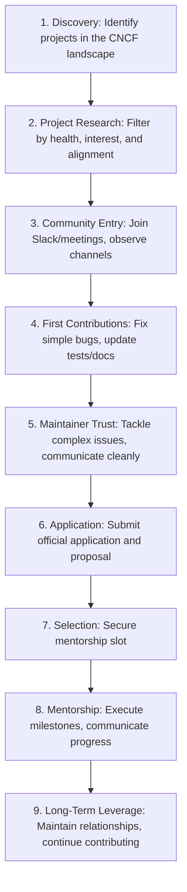

# LFX Mentorship Playbook

This playbook establishes the strategic roadmap, selection mechanics, and communication frameworks for successfully applying to, participating in, and leveraging the LFX (Linux Foundation) Mentorship Program within Govind-OS. It is written to serve as a repeatable execution playbook for any prestigious open-source mentorship program (including GSoC, Outreachy, and Summer of Bitcoin).

Selection is only the entry gate. The ultimate objective is to develop deep systems engineering expertise, build durable relationships with top CNCF maintainers, and establish global technical credibility.

---

## Purpose

The purpose of LFX Mentorship is not merely to obtain a temporary paid slot.

- **The purpose is to accelerate technical capability, build high-trust relationships within core open-source communities, and create long-term career leverage.**
- **The mentorship selection is a milestone; the skills, reputation, public commit history, and professional network built through the process represent the true, compounding assets.**

---

## What LFX Actually Is

Many applicants view LFX as an academic coding contest or a typical application-selection cycle. This is a fundamental misunderstanding.

*   **A Trust Evaluation Process:** LFX is a contribution-based evaluation system. Mentors are not looking for the applicant with the highest GPA or the flashiest resume. They are selecting a future collaborator they can trust to:
    *   Learn complex codebases rapidly with minimal hand-holding.
    *   Communicate technical blocks clearly and proactively.
    *   Deliver high-quality code that follows project patterns.
    *   Work independently without requiring constant supervision.
    *   Respond maturely to constructive criticism.
*   *Technical skill is a baseline constraint; trust and reliability are the selection triggers.*

---

## Core Philosophy

→ See [core/ENGINEERING_PRINCIPLES.md](../core/ENGINEERING_PRINCIPLES.md) for universal principles.

*   **Optimize for contribution quality:** One thorough, well-tested bug fix is worth more than ten minor typo corrections.
*   **Optimize for long-term participation:** Enter a project intending to remain active long after the official mentorship period ends.
*   **Prefer consistency over intensity:** Maintain a steady contribution cadence (e.g., 1-2 clean PRs per week) rather than burst activity.

---

## Understanding How Selection Really Works

The most common applicant delusion is that selection is decided during the official review phase based on proposal document styling.

```
Common Belief:  Application Form -> Proposal -> Selection
Actual Reality: Contribution History + Community Presence + Mentor Confidence = Selection
```

*   **The Selection Pre-Agreement:** By the time applications close, mentors usually already know which 1 or 2 contributors they intend to select. These are the individuals who have already been active in the repository, engaged in design discussions, and successfully merged code.
*   *Selection is earned on the ground in the months before the application portal opens.*

---

## The LFX Funnel

Successful LFX selection follows a structured conversion funnel:



---

## Project Selection Framework

Do not apply to projects based on brand prestige or hype. Use a structured filter to choose projects where your time will yield maximum return.

*   **Core Filters (from PROJECT_SELECTION.md):**
    *   **Technical Depth:** Does the project involve real systems engineering (e.g., container runtimes, consensus databases, tracing layers) or is it a basic website?
    *   **Mentor Quality:** Are the mentors active maintainers with a track record of guiding contributors?
    *   **Community Health:** Is the project actively developed? Check issue closure rates and PR merge velocity.
    *   **Future Opportunities:** Does this project lead to deeper CNCF maintainer roles?

---

## Pre-Application Phase

This is the highest-leverage phase of the program. It begins **8 to 12 weeks before** the LFX application period opens.

*   **Goals:**
    *   Establish a local development environment and run the test suite successfully.
    *   Understand the system architecture and data flows.
    *   Get your first 2 to 3 pull requests merged (focusing on unit tests, documentation refactors, or small bug fixes).
    *   Build familiarity with the contribution workflow (CLA signs, commit templates, reviews).

---

## Community Integration

Open source is a public community. You must become a visible, helpful participant.

*   **Slack/Discord Presence:** Join the project channels. Read active threads to observe what maintainers are currently debugging or planning.
*   **Community Meetings:** Attend scheduled developer video calls. Listen to the roadmap discussions. If appropriate, ask clarifying questions in the chat.
*   **Observe First, Speak Second:** Understand the community tone and conventions before proposing structural changes.

---

## Contribution Strategy

Structure your contributions to build credibility systematically:

### Phase 1: Context Gathering (Weeks 1-2)
*   Fix errors in documentation, add missing test cases, and improve code coverage in core modules. These are low-friction PRs that help you learn the release pipeline.

### Phase 2: Core Debugging (Weeks 3-6)
*   Filter issues labeled `good first issue` or `help wanted`. Reach out in the issue thread, outline your proposed solution briefly, and ask to be assigned.

### Phase 3: Architectural Engagement (Weeks 7-8)
*   Identify minor design flaws or performance bottlenecks, write a short proposal thread, discuss it with the maintainers, and implement the solution.

---

## Trust Signals

Mentors evaluate applicants based on the implicit signals their actions emit.

### Strong Trust Signals (Green Flags)
*   **High-Quality PRs:** Commits are clean, linted, signed-off, and accompanied by robust test coverage.
*   **Consistent Participation:** The applicant shows up week after week, slowly increasing the complexity of their work.
*   **Receptive to Feedback:** Implement reviewer requests immediately without defensiveness.
*   **Reliable Communication:** Provide clear updates on active issues; notify the team if a task is delayed.
*   **Deep Project Understanding:** Design proposals show the applicant has read the source code, not just the documentation.

### Weak Trust Signals (Red Flags)
*   **Superficial PR Count Padding:** Submitting dozens of minor typo fixes or whitespace edits to inflate contribution metrics.
*   **Vague/Generic Questions:** Asking maintainers basic questions without researching first (e.g., *"How do I run this?"*).
*   **Last-Minute Activity Spikes:** Disappearing for weeks and then trying to merge three complex PRs the night before applications close.
*   **Proposal-First Participation:** Submitting a detailed proposal without ever having cloned the repository or merged a single line of code.

---

## Application Strategy

Your official LFX application should not read like a generic academic cover letter.

*   **Establish Capability:** Highlight your existing merged contributions to the repository as direct proof that you can handle the codebase.
*   **Demonstrate Alignment:** Explain how your technical background directly solves the mentorship project's goals.
*   **Prove Feasibility:** Show that you have allocated sufficient weekly hours (typically 20-40 hours depending on the term) and have no major academic conflicts.

---

## Proposal Writing Framework

A successful LFX proposal is an engineering design document, not an essay. It must answer the following questions:

1.  **The Problem:** What current limitation or feature request does the project target?
2.  **The Scope:** What boundaries define the project? What is explicitly out of scope?
3.  **The Solution:** What is your technical design? (Include diagrams, package layouts, or API signatures).
4.  **The Milestones:** Provide a week-by-week execution timeline detailing what will be built, tested, and documented.
5.  **Risks & Mitigations:** What technical blockers or dependency delays could occur, and how will you handle them?
6.  **Verification:** How will the mentors verify that the work is correct? (Detail testing plans).

*Avoid vague statements of enthusiasm. Focus entirely on concrete execution plans.*

---

## Mentor Interaction Framework

Refer to MAINTAINER_INTERACTION.md for communication guidelines:

*   **Ask Informed Questions:** Prove you have researched the codebase before asking for assistance.
*   **Provide Clean Status Reports:** When requesting a review, summarize your progress and direct the mentor to the exact modules to look at.
*   **Respect Review Latency:** Give mentors several days to review your proposal or commits. Avoid pinging them across multiple channels.

---

## Technical Preparation

Before the official mentorship begins, ensure you have mastered:

*   **The System Architecture:** You should be able to explain the complete data flows, component boundaries, and failure modes of the project.
*   **The Local Toolchain:** Verify that compilation, testing, linting, and local container deployments run without friction.
*   **Project Conventions:** Follow the exact naming structures, lint configurations, and repository layouts used by the project.

---

## During the Selection Period

After submitting your application and proposal, **do not stop contributing.**

*   A common failure mode is for applicants to submit their proposal and disappear.
*   Mentors observe consistency during the selection window. Continue reviewing issues, helping other contributors, and merging bug fixes.
*   If a mentor leaves feedback on your proposal, apply the updates immediately.

---

## If Selected

Treat selection as the beginning of the journey, not the finish line.

*   **Set Communication Cadence:** Establish how and when you will communicate with your mentors (e.g., weekly sync calls or written updates in a specific Slack thread).
*   **Setup the Project Board:** Create a shared issue tracker or project board (GitHub Projects) to log tasks, milestones, and blockers.
*   **Deliver the First Milestone Early:** Establish momentum by merging your first scheduled milestone ahead of target.

---

## During the Mentorship

*   **Proactive Status Updates:** Send a weekly status report outlining:
    *   *Progress:* What was successfully merged or built this week.
    *   *Next Steps:* The immediate priorities for the coming week.
    *   *Blockers:* Technical issues or dependency delays that require mentor input.
*   **Never Hide Failures:** If you are blocked or will miss a milestone deadline, notify your mentors immediately. Maintainers tolerate technical challenges; they do not tolerate silence or surprises.
*   **Document as You Build:** Keep inline code comments and external README files updated as you implement features.

---

## Building Long-Term Leverage

The highest value of the LFX program emerges after the official mentorship ends:

*   **Maintain Ownership:** Continue maintaining the code you wrote. Fix bugs that arise in production and review PRs submitted by other developers.
*   **Expand Your Scope:** Volunteer to review other issues in the project. Move towards earning write permissions and triage rights in the repository.
*   **Leverage the Network:** Ask your mentors for LinkedIn recommendations, career referrals, or guidance on other CNCF projects. A strong recommendation from a core CNCF maintainer is a permanent career asset.

---

## Common Failure Modes

Avoid these frequent LFX mistakes:

*   **Prestige Chasing:** Applying to a project solely because of its brand name (e.g., Kubernetes Core) despite lacking interest or baseline skills in its domain.
*   **Proposal without Contribution:** Submitting a beautiful proposal document but having zero merged pull requests in the target repository.
*   **Time Overestimation:** Applying for a full-time mentorship while carrying a full-time academic course load or other employment. You will saturate and fail to deliver.
*   **Disappearing after Selection:** Treating selection as a victory, leading to dropped communication and missed milestones once the program starts.
*   **Failing to Adapt:** Refusing to adjust your design proposals or implementation details to match maintainer feedback.

---

## Rejection Framework

LFX is highly competitive. Rejection is a common outcome and must be treated as operational feedback.

*   **Perform a Post-Mortem:**
    *   Did I start contributing too late?
    *   Was my proposal lacking technical details or feasibility proofs?
    *   Did I fail to establish communication with the mentors?
*   **Keep Contributing:** If you enjoyed the project, continue contributing. Maintainers notice developers who stay active after being rejected. This builds massive trust for the next application cycle.
*   **Apply Again:** Use the lessons to select the next project, start earlier, and refine your proposal execution.

---

## LFX Success Checklist

Use this checklist to track your LFX trajectory:

### Pre-Application
- [ ] Targeted 2-3 CNCF projects aligned with career goals.
- [ ] Joined Slack channels and attended developer meetings.
- [ ] Successfully cloned the codebase, built locally, and ran tests.
- [ ] Merged at least 2-3 initial bug fixes or documentation PRs.

### Application Phase
- [ ] Drafted a technical design proposal outlining implementation steps.
- [ ] Reviewed proposal with mentors and incorporated feedback.
- [ ] Submitted official application detailing contribution history.
- [ ] Continued active repository contributions during selection window.

### During Mentorship
- [ ] Established weekly status report schedule with mentors.
- [ ] Kept project board updated with milestone progress.
- [ ] Merged features along with robust unit/integration tests.
- [ ] Documented all new configurations and API endpoints.

### Post-Mentorship
- [ ] Continued reviewing PRs and maintaining implemented features.
- [ ] Documented lessons learned and added project to resume/portfolio.
- [ ] Maintained active contact with mentors for future opportunities.

---

## Continuous Improvement

*   **Audit Your Application Loops:** Review your past mentorship applications. Identify where you dropped out of the funnel (e.g., proposal rejected, selected but failed to deliver) and adjust this handbook.
*   **Monitor Community Evolution:** Keep track of CNCF project roadmaps to anticipate upcoming LFX project requirements.
*   **Codify New Playbook Rules:** As you complete mentorships and gain experience, update this playbook to help other contributors in the Govind-OS ecosystem.
