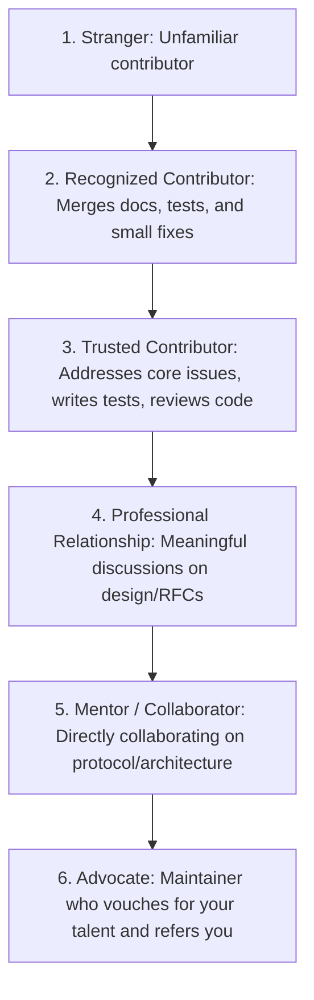
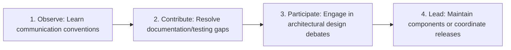
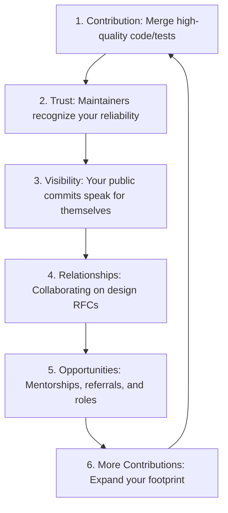

# Networking Playbook

This playbook establishes the strategic roadmap, relationship building mechanics, and outreach frameworks for developing a high-leverage professional network within Govind-OS.

For systems engineers, networking is not about social climbing or collecting connections. It is the process of building technical trust, professional reputation, and repeated positive interactions within core engineering communities.

---

## Purpose

The purpose of networking is to build genuine professional relationships that create mutual value over long periods of time.

*   **Networking is not about collecting contacts.**
*   **Networking is about becoming a trusted, reliable contributor within technical communities.**

---

## What Networking Actually Is

Networking is the process of:
*   **Building trust:** Providing consistent evidence of reliability, integrity, and capability.
*   **Demonstrating competence:** Proving technical depth through code, documentation, and engineering discussions.
*   **Creating visibility:** Making your work, learnings, and contributions public.
*   **Helping others:** Answering community questions, reviewing pull requests, and easing maintainer workloads.
*   **Maintaining relationships:** Keeping in touch systematically, rather than only when you need something.

*Strong networks are built through repeated positive interactions, not through one-time transactional requests.*

---

## Core Philosophy

*   **Prefer relationships over transactions:** Treat developers as peers and mentors rather than stepping stones.
*   **Prefer contribution over self-promotion:** Let your merged code and helpful reviews speak louder than self-aggrandizing updates.
*   **Prefer trust over visibility:** A single high-trust relationship with a core maintainer creates more leverage than 10,000 generic followers.
*   **Prefer long-term reputation over short-term gain:** Never sacrifice your professional credibility for temporary advantages.
*   **Prefer helping before asking:** Always look for ways to add value to a maintainer's project before requesting guidance or referrals.
*   **Prefer consistency over networking bursts:** Small, regular interactions in Slack/IRC build sustainable credibility over sudden, erratic outreach.

---

## Networking ROI Framework

Not all networking activities produce equal outcomes.

### High ROI
- **Open source contributions:** Direct evidence of technical execution and collaboration.
- **Maintainer interactions:** Review comments, issue triage, and public design reviews.
- **Technical discussions:** Participating in technical RFC debates and protocol mailing lists.
- **Mentorship programs:** LFX, GSoC, and Summer of Bitcoin structures.
- **Community participation:** Engaging in technical forums and public developer calls.

### Medium ROI
- **Conferences:** High impact if targeted; low impact if passively attending talks.
- **Technical blogging:** Writing deep postmortems, project details, and code explanations.
- **Local meetups:** Good for local connections, but limited in global systems engineering scale.

### Low ROI
- **Random connection requests:** Clicking "Connect" on social profiles without personalized context.
- **Generic networking events:** Speed-networking and broad career fairs lacking technical depth.
- **Mass cold outreach:** Blasting generic copy-pasted messages to hundreds of engineers.

*Prefer activities that build trust through demonstrated competence. This aligns directly with the leverage philosophy of Govind-OS.*

---

## Relationship Funnel

Move people up the funnel systematically by maintaining positive, value-adding contributions:

*Goal: Become memorable for positive, reliable engineering execution.*

---

## Building Reputation Before Networking

Networking works best when a reputation already exists. It is difficult to network with senior systems engineers if you have no public proof-of-work.

### How to build reputation capital before reaching out:
*   **Build Technical Projects:** Create production-like backend codebases demonstrating concurrency and database optimization.
*   **Open Source Contributions:** Maintain an active public presence with merged commits in reputable organizations.
*   **Write Technical Guides:** Document postmortems, compiler optimizations, or protocol walkthroughs.
*   **Participate in Forums:** Answer questions on GitHub Discussions, StackOverflow, or protocol mailing lists.

---

## Networking Through Open Source

Open source is a permissionless environment where networking occurs naturally through professional tasks:

*   **Pull Requests:** Writing clear description notes, tracing changes, and responding to review comments respectfully.
*   **Reviewing:** Constructively reviewing other contributors' PRs to lighten the maintainers' load (cross-reference with REVIEW_GUIDELINES.md).
*   **Issue Discussions:** Providing reproduction scripts, logs, and architectural trade-offs in open issues.
*   **Community Meetings:** Attending scheduled video conferences, listening to roadmap debates, and contributing in chat.
*   **Design Conversations:** Engaging in RFC/BIP drafts with technical depth and data-driven arguments.

---

## Networking Through Mentorship Programs

Mentorship programs (LFX, GSoC, Summer of Bitcoin) are structured accelerators for trust building (cross-reference with LFX.md, GSOC.md, and SUMMER_OF_BITCOIN.md):

*   **Mentors:** Treat them as colleagues. Deliver milestones early, communicate transparently, and respect their time.
*   **Maintainers:** Establish yourself as a regular in the codebase, showing commitment beyond your official program timeline.
*   **Fellow Contributors:** Collaborate, assist peers with environment setups, and review their proposals.
*   **Alumni:** Reach out to previous program graduates to learn about their career trajectories and transition strategies.

*Many career-defining opportunities emerge from mentorship relationships years after the official program ends.*

---

## Networking Through Technical Communities

Position yourself inside targeted, highly-specialized ecosystems:

### Target Systems Communities:
*   **CNCF & Cloud-Native:** Kubernetes, containerd, Harbor.
*   **Bitcoin & Layer 2:** Bitcoin Core, Lightning Network developers.
*   **Database Systems:** PostgreSQL internals, distributed engines.
*   **Systems Programming:** Go, Rust, C++ language developers.

### The Community Engagement Protocol:

---

## Networking Through Content Creation

Content creation allows you to network at scale by turning your learnings into public assets:

*   **Project Lessons:** Write blogs dissecting how you solved database deadlocks or network jitter in your side projects.
*   **Open Source Learnings:** Document the architectural conventions of Harbor or Bitcoin Script based on your contributions.
*   **Postmortems:** Write detailed technical reviews of system failures and how they were resolved.
*   **Technical Notes:** Share clean, readable summaries of complex systems papers or protocol specs.

*High-quality content acts as an asynchronous filter, attracting other like-minded systems engineers to your profile.*

---

## Networking Through Conferences and Events

Maximize your face-to-face and virtual event opportunities:

### Before the Event:
*   Research the speaker list and identify maintainers of target repositories.
*   Read their recent commits or blog posts.
*   Prepare 1–2 specific technical questions about their work.

### During the Event:
*   Attend their talks, listen carefully, and ask thoughtful questions.
*   Introduce yourself briefly afterwards, referencing your open-source work or specific elements of their presentation.
*   Take notes on key discussions to follow up on.

### After the Event:
*   Send a personalized message on Slack or email within 48 hours referencing your conversation.
*   Follow up with a contribution or resource relevant to their talk.

---

## Cold Outreach Framework

When reaching out to engineers, use a highly personalized, value-first approach (cross-reference with COLD_OUTREACH.md):

### The Outreach Structure:
1.  **Context:** State who you are and why you are reaching out.
2.  **Specific Interest:** Reference a specific piece of their work, blog post, or repository PR.
3.  **Relevant Question:** Ask a thoughtful technical question that demonstrates your prior research.
4.  **Gratitude:** Thank them for their time.

### Example:
> *"Hi X, I read your article on Harbor's replication workflows and noticed the discussion around error propagation. I recently worked on a related contribution and wanted to understand the trade-offs behind propagating errors up to the CLI boundary versus handling them directly inside subpackages. Thank you for your time and your contributions to the project."*

> [!CAUTION]
> **Never start with:** *"Can you give me a job?"* or *"Can you review my resume?"* This signals a transactional mindset and instantly lowers trust.

---

## Maintaining Relationships

Relationships require consistent, low-frequency maintenance:

*   **Share Progress Updates:** Send a quick note to past mentors when you merge a major PR or launch a project they discussed with you.
*   **Congratulate Achievements:** Acknowledge when they release a new version of their software, write a new specification, or change roles.
*   **Offer Help:** Reach out when you see their repository needs support or when they request help triaging issues.
*   **Continue Contributing:** Remain active in their project channels.

*Never disappear for two years and suddenly reach out to ask for a job recommendation.*

---

## Asking For Help

When you hit a blocker, ask for help in a way that respects the maintainer's cognitive bandwidth:

*   **Be Specific:** Pinpoint the exact line of code, config, or error message.
*   **Provide Context:** Explain the environment, compilation commands, and reproduction steps.
*   **Show Prior Effort:** Detail what you have already tried (e.g., docs read, logs checked, test modifications) to prove you aren't outsourcing your thinking.
*   **Respect Time:** Keep the message structured and easy to digest.

### Comparison:
*   **Bad:** *"Can you explain Kubernetes?"*
*   **Good:** *"I understand how Pods and Services route traffic, but I am confused about why EndpointSlices were introduced to replace older Endpoints. Could you point me toward resources or discussions explaining the scaling limitations of the older approach?"*

---

## Asking For Referrals

A referral must be the byproduct of established trust, not the initiation of a connection.

*   **Build the Relationship First:** Ensure the referee has seen your technical execution, code quality, and communication.
*   **Ensure They Know Your Work:** Link to specific merged PRs, design docs, or shared project accomplishments.
*   **Target a Relevant Opportunity:** Identify a specific open role that fits your skillset perfectly.
*   **Make it Easy:** Draft a short blurb summarizing your qualifications that the referrer can copy-paste directly to their recruiting team.

---

## Building a Personal Reputation

Reputation is your compounding career asset. It is the answer to: *"What do people associate with my name when I leave the channel?"*

*   **Reliability:** Do you deliver milestones on time, keep your word, and follow up?
*   **Systems Engineering:** Are you known for writing high-performance, well-tested systems code?
*   **Open Source:** Are you recognized as a helpful, consistent contributor in cloud-native or Bitcoin ecosystems?
*   **Thoughtfulness:** Do you write structured issues, design specifications, and polite reviews?

*Aim to become known for something specific and highly valuable.*

---

## Open Source Relationship Flywheel

The relationship flywheel explains why open-source contribution is the highest-leverage networking mechanism for systems engineers:

This flywheel bypasses traditional recruitment filters. Demonstrating competence directly in front of core maintainers leads to referrals and job offers because they have already spent months reviewing your code and observing your work style.

---

## Common Failure Modes

*   **Transactional Networking:** Reaching out only when you need a favor, referral, or job.
*   **Asking Before Contributing:** Demanding guidance or attention before proving value.
*   **Generic Outreach:** Copy-pasting templates without project-specific customization.
*   **Chasing Follower Metrics:** Focusing on social media numbers instead of deep, high-trust engineering connections.
*   **Ignoring Existing Connections:** Neglecting past mentors, peers, and collaborators.
*   **Failing to Follow Up:** Leaving issues unaddressed or failing to send progress updates after receiving advice.

---

## Networking Success Checklist

### Monthly Cadence
- [ ] Participated actively in community channels (CNCF, Bitcoin, or databases).
- [ ] Contributed code, reviews, or documentation to public repositories.
- [ ] Maintained contact with 1–2 existing relationships (sharing updates or updates on their work).
- [ ] Shared at least one technical insight or project postmortem publicly.
- [ ] Helped another developer (answering questions, debugging setup).

### Quarterly Cadence
- [ ] Expanded your network intentionally by engaging with 1-2 new maintainers or engineers.
- [ ] Built a new technical relationship by contributing to a new repository.
- [ ] Reviewed and strengthened connections with past mentors and program alumni.
- [ ] Assessed and updated your reputation capital in your target communities.

---

## Continuous Improvement

*   **Audit Your Relationships:** Periodically review your network to see if you have lost contact with key mentors, and send lightweight updates.
*   **Refactor Your Messaging:** Analyze which cold outreach formats receive replies and refine your messaging templates.
*   **Keep Playbooks Updated:** As you transition from contributor to reviewer, update this playbook to capture new leadership lessons.
