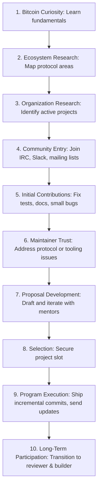

# Summer of Bitcoin Playbook

This playbook establishes the strategic roadmap, selection mechanics, technical preparation, and communication frameworks for successfully applying to, executing, and leveraging the Summer of Bitcoin (SoB) program within Govind-OS.

Selection is only the entry gate. The ultimate objective is to develop deep systems and security engineering expertise, build durable relationships with top Bitcoin core maintainers, and establish global technical credibility.

---

## Purpose

The purpose of Summer of Bitcoin is to accelerate engineering growth through meaningful contributions to Bitcoin and Bitcoin-adjacent open-source software.

- **The objective is not merely to receive a stipend or secure selection.**
- **The objective is to develop deep technical capability, build credibility within the Bitcoin ecosystem, and establish long-term relationships with maintainers and contributors.**

---

## What Summer of Bitcoin Actually Is

Summer of Bitcoin is a trust-based mentorship program focused on Bitcoin open-source development.

Organizations select contributors they believe can:
*   **Learn complex systems quickly:** Bitcoin protocols are adversarial and highly optimized.
*   **Understand existing codebases:** Building on top of historical, consensus-critical code.
*   **Communicate effectively:** Explaining technical decisions clearly on mailing lists, IRC, and GitHub.
*   **Deliver reliable software:** Code correctness is paramount when financial value is at stake.
*   **Operate independently:** Identifying next steps and solving blockers autonomously.

*The strongest applicants are usually already participating in the ecosystem before applications open.*

---

## Core Philosophy

*   **Optimize for understanding:** Deeply comprehend the protocols (Bitcoin, Lightning, etc.) rather than rushing to write code.
*   **Optimize for contribution quality:** Focus on robust, well-tested commits that solve critical bottlenecks over trivial styling or documentation fixes.
*   **Optimize for maintainer trust:** Value the reviewer's time, communicate transparently, and adhere to project standards.
*   **Optimize for long-term participation:** Plan to stay active in the ecosystem beyond the official program timeline.
*   **Prefer engineering depth over project prestige:** Choose projects that stretch your technical skills rather than selecting based on popularity.
*   **Prefer consistency over activity spikes:** Regular, sustained contributions build more trust than high-volume burst activity.
*   **Prefer meaningful contributions over contribution counts:** Quality commits matter far more than inflating pull request metrics.

---

## Why Organizations Select Contributors

Selection is rarely based on proposals alone. It is a multi-dimensional confidence score influenced by:

*   **Community Participation:** How active and helpful you are in public developer communication channels.
*   **Contribution History:** The quality, test coverage, and design cleanliness of your merged pull requests.
*   **Mentor Confidence:** How much trust mentors have in your ability to follow through and work independently.
*   **Technical Ability:** Your grasp of systems programming, testing, concurrency, and debugging.
*   **Proposal Quality:** The depth, clarity, feasibility, and risk mitigation strategies outlined in your design document.

*Organizations select contributors they trust to complete the project autonomously and responsibly.*

---

## Summer of Bitcoin vs. GSoC vs. LFX

Understanding where Summer of Bitcoin fits in the mentorship landscape allows you to target your application strategies:

| Dimension | LFX Mentorship | Google Summer of Code | Summer of Bitcoin |
| :--- | :--- | :--- | :--- |
| **Primary Ecosystem** | Cloud Native / Linux Foundation (CNCF) | General Open Source Ecosystem (Broad OSS) | Bitcoin & Lightning Ecosystem |
| **Proposal Importance** | Medium (selection is highly decided by early merged code volume) | High (requires structured project timeline and deliverables) | High (demands clear technical architectural understanding) |
| **Domain Knowledge** | Project-specific (Kubernetes, containerd, Harbor) | Project-specific (Python, Apache, GNOME) | Bitcoin-specific (UTXO, Lightning, Cryptography) |
| **Community Importance**| High | High | Very High (small, tight-knit developer network) |
| **Long-Term Retention** | High (leads to CNCF path) | Medium (broad contributor base) | Very High (primary pipeline for core Bitcoin funding) |

---

## The SoB Funnel

Summer of Bitcoin success follows a structured pipeline:

---

## Bitcoin Ecosystem Map

Before selecting projects, understand where the organization operates within the ecosystem:

### Bitcoin Core & Layer 1
*   **Consensus:** The consensus rules (Bitcoin Script, Taproot, SegWit, softfork dynamics).
*   **Validation:** Signature verification, block verification, transaction validation logic.
*   **Networking:** The P2P network layer, connection slot management, message protocols.
*   **Mempool:** Transaction validation, fee estimation, package relay, RBF (Replace-by-Fee) policy.
*   **Wallet:** Key derivation, descriptor wallets, coin selection algorithms, transaction signing.

### Lightning Network & Layer 2
*   **Routing:** Pathfinding algorithms, onion routing, payment channel updates.
*   **Channels:** Hashed Timelock Contracts (HTLCs), payment channel state machine (LN-penalty, eltoo).
*   **Payments:** Invoice creation, keysend, MPP (Multi-Path Payments).
*   **Liquidity:** LSP (Lightning Service Provider) dynamics, channel management, fee rate optimization.

### Wallet Infrastructure & Libraries
*   **Transaction Construction:** Partially Signed Bitcoin Transactions (PSBT) workflow.
*   **Key Management:** BIP32/39/44 derivation, hardware wallet integration, multisig setups.
*   **Security:** Cold/warm storage paradigms, air-gapped signatures.

### Developer Tooling & Libraries
*   **Language Ecosystems:** Rust-bitcoin, BDK (Bitcoin Dev Kit), LDK (Lightning Dev Kit), NDK (Nostr Dev Kit).
*   **Testing Tools:** Regtest integration testing pipelines, simulation tools (e.g., Warnet, SimLN).

### Privacy & Security
*   **CoinJoin:** Collaborative transaction construction protocols (WabiSabi, ZeroLink).
*   **Wallet Privacy:** BIP157/158 client-side block filtering, address reuse prevention.

### Infrastructure & APIs
*   **Indexing/Exploring:** Blockstream Esplora, Electrum servers, custom indexers.
*   **Node Management:** Core Lightning (CLN), LND, eclair, custom node daemons.

---

## Organization Selection Framework

Evaluate target organizations using the following dimensions:

*   **Mentor Quality:** Are they active protocol developers or core contributors? Check their recent public comments and PR reviews.
*   **Organization Health:** Is the codebase actively maintained? Look at PR merge frequency and issue triage speed.
*   **Review Responsiveness:** How quickly do maintainers respond to contributor questions and pull requests?
*   **Technical Depth:** Does the project offer deep engineering learning (e.g., consensus, cryptography, low-level networking) or is it a simple wrapper?
*   **Long-Term Relevance:** Does this codebase align with where you want to build your technical career?
*   **Community Culture:** Is the developer community welcoming, and do they engage in constructive public reviews?

> [!WARNING]
> **Avoid Prestige Chasing:** Do not apply to a project solely because of its brand name if the codebase does not interest you or if the mentor latency is too high.

---

## Technical Preparation Framework

Before applying, ensure you build the core technical foundations:

### General Software Engineering
*   **Git & GitHub:** Master branching, rebasing, squashing, cherry-picking, and signing commits.
*   **Linux/CLI:** Comfortable working in shell environments, compilation scripts, and build tools (make, cargo, cmake).
*   **Testing & CI/CD:** Writing unit/integration tests and debugging failed CI pipeline runs.
*   **Code Review Process:** Understanding how to write descriptive PR reviews and how to address reviewer comments cleanly.

### Bitcoin-Specific Foundations
*   **UTXO Model:** Understand how transaction inputs and outputs work, scriptpubkeys, and witness data.
*   **Transactions & Blocks:** Mechanics of serialization, transaction structure, block headers, and proof-of-work validation.
*   **Nodes & Networks:** The difference between Mainnet, Testnet, Signet, and Regtest environments.
*   **Consensus Basics:** The concepts of soft forks, hard forks, and network consensus parameters.

> [!TIP]
> You do not need to be an expert in all cryptographic protocols before you start, but you must know enough to participate intelligently in issue discussions.

---

## Community Integration

Bitcoin development is highly decentralized and relies heavily on public channels.

*   **Identify the Channels:** Join the specific Slack workspaces, Discord servers, IRC channels (`#bitcoin-core-dev` on Libera.chat), or Telegram groups for your target project.
*   **Observe First:** Spend a week reading history. Pay attention to community standards, developer jargon, and ongoing architectural debates.
*   **Contribute Second:** Help answer community setup questions, fix build warnings, or update outdated READMEs.
*   **Propose Third:** Avoid suggesting massive protocol changes early on. Focus first on building a reputation for executing smaller tasks reliably.

---

## Contribution Strategy

Maximize your selection probability by pacing your contributions:

### Phase 1: Onboarding & Low-Hanging Fruit (Weeks 1-2)
*   Fix documentation inaccuracies, compile issues, or missing test cases. This validates your environment setup and merges your first commits.

### Phase 2: Featurettes & Tooling (Weeks 3-6)
*   Tackle open bugs, improve simulation scripts, or implement small helper utilities. Engage in issue threads before writing code.

### Phase 3: Project Integration & Proposal Design (Weeks 7-8)
*   Collaborate with mentors to outline your project proposal. Submit PRs that lay the groundwork for your proposed feature (e.g., refactoring interfaces, adding base data models).

*Goal: Become a recognized contributor before official applications open.*

---

## Proposal Writing Framework

Your proposal is a technical specification. It should clearly answer:

1.  **What problem exists?** Clear statement of the bug, limitation, or feature request.
2.  **Why does it matter?** The utility it brings to the user, developer, or protocol.
3.  **How will it be solved?** Technical design including data structures, logic flows, and API changes.
4.  **How will it be tested?** Comprehensive testing plan (unit, integration, fuzz, regtest simulation).
5.  **What milestones exist?** A week-by-week timeline of deliverables.
6.  **What risks exist?** External dependencies, unknown API behaviors, and mitigation plans.

*Avoid generic enthusiasm or promises to "work hard." Focus on concrete engineering specs.*

---

## Mentor Interaction Framework

Refer to MAINTAINER_INTERACTION.md for communication guidelines.

*   **Respect Reviewer Time:** Provide all necessary context in your questions. Share logs, reproduction steps, and what you have already tried.
*   **Strive for Clarity:** Keep messages short, structured, and easy to parse.
*   **Ensure Consistency:** Give regular updates on tasks assigned to you.
*   **Follow Through:** If you ask for an issue to be assigned, deliver the PR or give a status update promptly.

---

## Bitcoin-Specific Knowledge Areas

Focus your learning on these high-value topics based on your project domain:

*   **Bitcoin Fundamentals:** BIPs (Bitcoin Improvement Proposals), script types (P2PKH, P2SH, P2WPKH, P2TR).
*   **UTXO Management:** Coin selection policies, fee calculation, transaction weight.
*   **Wallet Architecture:** BIP32 hierarchical deterministic wallets, descriptor-based wallets.
*   **Lightning Network Protocol:** BOLT specifications (Basis of Lightning Technology), HTLC states.
*   **P2P Networking:** Block relay, transaction relay, compact blocks, BIP152.
*   **Cryptography:** ECC (Elliptic Curve Cryptography), Schnorr signatures, MuSig.
*   **Privacy Protocols:** CoinJoin mechanics, Taproot script paths, client-side filtering.

*Do not try to master everything at once. Learn the specific modules relevant to your organization first.*

---

## During Selection Period

*   **Maintain Momentum:** Continue contributing to the codebase after submitting your proposal. Many applicants make the mistake of going silent.
*   **Iterate on Proposal:** Refine your technical design immediately when mentors raise questions or suggest alternative designs.
*   **Engage in Reviews:** Review other applicants' PRs constructively. This shows you are a collaborative team player.

---

## During the Program

*   **Ship Incrementally:** Do not work on a massive branch for weeks. Merge small, tested, and self-contained PRs regularly.
*   **Communicate Weekly:** Send structured status reports to your mentors:
    *   *Completions:* What you built and tested.
    *   *Next Steps:* Priorities for the coming week.
    *   *Blockers/Risks:* Any dependencies or design roadblocks.
*   **Never Surprise Mentors:** If you foresee a delay or a technical roadblock, discuss it immediately.

---

## Building Long-Term Leverage

The mentorship is only a launching pad. The real value is the network and credibility:

*   **Code Ownership:** Maintain the modules you wrote. Fix bugs, respond to issues, and keep documentation updated.
*   **Code Reviewing:** Assist maintainers by reviewing new pull requests. This builds deep architectural context.
*   **Community Mentorship:** Help new contributors get started, reinforcing your position as a trusted community member.

---

## Bitcoin Career Leverage

Unlike general internship programs, Summer of Bitcoin is a gateway to a specialized, well-funded industry:

*   **Open Source Reputation:** Merged code in protocols like Bitcoin Core, LND, or BDK is a permanent, publicly auditable proof of work.
*   **Bitcoin Infrastructure Roles:** The industry values protocol familiarity. Successful alumni often transition to full-time roles at companies like Blockstream, Spiral, Brink, Lightning Labs, and Chaincode Labs.
*   **Backend Engineering Opportunities:** Low-level C++/Rust experience on consensus engines is highly valued across all high-performance distributed systems.
*   **Security Engineering Exposure:** Security is paramount in Bitcoin. You will gain exposure to threat modeling, cryptographic validation, and adversarial thinking.
*   **Future Funding & Grants:** Promising developers in the Bitcoin space can secure independent developer grants from organizations like Brink, OpenSats, or Spiral to work full-time on open-source protocol development.

---

## Bitcoin Engineering Mindset

Bitcoin software operates in adversarial environments.

Engineers should:

- Assume inputs may be malicious.
- Prefer correctness over feature velocity.
- Treat backward compatibility carefully.
- Think about incentives and game theory.
- Design with failure scenarios in mind.
- Prioritize security before convenience.

In Bitcoin development, a small bug can have disproportionately large consequences.

Reliability and security are foundational engineering requirements.

This captures something unique about Bitcoin engineering that differs from most other software domains.

---

## Common Failure Modes

*   **Applying Without Contributions:** Submitting a proposal without any history of interaction or merged PRs in the target repository.
*   **Prestige Chasing:** Selecting a project purely because it is famous, regardless of whether you have the background to contribute.
*   **Weak Communication:** Going silent when blocked, failing to provide weekly status updates.
*   **Scope Overestimation:** Designing a proposal that is too large to execute, leading to unmerged branches.
*   **Ignoring Mentor Feedback:** Stubbornly implementing your own design instead of adapting to community preferences.
*   **Treating SoB as a Temporary Gig:** Dropping all involvement immediately after the final stipend is paid.

---

## Rejection Framework

Rejection is a natural part of entering a competitive ecosystem. Use it to improve:

*   **Request Feedback:** Ask mentors politely for areas of improvement in your proposal or coding style.
*   **Perform a Self-Audit:** Did you start contributing too late? Was your proposal technically vague? Did you pick a project with too few mentor slots?
*   **Stay Active:** If you believe in the project, keep contributing. Maintainers deeply respect developers who continue working after a rejection. This almost guarantees selection or grant opportunities in future cycles.

---

## Summer of Bitcoin Success Checklist

### Before Applying
- [ ] Research Bitcoin-adjacent organizations and map their domains.
- [ ] Join the target community's chat and mailing lists.
- [ ] Merge at least 2-3 PRs (docs, tests, or minor bug fixes).
- [ ] Draft a comprehensive technical design proposal.
- [ ] Iterate on the proposal with your mentors before the deadline.

### During the Program
- [ ] Submit small, functional PRs weekly.
- [ ] Send weekly status reports (Completions, Next Steps, Blockers).
- [ ] Cover all new logic with robust unit/integration tests.
- [ ] Document all new features and configurations.

### After the Program
- [ ] Maintain the code you merged and triage incoming issues.
- [ ] Review PRs submitted by other developers.
- [ ] Document your experience and add it to your engineering portfolio.

---

## Continuous Improvement

*   **Review Your Process:** After each cycle, evaluate where your preparation fell short and update this playbook.
*   **Monitor Protocol Updates:** Keep track of BIP drafts and protocol discussions to identify new areas of contribution opportunity.
*   **Update the Playbook:** Add new lessons, tools, or resources as you gain more experience in the Bitcoin ecosystem.
