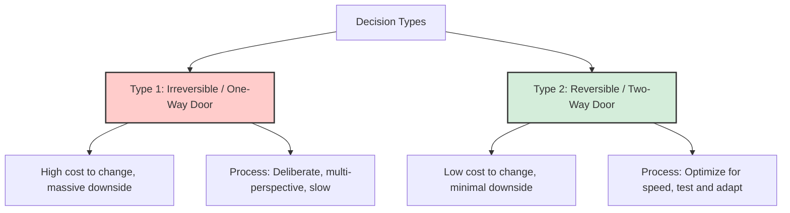

# Decision Making Framework

This document defines the cognitive models, analytical frameworks, and operational filters for making decisions within Govind-OS. It serves as a metacognitive guide to ensure time, attention, energy, and capital are consistently allocated toward the highest-leverage compounding opportunities.

A software engineer's long-term trajectory is not determined solely by coding speed, but by the quality of their compounded decisions.

---

## Purpose

The primary purpose of decision making is to consistently allocate resources (time, focus, energy, and capital) toward the highest-leverage opportunities while avoiding catastrophic downsides.

- **Life and career outcomes are determined by accumulated, compounded decisions.**
- **The objective is not to make perfect decisions; the objective is to make high-quality decisions under uncertainty, manage risk, and continuously calibrate judgment over time.**

Every decision is an allocation of finite lifecycle resources. This framework ensures those allocations are deliberate, evidence-based, and aligned with long-term goals.

---

## Core Philosophy

→ See [core/ENGINEERING_PRINCIPLES.md](ENGINEERING_PRINCIPLES.md) for universal principles.

*   **Prefer asymmetric upside opportunities:** Seek options with capped downsides but unbounded potential upsides.
*   **Prefer compounding opportunities over isolated wins:** Invest in skills, codebases, and networks that build upon themselves.
*   **Prefer first principles over conventional opinions:** Strip problems down to their fundamental truths.
*   **Prefer action after sufficient analysis:** Avoid analysis paralysis. Gather enough data, then execute decisively.

---

## First Principles Thinking

Before adopting conventional advice, popular tech trends, or peer paths, deconstruct the problem to its basic components:

*   **Identify the Core Problem:** What physical or business constraint are we actually trying to solve?
*   **Audit Assumptions:** Write down all active assumptions. Where did they come from? Are they verified facts, or are they inherited opinions from others?
*   **Reason from Base Truths:** If you had to solve this problem from scratch with zero pre-existing templates, how would you structure the solution?

*First principles thinking reduces reliance on industry hype and prevents you from applying complex solutions (e.g., premature microservices) to simple problems.*

---

## Opportunity Cost Thinking

Every choice is a trade-off. Committing to one path means saying "No" to dozens of other viable alternatives.

*   **Look Beyond Direct Cost:** The cost of an opportunity is not just its price tag or immediate time commitment; it is the value of the next best alternative you must give up.
*   **Evaluate Exclusion:** Before agreeing to a project, mentorship, or technology stack, explicitly write down what you will *not* be able to do as a result.
*   **The "No" Default:** Treat your time as a highly constrained capital asset. Default to saying "No" to low-leverage requests to preserve capacity for high-leverage opportunities.

---

## Reversible vs. Irreversible Decisions

Decisions fall into two categories, and should be analyzed and executed with different speeds and processes:

*   **Type 1: Irreversible (One-Way Doors):** Decisions that are extremely difficult or expensive to undo.
    *   *Examples:* Accepting a long-term contract, choosing a career specialization, forming co-founder agreements, making foundational database schema selections.
    *   *Approach:* Analyze slowly, consult multiple perspectives, gather deep evidence, and wait for clarity.
*   **Type 2: Reversible (Two-Way Doors):** Decisions that can be easily undone or changed without significant cost.
    *   *Examples:* Trying out a new tool, writing a prototype script, modifying a local developer workflow, reading a specific book.
    *   *Approach:* Make these decisions rapidly. Do not waste days or weeks analyzing minor, low-downside choices. Learn by doing.

---

## Decision Quality vs. Outcome Quality

A common cognitive trap is judging the quality of a decision solely by its outcome. 

*   **Good Decisions can yield Bad Outcomes:** A well-analyzed choice with an 80% probability of success can still land in the unlucky 20% due to factors out of your control.
*   **Bad Decisions can yield Good Outcomes:** Guessing or taking reckless, unhedged risks can occasionally result in a random win due to pure luck.
*   **Evaluate the Process:** Assess decision quality based on the information available at the time, the depth of risk assessment, and the rationality of the reasoning process, not just the final result.

---

## Leverage Thinking

Prioritize activities where input effort generates disproportionate output returns.

| High-Leverage Activities (Focus) | Low-Leverage Activities (Minimize) |
| :--- | :--- |
| Contributing to core CNCF repositories (Kubernetes, Harbor). | Collecting superficial certificates and badges. |
| Writing deep technical articles and handbooks. | Padding resumes with lists of unapplied keywords. |
| Mastering foundational systems (operating systems, networking). | Chasing shallow vanity metrics (social followers, stars). |
| Joining high-quality structured mentorships (LFX, GSoC). | Attending generic networking events without focus. |
| Building clean, reusable software abstractions. | Re-writing boilerplates and styling scripts. |

---

## Compounding Thinking

Seek opportunities that continue to produce value long after the initial effort is spent.

*   **One-Time Wins (Linear):** Contracting for a fixed fee, writing throwaway scripts, studying for a single localized exam. Once the effort stops, the value generation drops to zero.
*   **Compounding Assets (Exponential):** Contributing to open-source libraries (establishes durable global reputation), building reusable developer tooling, establishing deep professional relationships, writing core engineering docs. These assets act as a force multiplier, paying dividends for years.

---

## Evidence-Based Decisions

Never make critical architecture or career moves based on assumptions, hearsay, or trend-chasing.

*   **Benchmark:** Write tests and run load tests to prove a performance hypothesis.
*   **Audit Sources:** Verify statements made in blog posts or documentations. Look at source code implementations to confirm how tools handle edge cases.
*   **Experiment:** Build small, isolated prototypes (spikes) to validate developer experience and runtime behaviors before committing to a tool.

---

## Risk Assessment

Before committing to a decision, calculate the risk envelope:

1.  **Downside:** What is the worst-case scenario if this decision fails?
2.  **Probability:** What is the likelihood of that worst-case scenario occurring?
3.  **Recoverability:** Can we recover from the failure? How long will it take, and how much will it cost?
4.  **Upside:** Is the potential benefit worth the risk?

*Asymmetric Risk:* Seek decisions where the downside is capped and manageable, but the upside is unbounded (e.g., applying for a highly competitive CNCF internship—worst case: rejected, zero cost; best case: selected, career-altering).

---

## Uncertainty Management

You will rarely have 100% of the information required to make a perfect decision.

*   **The 70% Rule:** Make Type 2 decisions when you have gathered approximately 70% of the required information. Waiting for 90%+ certainty leads to analysis paralysis and missed opportunities.
*   **Isolate Key Unknowns:** Identify the 1 or 2 critical pieces of missing information that would shift your decision. Focus your research exclusively on resolving those unknowns.
*   **Iterative Updates:** View your choices as hypotheses. As new evidence emerges in production or career paths, update your models and pivot if necessary.

---

## Decision Framework

When faced with a significant Type 1 decision, run it through this ten-step process:

1.  **Define the problem:** Clarify the root issue, avoiding symptoms or false constraints.
2.  **Identify constraints:** Document budget, timeline, legal boundaries, and technical limits.
3.  **Generate alternatives:** List at least 3 distinct options, including "do nothing."
4.  **Evaluate trade-offs:** Contrast the pros and cons of each alternative.
5.  **Assess opportunity cost:** Identify what you must sacrifice to pursue each option.
6.  **Evaluate risk:** Calculate the worst-case downside, probability, and recovery path.
7.  **Run the Council Framework:** Gather diverse perspectives (see below).
8.  **Make the decision:** Commit to the path with the highest long-term leverage.
9.  **Execute:** Act swiftly and communicate the decision clearly to stakeholders.
10. **Review and Calibrate:** Set a review date to evaluate the decision's quality and calibrate future choices.

---

## Council Framework

A multi-perspective evaluation tool for Type 1 decisions. For full usage details, see [agents/CLAUDE.md](../agents/CLAUDE.md).

| Persona | Focus | Core Question |
|---|---|---|
| Contrarian | Failure scenarios, hidden costs | "Why will this fail?" |
| First Principles | Base facts, logical consistency | "What assumptions are unverified?" |
| Expansionist | Strategic growth, compounding | "How does this compound over 3-5 years?" |
| Outsider | Objective detachment, simplicity | "What would an external consultant say?" |
| Executor | Timelines, resource constraints | "What is the simplest path to get this done?" |

**Output:** Document agreements, disagreements, blind spots, recommendation, and next action.

---

## Decision Journaling

Record key decisions in [experience/DECISION_LOG.md](../experience/DECISION_LOG.md) using the structured entry template defined there. Review journal entries 6 to 12 months later to prevent hindsight bias and highlight systemic errors in risk calculations.

---

## Common Cognitive Biases

Understand these common cognitive traps to protect your decision-making process:

*   **Sunk Cost Fallacy:**
    *   *Definition:* Continuing to invest time or capital in a failing project because you have already spent resources on it.
    *   *Mitigation:* Base future investments solely on future expected value, not past costs. Be willing to kill projects that no longer align with leverage goals.
*   **Confirmation Bias:**
    *   *Definition:* Actively searching for information that confirms your existing beliefs while ignoring contrary evidence.
    *   *Mitigation:* Assign someone to play the Contrarian. Actively search for evidence that disproves your hypothesis.
*   **Survivorship Bias:**
    *   *Definition:* Focusing on successful examples (e.g., startup founders who dropped out) while ignoring the silent majority who failed using the same path.
    *   *Mitigation:* Analyze base rates. Look at the failure rates and risk distributions of the entire cohort, not just the winners.
*   **Status Quo Bias:**
    *   *Definition:* Preferring things to stay the same, viewing changes as a risk.
    *   *Mitigation:* Evaluate the cost of doing nothing. Remaining static is itself a decision with high opportunity costs.

---

## Career Decision Framework

Apply this filter when choosing internships, projects, or employment opportunities. Rate each choice on these dimensions:

1.  **Skill Growth:** Will this opportunity push me to master complex systems (e.g., distributed architectures, Kubernetes internals)?
2.  **Career Leverage:** Does this brand or project command respect in the global open-source community?
3.  **Technical Depth:** Does the role require deep engineering, or is it simple glue-code assembly?
4.  **Network Quality:** Will I collaborate with high-level maintainers, architects, and engineers?
5.  **Compounding Value:** Will the artifacts I build here remain public, reusable, and visible in my portfolio?

---

## Open Source Decision Framework

Before dedicating significant engineering hours to contributing to an open-source repository, ask:

*   **Is the project active?** Check commit frequency, issue response times, and PR merge rates. Avoid dead repositories.
*   **Is it CNCF-aligned?** Focus on projects within the CNCF landscape (Kubernetes, containerd, Harbor) to align with career trajectory.
*   **Are the maintainers welcoming?** Read the contribution guidelines and inspect public PR review tones. Invest your time where mentoring and clean reviews occur.
*   **Will contributions compound?** Will fixing this issue or building this feature deepen my understanding of core systems, or is it a minor cosmetic fix?

---

## Learning Decision Framework

The volume of technologies is infinite; your study time is highly constrained. Before learning a new language, database, or tool, verify:

*   **Utility:** Will I apply this to a real project in the next 90 days? (Learning without application leads to rapid decay).
*   **Durability:** Does this technology teach foundational engineering principles (e.g., studying Raft consensus) or is it a transient frontend wrapper?
*   **Alignment:** Does this resource directly support my long-term goals (CNCF contributions, platform engineering, distributed database management)?

---

## AI-Assisted Decision Making

Use AI to expand your perspective, not to replace your judgment:

*   **AI Strengths:** Use AI to play the Contrarian, generate alternative solutions, point out logical fallacies in your reasoning, and summarize complex documentation.
*   **AI Limitations:** AI lacks contextual risk tolerance, emotional intelligence, and accountability.
*   **Ownership Rule:** *AI can suggest options, but human judgment owns the final decision and bears all consequences.*

---

## Common Decision Anti-Patterns

*   **Analysis Paralysis:** Waiting for perfect information before acting on a Type 2 decision.
*   **Trend Chasing (FOMO):** Committing to a technology solely because it is trending, without verifying engineering utility.
*   **Prestige-Driven Choices:** Accepting roles for brand prestige rather than depth of technical work.
*   **Short-Term Optimization:** Maximizing immediate financial return at the expense of long-term skill compounding.

---

## Kill Criteria

Not every commitment should be continued indefinitely. Before starting a project, applying for a program, or learning a technology, define the explicit conditions under which the effort should be abandoned, paused, or re-evaluated.

### Recommended Kill Criteria
*   **Goal Realignment:** The project or technology no longer aligns with your long-term goals or career trajectory.
*   **Community/Project Decay:** Open-source maintainers become completely inactive or unresponsive for an extended period, indicating a dying project ecosystem.
*   **Learning Plateau:** The rate of skill acquisition drops significantly, and tasks transition to repetitive, low-leverage work.
*   **Opportunity Cost Spike:** A new, clearly superior opportunity emerges that offers exponentially higher leverage or compounding value.
*   **Operational Saturation:** The time required to maintain current commitments compromises your health, academic results, or core engineering velocity.

*Never continue investing in a path simply because you have already spent hours on it. Future decisions must be based on future expected value, not past effort. The thought "I have already spent 100 hours on this" is the sunk-cost fallacy in disguise.*

---

## Continuous Improvement

Your decision-making capability is an evolutionary system:

*   **Perform Post-Decisional Audits:** Treat bad outcomes as system logs. Was the bad outcome due to poor decision quality (system bug) or bad luck (network partition)? Adjust your frameworks accordingly.
*   **Calibrate Probability Estimates:** Track your confidence levels in your decision journal. If you are "90% confident" but fail 50% of the time, recalibrate your risk assessment models.
*   **Refine the Handbooks:** As your engineering career develops, update these filters to protect your focus and optimize your trajectory.
