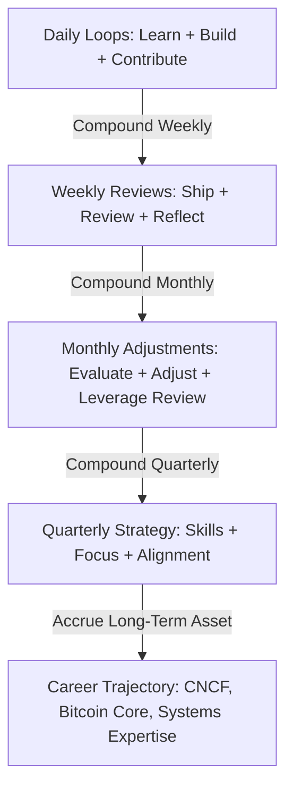
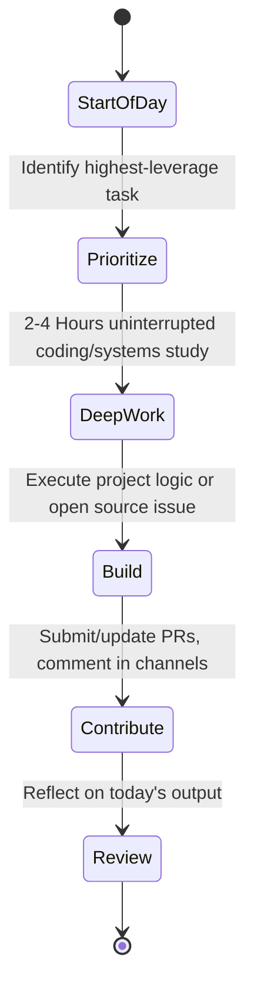
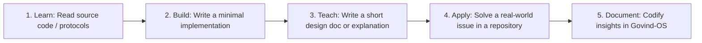
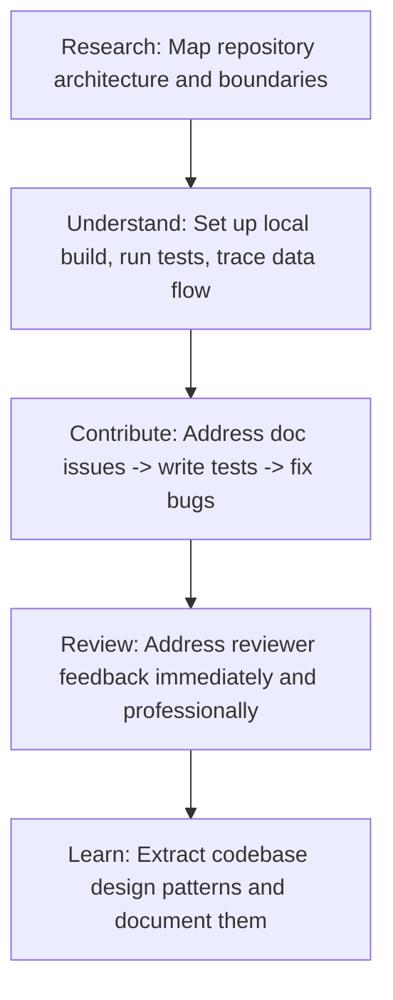
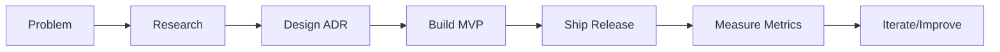
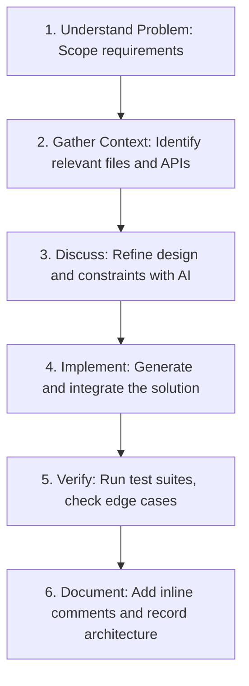
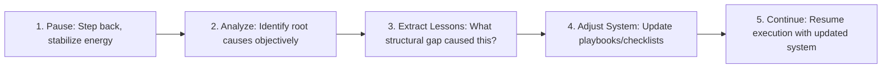

# Personal Execution Workflows

This document serves as the operational execution engine of Govind-OS. It defines the structured routines, decision filters, and reflection loops required to consistently execute on high-leverage activities, build systems engineering depth, and accelerate career outcomes.

---

## Purpose

The purpose of workflows is to convert goals into repeatable systems.

*   **Motivation is unreliable:** Willpower and motivation wax and wane with energy, emotion, and environment.
*   **Systems create consistency:** By standardizing how you execute day-to-day, you offload decision fatigue and build compound momentum.
*   *The objective is not to work harder. The objective is to execute consistently on the highest-leverage activities over long periods of time.*

---

## Core Philosophy

*   **Prefer systems over motivation:** Design routines that run automatically without requiring willpower.
*   **Prefer consistency over intensity:** 1 hour of daily effort compounds far better than a single 10-hour weekend sprint.
*   **Prefer execution over planning:** Minimize time spent drafting elaborate roadmaps; maximize time spent writing code and shipping features.
*   **Prefer compounding actions over isolated effort:** Every action should build assets (code, writing, relationships) that accrue long-term value.
*   **Prefer measurable progress over perceived productivity:** Track deliverables (PRs, commits, notes) rather than hours spent sitting at the desk.
*   **Prefer long-term sustainability over short-term bursts:** Establish a sustainable pace to prevent burnout.

---

## The Compounding System

Most professional career outcomes are the result of compounding small, consistent daily actions.



| Frequency | Target Action | Deliverable | Compounding Effect |
| :--- | :--- | :--- | :--- |
| **Daily** | Learn, Build, Contribute | Small commits, notes, active communication | Habit formation, incremental skill acquisition |
| **Weekly** | Ship, Review, Reflect | Merged features, structured retrospective | Blockers removed, process updates, portfolio growth |
| **Monthly** | Evaluate, Adjust, Audit | Resume update, leverage audit, priority pivots | Alignment with high-leverage goals, career leverage |
| **Quarterly** | Strategic Review | Long-term priorities alignment, project archive/continuation | Tactical correction, prevention of drift, strategic direction |

---

## Daily Workflow

The daily execution loop ensures that the highest-priority tasks receive your best energy:



### Daily Priorities:
1.  **Learning:** Dedicate the first hour to systems reading or codebase review (before notifications).
2.  **Building:** Write core feature logic for your side projects or assigned mentorship milestones.
3.  **Contributing:** Review open issues, communicate in community channels, and address PR feedback.
4.  **Review:** Spend 5 minutes assessing what was shipped and preparing the next day's leverage point.

### Critical Daily Questions:
*   *What is today's highest-leverage task?*
*   *What moves me closer to my long-term engineering goals?*
*   *What concrete unit of progress can I ship today?*

---

## Weekly Workflow

The weekly review is the operational boundary. It prevents drift and keeps you aligned with your mentorship and engineering targets.

### Every Sunday:
*   **Review Learning Progress:** Did you complete the targeted readings in LANGUAGE_AGNOSTIC_ENGINEERING.md?
*   **Review Open Source Progress:** What is the status of your active PRs in LFX, GSoC, or SoB?
*   **Review Project Progress:** Did you hit your side-project milestones?
*   **Review Network Growth:** Have you engaged meaningfully with maintainers or other contributors?
*   **Document Resume-Worthy Achievements:** Did you merge a significant feature or solve a major bug?

### Weekly Questions:
*   *What activities created the most leverage this week?*
*   *What tasks wasted time or caused unnecessary friction?*
*   *What operational system changes should I make for next week?*

---

## Monthly Workflow

The monthly review takes a macro-level view of your development loop.

*   **Evaluate Skill Growth:** Are your coding, architectural design, and debugging skills improving?
*   **Evaluate Portfolio Growth:** Is your public GitHub profile reflecting high-quality, readable systems code?
*   **Evaluate Open Source Impact:** Are you moving closer to trusted contributor/reviewer status in your chosen community?
*   **Evaluate Career Trajectory:** Are you building target signals for LFX, GSoC, or Summer of Bitcoin selection?
*   **Evaluate Opportunity Pipeline:** Are new projects, mentorship terms, or industry roles approaching?

*Goal: Actively steer your efforts. Never operate on autopilot.*

---

## Leverage Review

Every month, perform a structured audit of your activities to ensure you are maximizing return on time invested. This aligns directly with your CNCF path, open-source goals, mentorship goals, and backend engineering roadmap.

```
Leverage Ratio = (Skills + Reputation + Relationships + Opportunities) / Time Invested
```

### High-Leverage Activities (Increase Investment)
*   **Deep Systems Contribution:** Writing consensus logic, solving concurrency bugs, or implementing core library wrappers.
*   **Constructive Code Reviewing:** Reviewing other contributors' PRs to learn codebases and build peer maintainer trust.
*   **Direct Maintainer Collaboration:** Discussing design specifications and RFCs in public mailing lists or community meetings.

### Low-Leverage Activities (Minimize or Automate)
*   **Tutorial Purgatory:** Watching generic coding tutorials without writing active code.
*   **Metric Padding:** Making simple formatting updates or minor documentation edits solely to increase commit count.
*   **Unfocused Networking:** Sending generic outreach messages without a clear, value-first context.

*Action:* Discontinue the bottom 20% of low-leverage activities and reallocate that bandwidth to deep contribution and review.

---

## Quarterly Strategy Review

Every three months, review your progress at the strategic layer to ensure your day-to-day execution remains aligned with long-term career objectives:

### Skills
*   What skills improved over the last quarter? (Compare against targets in LANGUAGE_AGNOSTIC_ENGINEERING.md).
*   What skills remain weak or require remediation?

### Open Source
*   Am I closer to reviewer or maintainer status in my target communities?
*   Which open-source communities provide the highest technical learning and career leverage?

### Career
*   Is my resume stronger than it was three months ago? (Check RESUME_RULES.md).
*   Am I actively creating new opportunities or merely consuming existing ones?

### Projects
*   Which projects/codebases should be continued and scaled?
*   Which projects/codebases should be paused, archived, or refactored?

### Focus
*   What are the next 1–3 highest-leverage priorities for the upcoming quarter?

*The goal is to ensure effort remains aligned with long-term objectives and to bridge the gap between monthly execution and multi-year goals.*

---

## Learning Workflow

Based on the principles in LANGUAGE_AGNOSTIC_ENGINEERING.md, do not treat learning as passive reading. Implement the **Learn-Build-Teach** loop:



> [!IMPORTANT]
> Never stop at **Consume**. If you read about a concept (e.g., UTXOs, LSM Trees, raft consensus), you must build a simplified version of it to claim understanding.

---

## Open Source Workflow

Standardize your pipeline for interacting with external codebases (cross-reference with CONTRIBUTION_WORKFLOW.md):



*Goal:* Establish trust compounding. Each merge increases your reputational capital.

---

## Mentorship Workflow

For active participation in structured mentorships like LFX, GSoC, and Summer of Bitcoin:

### Weekly Mentorship Protocol:
*   **Review Roadmap:** Ensure current milestones align with the official project schedule.
*   **Track Milestones:** Maintain a public or shared kanban board to document progress.
*   **Send Updates:** Email or message mentors a clean, structured weekly report:
    *   *What was accomplished* (with links to commits/PRs).
    *   *What is planned next.*
    *   *Blockers/Risks* needing mentor guidance.
*   **Surface Blockers Early:** Never wait until the end of the week to announce you are stuck. Show what you tried first.
*   **Capture Lessons:** Add architectural patterns or feedback corrections directly into your personal playbooks.

---

## Project Workflow

For building side projects and internal tooling:



> [!CAUTION]
> **Avoid the Research Loop:** Do not spend weeks in the `Research -> Research -> Research` cycle without writing code. Set a hard limit of 3 days of research before committing to an initial design and building the MVP.

---

## Opportunity Evaluation Workflow

Before committing significant hours to a new project, library, or mentorship path, evaluate it systematically (cross-reference with PROJECT_SELECTION.md and DECISION_MAKING.md):

1.  **Assess Opportunity Cost:** What existing goal must be paused to accommodate this new project?
2.  **Evaluate Leverage:** Will this project build skills, relationships, or reputation that accelerate my primary roadmap?
3.  **Compare Alternatives:** Is there a more direct route to the same outcome?
4.  **Score and Decide:** Commit only if the score exceeds your quality threshold. Otherwise, decline immediately.

---

## Resume Update Workflow

Do not wait for application season to update your resume. Keep it alive:

### The Instant-Update Trigger:
As soon as one of the following events occurs:
*   A non-trivial pull request is merged into an upstream repository.
*   A personal side project achieves a functional MVP or landmark release.
*   A mentorship term is successfully completed.
*   An internship or competition concludes.

### Action Steps:
1.  Open your resume profile (cross-reference with RESUME_RULES.md).
2.  Document the achievement using the STAR methodology (Situation, Task, Action, Result).
3.  Include concrete metrics: *e.g., "reduced connection pooling latency by 14%," "merged Taproot serialization module into Rust-bitcoin library."*
4.  Update your public portfolio and GitHub README.

---

## Decision Journal Workflow

For major architectural or career decisions, log your thoughts (cross-reference with DECISION_MAKING.md):

*   **Log Entry Fields:**
    *   *The Decision:* What is being decided.
    *   *The Context:* The constraints, resources, and alternatives.
    *   *The Rationale:* Why this option was selected.
    *   *Expected Outcome:* What success looks like in 1, 3, and 6 months.
    *   *Confidence Level:* A percentage score representing your certainty.
*   **Review Cycle:** Set a calendar reminder to review the entry when the milestone arrives. Compare the actual outcome against your expectations.

---

## Deep Work Workflow

Maximize cognitive output by designing high-concentration work blocks:

1.  **Define Objective:** Know exactly what file, function, or bug you are targeting before starting the block.
2.  **Remove Distractions:** Close browser tabs unrelated to the task, mute communication tools (Slack/Discord), and place your phone out of sight.
3.  **Work on One Task:** Avoid multitasking. Focus entirely on executing the defined objective.
4.  **Complete a Meaningful Unit of Progress:** Do not end the block until the code compiles, a test passes, or a clear design document is written.
5.  **Record Results:** Document what was completed and what state the code is in for a clean restart next time.

> [!TIP]
> Measure productivity by **concrete outputs shipped** (features, tests, docs), not by hours spent sitting in front of the IDE.

---

## AI Collaboration Workflow

Leverage AI as a co-pilot, not as an outsourced thinker (cross-reference with AI_COLLABORATION.md):



> [!CAUTION]
> **Never copy-paste code blindly.** Verify imports, variable bounds, error propagation patterns, and concurrency safeties before shipping.

---

## Knowledge Management Workflow

Insights and optimizations must be cataloged so they can compound over time.

### Capture Triggers:
*   Whenever a complex bug is fixed after hours of debugging.
*   When a peer reviewer provides an insightful design critique on a PR.
*   When you learn a deep internals lesson (e.g., PostgreSQL query planner behavior, Kubernetes controller reconcile loop).

### Catalog Format:
*   **Problem:** Clear description of the symptom or limitation.
*   **Solution:** Code snippet or config adjustment resolving the issue.
*   **The Underlying Cause:** The architectural explanation of *why* the solution worked.
*   **Future Application:** How to prevent or quickly resolve similar issues in other repositories.

*Knowledge compounds only when stored.*

---

## Reflection Workflow

Perform structured retrospectives weekly to adjust your systems:

*   **Wins:** What was completed successfully? What habits worked?
*   **Failures:** Where did execution slip? What bottlenecks appeared?
*   **Lessons:** What did we learn about codebases, personal habits, or mentor communication?
*   **Improvements:** What concrete change will be implemented next week to resolve a bottleneck?

---

## Failure Recovery Workflow

When things go wrong (e.g., rejected proposal, blocked project, burnout, production bugs):



*Avoid the default failure loop:* `Failure -> Self-Doubt -> Inaction`. Pivot immediately to *system audit*.

---

## Continuous Improvement

Every completed PR, rejected proposal, side project milestone, and internship contains insights that can improve your personal system.

*   **Treat systems as software:** Your execution workflows are not static; they require regular refactoring.
*   **Continuous Refactoring:** When you discover a process bottleneck, open `WORKFLOWS.md` and update the relevant checklist or workflow immediately.
*   *Keep the feedback loop tight. The faster your system learns, the faster you progress.*
