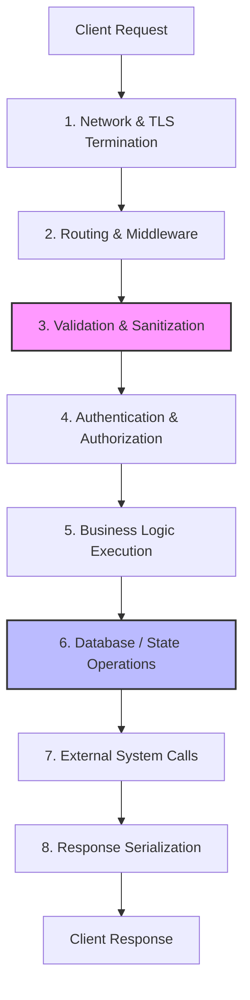
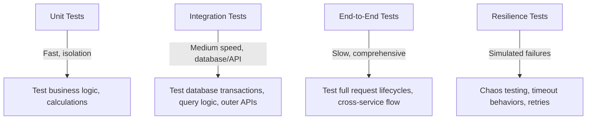

# Backend Engineering

This document establishes the architectural principles, engineering patterns, and mental models for building backend systems within Govind-OS. Unlike files that teach syntax or framework usage, this document encodes **how to think** about designing, building, and operating production-grade backend systems.

Frameworks change, libraries get deprecated, and languages shift. The principles of data flow, reliability, transactional integrity, and system decomposition remain durable across decades.

---

## Purpose

The primary purpose of backend engineering is to build reliable systems that correctly process data, enforce business rules, and provide stable, secure interfaces for users and other systems.

Backend systems should prioritize correctness, reliability, maintainability, and observability before scale and optimization.

- **The goal is not simply to make requests succeed.**
- **The goal is to build systems that continue operating correctly as complexity and load grow.**

A backend system is a custodian of state. Its design must ensure that state remains consistent, secure, and traceable under all operational conditions.

---

## Core Philosophy

When making decisions about architecture, system design, or code implementation, apply these directional preferences:

*   **Prefer correctness before performance:** A fast system that returns incorrect data is worse than a slower system that returns correct data. Establish correctness first, then optimize the verified bottlenecks.
*   **Prefer simplicity before sophistication:** Simple systems are easier to understand, debug, maintain, and scale. Choose the simplest technology, data model, and code structure that solves the problem.
*   **Prefer observability before optimization:** You cannot optimize what you do not measure. Build visibility into the system before trying to make it faster.
*   **Prefer reliability before scale:** Ensure the system behaves predictably and fails gracefully under normal or slightly elevated loads before designing for internet-scale traffic.
*   **Prefer explicit behavior before hidden behavior:** Avoid magic frameworks, implicit global state, and automatic configuration. Code should be readable and traceable from input to output.
*   **Prefer evidence before assumptions:** Do not assume a database query is slow, a cache is needed, or a specific refactor will improve performance. Use profiling, benchmarking, and metrics to prove your hypothesis.
*   **Design for maintenance, not just implementation:** Writing code takes hours or days; maintaining code takes months or years. Make decisions that favor the future reader and operator.

---

## What Makes a Good Backend Engineer

A strong backend engineer is not defined by their fluency in a specific framework's APIs. Instead, they possess a deep understanding of:

*   **Data Flow:** Tracking how data enters the system, transforms, gets stored, and is returned.
*   **Control Flow:** Understanding the execution paths, asynchronous boundaries, and error recovery channels.
*   **System Boundaries:** Knowing where their service ends and another begins, and how to define clean contracts between them.
*   **Failure Modes:** Anticipating what happens when networks drop, databases lock, disks fill, or external APIs fail.
*   **Database Behavior:** Knowing how the database stores, indexes, locks, and queries data, rather than treating it as a black-box object-relational mapping (ORM) repository.
*   **API Contracts:** Understanding how changes affect consumers and how to maintain compatibility.
*   **Performance Trade-offs:** Knowing the CPU, memory, network, and storage costs of different algorithms and system topologies.
*   **Operational Concerns:** Understanding how the code is deployed, configured, monitored, and scaled in production.

*Backend engineering is not merely writing handlers and queries. It is designing systems that behave predictably under real-world conditions.*

---

## Backend System Objectives

Every backend system should optimize for the following objectives, ordered by priority:

1.  **Correctness:** The system must process business rules accurately and preserve data integrity under all conditions.
2.  **Reliability:** The system must remain operational and behave predictably during partial outages, network issues, and minor failures.
3.  **Maintainability:** The codebase and architecture must be easy to read, test, modify, and extend by engineers other than the author.
4.  **Security:** The system must protect data against unauthorized access, validation bypasses, and common threat vectors.
5.  **Observability:** The system must emit sufficient telemetry (logs, metrics, traces) to allow operators to understand its internal state and debug issues.
6.  **Performance:** The system must respond within acceptable latency thresholds and utilize hardware resources efficiently.
7.  **Scalability:** The system must be capable of handling increased load (requests, data volume, concurrency) by adding resources.

*Scale is important, but correctness is mandatory. An ultra-scalable database that corrupts data under write load is a failure.*

---

## Request Lifecycle Thinking

To build reliable APIs, you must understand the complete lifecycle of a request from the moment it hits your server boundaries to the moment the response is returned:



### The Lifecycle Stages

1.  **Network Boundary & TLS:** The request arrives at the load balancer or reverse proxy. The connection is established, SSL/TLS is terminated, and rate limits are checked.
2.  **Routing & Middleware:** The router directs the request to the correct handler based on path and method. Middleware handles cross-cutting concerns (request logging, correlation IDs, telemetry context).
3.  **Validation & Sanitization:** The request payload, headers, and query parameters are validated against a strict schema. Malformed input is rejected immediately with a client error.
4.  **Authentication & Authorization:** The system identifies who the user is (Authentication) and verifies whether they have permission to perform this action on this specific resource (Authorization).
5.  **Business Logic:** The application domain rules are applied. This is the core engine, completely decoupled from HTTP concerns.
6.  **Database Operations:** The application reads or writes persistent state, using transactions to guarantee atomicity and isolation.
7.  **External Services:** The system interacts with other microservices, message brokers, or third-party APIs.
8.  **Response Serialization:** The domain models are converted into a stable external payload format (e.g., JSON), setting the correct headers and status codes.

*Before implementing changes, identify exactly where they affect this lifecycle and where potential failures could occur.*

---

## API Design Principles

Good APIs are designed for their consumers, not their implementers. Whether building REST, gRPC, or GraphQL APIs, follow these guidelines:

*   **Be Predictable:** Follow industry-standard conventions. Use HTTP methods correctly (`GET` for safe reads, `POST` for creation, `PUT` for complete updates, `PATCH` for partial updates, `DELETE` for removal). Return standard HTTP status codes (`2xx` success, `4xx` client errors, `5xx` server errors).
*   **Be Consistent:** Use uniform naming conventions (e.g., `camelCase` or `snake_case`), pagination patterns, error envelopes, and date formats (always use ISO 8601 UTC).
*   **Be Explicit:** Avoid default actions that cause hidden side effects. Require explicit parameters for destructive operations.
*   **Be Well-Documented:** Keep API contracts up to date using tools like OpenAPI (Swagger) or Protobuf schemas. Do not let documentation drift from actual behavior.
*   **Maintain Backward Compatibility:** Never break an existing API contract without a deprecation path and a major version change. Use API versioning (`/v1/`, headers, or content types) to isolate changes.

### Guidelines for API Contracts

*   **Define a Standard Error Envelope:**
    ```json
    {
      "error": {
        "code": "resource_not_found",
        "message": "The requested user details could not be found.",
        "details": {
          "user_id": "usr_12345"
        }
      }
    }
    ```
*   **Validate Input Strictly:** Return `400 Bad Request` or `422 Unprocessable Entity` with a list of validation failures. Never let unvalidated inputs reach your business logic.
*   **Design for Idempotency:** Allow clients to safely retry requests (especially write operations like payments or creations) by using unique idempotency keys (`Idempotency-Key` header).

---

## Data Modeling Principles

Your data model is the foundation of your system. If your data model is incorrect, your code will be complex, brittle, and prone to bugs.

*   **Reflect Business Concepts:** Database schemas and application models should use the vocabulary of the business domain.
*   **Establish Clear Ownership:** Every table or collection should have a single logical owner service. Avoid direct cross-service database access.
*   **Normalize First, Denormalize with Evidence:** Start with clean normalized relations to ensure data integrity and avoid duplicate sources of truth. Only denormalize for performance when backed by query plan benchmarks.
*   **Use Consistent Naming:** Establish conventions for tables, columns, constraints, and keys. Use clear singular or plural patterns and keep foreign keys self-documenting (e.g., `user_id` referencing the `users` table).
*   **Explicit Deletions:** Distinguish between soft deletions (`deleted_at` timestamps) and hard deletions. Soft deletions protect against accidental data loss but increase query complexity and indexing overhead. Make the choice consciously.

---

## Database Thinking

Databases are highly complex, stateful systems, not simple storage buckets. A good backend engineer designs applications around how the database actually executes tasks.

### Core Database Guidelines

*   **Understand ACID & Isolation Levels:** Understand how your database handles concurrency. Know the difference between `Read Committed`, `Repeatable Read`, and `Serializable`, and how they protect against anomalies like dirty reads, non-repeatable reads, and phantom reads.
*   **Treat Transactions as Units of Work:** A database transaction must group operations that belong to a single atomic business process. Keep transactions as short and narrow as possible to prevent lock contention, deadlocks, and connection pool exhaustion.
*   **Design Indexes Strategy:** Do not guess which indexes are needed. Indexes speed up reads but slow down writes and consume disk/memory. 
    *   Index columns used in `WHERE` clauses, `JOIN` conditions, and `ORDER BY` operations.
    *   Utilize compound indexes, but remember that the order of columns in a compound index matters.
*   **Enforce Integrity at the Database Level:** Use foreign keys, unique constraints, and check constraints. Code bugs can bypass validation, but database-level constraints act as the final line of defense against data corruption.
*   **Analyze Query Plans:** Learn to read output from `EXPLAIN` or `EXPLAIN ANALYZE` commands. Watch out for sequential table scans (`Seq Scan`) on large tables, nested loop joins, and high disk I/O costs.

---

## State Management

State introduces complexity, concurrency issues, and synchronization costs. Managing state correctly is a primary concern of backend engineering.

*   **Minimize Mutable State:** Keep services stateless wherever possible. Push mutable state into databases or transactional datastores. Stateless application servers are trivial to scale, restart, and replace.
*   **Make State Transitions Explicit:** Design state transitions as first-class domain operations. A transaction shouldn't just change a status column from `PENDING` to `COMPLETED`; it should record the event, the initiator, the timestamp, and the business reason.
*   **Keep State Transitions Predictable:** Avoid implicit status updates triggered by database hooks, background jobs, or cron triggers. Ensure state transitions are initiated by explicit commands or event handlers.
*   **Avoid Hidden Side Effects:** Functions that modify state should not perform unexpected out-of-band actions like sending emails or charging credit cards inside a database transaction. Use event publishers or transaction outbox patterns to handle side effects reliably.

---

## Caching Strategy

Caching is a performance optimization designed to reduce latency and database load. **Never use caching to fix an incorrect design or a slow database schema.**

### The Rules of Caching

1.  **Measure Bottlenecks First:** Only cache data when profiling shows that the query or calculation is a primary bottleneck.
2.  **Define an Invalidation Strategy:** The hardest part of caching is ensuring that users do not read stale or incorrect data. Choose your strategy:
    *   **Time-to-Live (TTL):** Evict data automatically after a fixed time. Use for data that is tolerably eventual-consistent.
    *   **Write-Through / Write-Aside:** Update or evict the cache key immediately whenever the underlying database record is modified.
3.  **Define Ownership:** Establish which service owns a cache key and who is allowed to write to it. Avoid shared, cross-service cache keys.
4.  **Handle Cache Penetration and Stampede:**
    *   **Cache Penetration:** Cache empty results (e.g., negative queries) to prevent clients from attacking the database by requesting non-existent records repeatedly.
    *   **Cache Stampede (Thundering Herd):** Use mutex locks or background pre-fetching to ensure that a cache miss on a hot key does not cause hundreds of concurrent requests to hit the database simultaneously.

*There are only two hard things in Computer Science: cache invalidation and naming things.*

---

## Background Processing

Never block client-facing requests to perform slow, independent operations. Move this work to asynchronous workers.

### When to Use Asynchronous Workers
*   Sending notifications (emails, SMS, push notifications).
*   Generating heavy reports, PDFs, or exports.
*   Processing video, audio, or image uploads.
*   Syncing data to third-party CRM, billing, or analytics platforms.
*   Executing periodic batch jobs (billing cycles, cleanup).

### Reliability Requirements for Queues

*   **Idempotency:** Background workers will execute jobs multiple times due to retries, network blips, or worker crashes. Every job handler must be idempotent (safe to run multiple times with the same input). Use unique transaction IDs or idempotency keys.
*   **Retry Policies with Exponential Backoff:** When an external dependency fails, do not retry immediately. Implement backoff strategies with random jitter to prevent overwhelming target systems.
*   **Dead Letter Queues (DLQ):** After a job fails a specific number of times, move it to a DLQ for manual inspection. Never let failing jobs block the entire queue.
*   **Queue Monitoring:** Monitor queue depth, worker processing latency, and error rates. If queue lag is growing, it indicates a bottleneck or system failure.

---

## Reliability Principles

In backend engineering, we assume that everything will eventually fail. We design systems to survive these failures without cascading outages.

*   **Set Timeouts Everywhere:** Never make a network call (HTTP, database, queue, cache, DNS) without a timeout. A hung external service should never lock up your application thread pool.
*   **Implement Circuit Breakers:** If an downstream service fails repeatedly, trip the circuit breaker. Stop sending requests to it immediately, return a cached or degraded response, and give the downstream system time to recover.
*   **Design for Graceful Degradation:** If the recommendation engine is down, show default items. If the search index is down, fall back to basic database querying. Keep the core user flow functional even when auxiliary services fail.
*   **Provide Liveness and Readiness Probes:**
    *   **Liveness:** Tells the orchestrator if the application process is alive or crashed.
    *   **Readiness:** Tells the orchestrator if the application is ready to accept traffic (e.g., database connection established, cache warmed up).
*   **Isolate Failures (Bulkheads):** Separate resources (thread pools, connection pools, memory) for critical paths so that a failure in a non-critical feature (like report generation) does not consume all resources and crash the core flow (like user checkout).

---

## Scalability Principles

Do not design for internet scale by default. Over-engineering for a scale you do not have introduces complexity that will slow down development and introduce bugs.

*   **Build the Correct System First:** Focus on correctness, observability, and clean architecture. Correct, clean code is vastly easier to refactor, partition, and scale when the time comes.
*   **Scale Vertically First:** Before refactoring into microservices or distributed key-value stores, look at increasing CPU, memory, and database IOPS. Vertical scaling is often the most cost-effective solution when developer hours are factored in.
*   **Scale Horizontally via Statelessness:** Ensure your application servers share no state. Load balancers should be able to route requests to any application instance.
*   **Scale the Database Intelligently:**
    *   Use **Read Replicas** to offload read queries from the primary database.
    *   Implement **Database Partitioning** (logical division of tables) or **Database Sharding** (physical distribution of tables across instances) only when write volumes exceed the capacity of a single machine.

---

## Observability Principles

A system is observable if you can understand its internal state solely by looking at its external outputs (logs, metrics, and traces). If a system cannot be observed, it cannot be reliably operated.

### The Three Pillars of Observability

| Pillar | Focus | Use Case |
| :--- | :--- | :--- |
| **Logs** | Structured records of discrete events (JSON format). | Debugging specific failures, tracking transaction history. |
| **Metrics** | Aggregated numeric values over time (e.g., CPU, latency, error rates). | Real-time monitoring, alerts, profiling system trends. |
| **Traces** | End-to-end request path across service boundaries. | Identifying bottlenecks in distributed calls, profiling execution. |

*   **Correlation IDs:** Generate a unique ID (e.g., `X-Correlation-ID`) at the entry boundary. Propagate this ID through every log message, database query, and downstream service call. This allows you to reconstruct the entire story of a single request.
*   **Actionable Alerts:** Alerts should only fire when there is an actual, user-impacting issue that requires immediate human intervention. Do not alert on transient CPU spikes or normal network hiccups.
*   **Telemetry Standards:** Standardize on vendor-agnostic frameworks (like OpenTelemetry) to prevent locking the codebase into a specific APM platform.

---

## Security Fundamentals

Assume all input is untrusted and the network is hostile. Apply defensive coding at every boundary.

*   **Sanitize and Validate Inputs:** Use strict schemas for validation. Never construct SQL queries, file paths, or shell commands using string interpolation with client input. Use parameterized queries and prepared statements to prevent SQL Injection (SQLi).
*   **Enforce Authorization at the API Entry Point:** Do not rely on clients hiding UI elements. Every API route must explicitly verify that the authenticated identity is authorized to access the specific resource requested.
*   **Encrypt Data Everywhere:**
    *   **In Transit:** Force HTTPS/TLS for all public and internal service communications.
    *   **At Rest:** Encrypt databases, backups, and file storage.
    *   **Sensitive Data:** Hash passwords using modern, secure algorithms (like Argon2 or bcrypt). Never store API keys, tokens, or personal identifiable information (PII) in plain text.
*   **Apply the Principle of Least Privilege:** Ensure your application database users, server processes, and IAM roles have only the minimum permissions required to perform their duties. The web server should not connect to the database as `root` or `superuser`.

---

## Performance Engineering

Performance engineering is a continuous process of measurement and refinement, not a one-time sprint before launch.

*   **Use Profiling Tools:** Run CPU and memory profilers under realistic loads. Identify the hot paths where allocations or lock contentions are occurring.
*   **Establish Benchmarks:** Write automated micro-benchmarks for critical algorithms or database integrations. Run them regularly to detect performance regressions.
*   **Define Service Level Objectives (SLOs):** Set clear targets for endpoint latencies (e.g., "99% of requests must complete under 200ms" - the `p99` metric).
*   **Optimize System I/O First:** In backend systems, the primary bottleneck is almost always I/O (database queries, network calls, disk access), not CPU cycles. Optimize database indexing, payload sizes, and connection pools before trying to optimize application logic.

---

## Backend Testing Strategy

A robust backend testing suite verifies the system's correctness, performance boundaries, and resilience to failures. Do not only test happy paths.



*   **Unit Tests:** Test your business logic in isolation. Mock external adapters, but keep domain logic free of mocks by using clean architecture.
*   **Integration Tests:** Test database migrations, query outputs, transaction limits, and interactions with message queues. Use containerized databases (e.g., Testcontainers) rather than mocking database drivers.
*   **Fail-Path Testing:** Ensure your tests explicitly assert that the system rejects invalid inputs, throws the correct error codes on unauthorized access, and gracefully handles database connection drops.
*   **Prevent Regression:** Write a test case for every bug fixed. The test should reproduce the bug and verify that the code change prevents it.

---

## Distributed Systems Awareness

As systems grow from single monoliths to multiple services, coordination costs and failure rates rise. Understand these trade-offs before introducing distributed complexity.

*   **CAP Theorem Realities:** A distributed system can guarantee at most two of: Consistency, Availability, and Partition Tolerance. When network partitions occur, you must decide whether to return errors (favor Consistency) or accept stale data (favor Availability).
*   **Embrace Eventual Consistency:** In distributed environments, maintaining immediate strong consistency across services is incredibly expensive. Design system domains to accept eventual consistency using message brokers, saga patterns, and reconciliation jobs.
*   **Beware of Network Latency:** Every remote call (HTTP, gRPC, DB query) is orders of magnitude slower than a local in-memory function call. Keep call graphs shallow. Avoid distributed loops where a service requests data in a loop from another service.
*   **Distributed Consensus is Expensive:** Avoid building custom distributed locking, leader elections, or coordinated transactions. Rely on proven distributed systems (like ZooKeeper, Consul, or Raft-backed databases) if consensus is strictly required.

---

## Trade-Off Thinking

Backend engineering is the art and science of trade-off management. There is rarely a single, perfect architectural decision; every choice carries a cost in complexity, operational overhead, performance, or development time.

### Common Engineering Trade-Offs

*   **Consistency vs. Availability:** In the presence of network partitions, you must choose whether to prioritize returning the most up-to-date data at the cost of error rates (Consistency), or returning stale data to ensure the service remains responsive (Availability).
*   **Latency vs. Correctness:** High-accuracy computations or absolute data consistency (e.g., cross-checking distributed ledgers) take time. You must weigh the acceptable user response times against the necessity of real-time correctness.
*   **Simplicity vs. Flexibility:** Building a generic, highly pluggable system introduces abstraction overhead and cognitive load. Keep systems simple until the need for flexible extension is proven by multiple use cases.
*   **Performance vs. Maintainability:** Highly optimized code (e.g., manual memory management, custom caching layers, dense bitwise operations) is often harder to read, debug, and maintain. Write clean, readable code first, and only sacrifice maintainability where measurable bottlenecks demand it.
*   **Development Speed vs. Technical Debt:** Rushing a feature to production by bypassing proper data modeling, testing, or API design allows immediate delivery but compromises future velocity. Balance short-term business constraints with long-term system stability.

The objective is not to find a compromise that pleases everyone, but to make informed, deliberate trade-offs that align with the specific system requirements and business constraints.

*Always document significant trade-offs and the rationale behind them in Architecture Decision Records (ADRs) or directly in code comments.*

---

## Open Source Backend Engineering

When designing backend features or libraries meant for open source consumption, you must adhere to higher standards of contract stability and developer usability:

*   **Maintain Stable Public APIs:** The public surface of your library or module should be as small as possible. Use language-specific access controls (e.g., private structures, internal modules) to prevent users from binding to implementation details.
*   **Graceful Deprecation Paths:** Never remove or modify a public method signature without warning. Deprecate the method, document the replacement, and keep it functional for at least one major release.
*   **Extensibility via Dependency Injection:** Allow users of your package to swap out default implementations (e.g., custom loggers, cache adapters, metric exporters) by defining clean interface contracts.
*   **Conventions Over Configuration:** Choose sensible defaults that work for 80% of use cases, while offering detailed configuration parameters for advanced developers.

---

## AI-Assisted Backend Development

AI tools accelerate backend development, but they lack architectural foresight, system context, and deep operational accountability.

*   **AI Strengths:** Use AI to draft initial boilerplate, construct test fixtures, review API schemas for consistency, explain legacy code pathways, and suggest alternative refactoring options.
*   **AI Limitations:** Never blindly copy and paste AI-generated code, especially in critical areas like security boundary checks, concurrency handlers, and database transactions.
*   **Review Process:** Treat AI output with the same skepticism you would apply to code written by an unverified junior engineer. Audit it for performance bottlenecks, edge cases, error handling, and security vulnerabilities before merging.
*   **Retain Architectural Ownership:** Do not ask AI to design your system topology. Establish the core interfaces, domain boundaries, and data flows yourself, then use AI to help implement the details within those boundaries.

---

## Common Backend Anti-Patterns

Avoid these common architecture and implementation pitfalls:

*   **Fat Handlers:** Placing business logic, database queries, and validation directly inside the API route handlers. Keep handlers lean; they should only parse inputs, call domain services, and format outputs.
*   **Business Logic in Controllers or Models:** Spreading business rules across controllers, database models, or repository layers. Business logic belongs in pure domain services.
*   **N+1 Database Queries:** Querying a list of records and then issuing another query inside a loop for each record to fetch its relations. Always utilize database joins or batch queries (`IN` clauses).
*   **Silent Failures:** Catching exceptions or errors and swallowing them, or returning success responses when the operation failed. Log the error and fail explicitly.
*   **Global Mutable State:** Relying on global variables, singletons with write access, or process memory to store request-scoped data. This causes race conditions and makes scaling horizontally impossible.
*   **Premature Microservices:** Splitting a system into microservices before understanding the domain boundaries and organizational needs. Start with a clean modular monolith.
*   **Cache-First Design:** Directing database writes to a cache first and relying on cache-aside replication without verifying transactional safety. Always treat the database as the primary source of truth.

---

## Continuous Improvement

Backend engineering is an evolutionary process. Every incident, bug, and performance degradation is an opportunity to improve the system:

*   **Blameless Post-Mortems:** When a production incident occurs, focus on *why* the system allowed the failure to occur, not *who* made the mistake. Document the timeline, the root cause, the impact, and the preventive actions.
*   **Automate Guardrails:** Instead of relying on human memory to prevent bugs, codify lessons. Add static analysis (linters), security scanners, schema validation tests, and CI/CD checks to prevent repeat failures.
*   **Refine the Guidelines:** As the systems grow and you learn new lessons, update this document. Ensure that the collective experience of building Govind-OS is compiled and passed down to future contributors.
