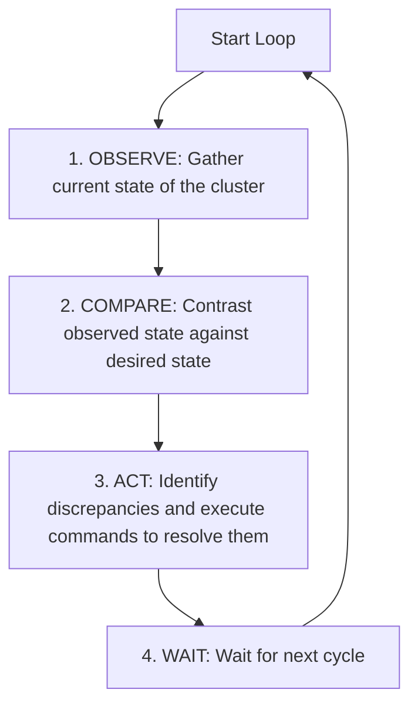

# Cloud Native Engineering Guide

This document defines the architectural philosophies, operational patterns, and design principles that shape cloud-native systems within Govind-OS. It serves as the foundational mental model before exploring specific container orchestration platforms like Kubernetes, registries like Harbor, or runtime engines like containerd.

Cloud native is not a specific piece of software. It is a system architecture and engineering mindset designed to handle rapid change, continuous growth, and inevitable failures in modern infrastructure.

---

## Purpose

The primary purpose of cloud-native engineering is to build systems that are resilient, scalable, observable, and adaptable in dynamic, high-velocity environments.

- **Cloud-native systems must tolerate constant change, infrastructure failures, and rapid growth without requiring extensive manual human intervention.**
- **The goal is not simply to deploy software; the goal is to build systems that operate reliably and self-heal under continuous change.**

An application is not "cloud native" simply because it runs in a virtual machine in the cloud. It must be designed from the ground up to embrace ephemeral hardware, dynamic networking, and automated lifecycles.

---

## Core Philosophy

When building or operating cloud-native systems, apply these core values:

*   **Prefer automation over manual processes:** Infrastructure provisioning, scaling, testing, and deployment must be codified and automated.
*   **Prefer declarative systems over imperative operations:** Tell the platform *what* the system state should look like, not *how* to construct it.
*   **Prefer resilience over perfect uptime assumptions:** Design applications assuming the underlying nodes, networks, and databases will fail.
*   **Prefer observability over guesswork:** Instrument applications from day one to expose metrics, logs, and traces.
*   **Prefer immutable deployments over in-place modification:** Never patch running servers or containers. Deploy a new, immutable image and destroy the old one.
*   **Prefer self-healing systems over manual recovery:** Build loops that monitor system health and automatically restart, reschedule, or scale components.
*   **Design for failure:** Assume failure is a regular occurrence, not an anomaly.

---

## What Cloud Native Means

Cloud native is an architectural approach to designing, building, and operating workloads.

### Cloud Native Is Not:
*   Kubernetes, Docker, or containerd.
*   Amazon Web Services (AWS), Google Cloud (GCP), or Microsoft Azure.
*   A specific software vendor or tool.

### Cloud Native Is:
The practice of designing systems that:
*   **Scale Horizontally:** Handle load changes by spawning or destroying stateless application instances.
*   **Recover Automatically:** Re-route traffic, restart crashed processes, and reschedule workloads on healthy nodes without human intervention.
*   **Operate through Automation:** Utilize CI/CD pipelines, GitOps configurations, and Infrastructure as Code (IaC).
*   **Remain Observable:** Emit structured logs, aggregate metrics, and propagate tracing headers to explain their current health.
*   **Adapt to Changing Environments:** Scale up during traffic spikes, scale down during quiet periods, and tolerate nodes being removed from the network cluster.

---

## Why Cloud Native Exists

Cloud-native patterns emerged to address the physical and operational limitations of traditional IT systems:

| Architectural Metric | Traditional Systems | Cloud-Native Systems |
| :--- | :--- | :--- |
| **Deployment Model** | Manual copy, custom scripts, SSH-based patches. | Automated CI/CD pipelines, immutable container images. |
| **Infrastructure** | Static physical servers or long-running, customized VMs. | Ephemeral, declared infrastructure (containers/autoscaling nodes). |
| **Scaling** | Vertical (upgrading hardware). High cost, physical limits. | Horizontal (adding instances). Dynamic, auto-scalable. |
| **Recovery** | Manual intervention, pagers, human-driven diagnostics. | Automated self-healing, health-probes, orchestrators. |
| **Configuration** | In-place config edits, snowflake configurations. | Declarative configuration versioned in Git (GitOps). |

As businesses required faster feature delivery and higher availability under massive traffic, the overhead of managing static, snowflake infrastructure became unsustainable. Cloud-native systems automate these operational boundaries.

---

## Cloud Native Principles

Every cloud-native system should implement these seven fundamental principles, regardless of the tools used:

1.  **Automation:** Eliminate manual tasks. Code templates govern infrastructure, pipelines verify code, and scripts trigger deployments.
2.  **Immutability:** Once an artifact (container image, VM template) is built, it is never modified. Changes require building and deploying a new version.
3.  **Declarative Configuration:** Define the desired end-state in structured configuration files (YAML, JSON). The platform handles the steps required to achieve that state.
4.  **Observability:** Provide external visibility into internal operations through structured logs, aggregated metrics, and distributed traces.
5.  **Resilience:** Incorporate circuit breakers, timeouts, retries, and fallbacks to prevent local errors from causing cascading global outages.
6.  **Scalability:** Separate application state from compute logic to allow stateless components to scale horizontally.
7.  **Self-Healing:** Continuously monitor running services. If a component fails or drifts from the desired state, automatically repair or replace it.

---

## Desired State Thinking

Cloud-native systems are built entirely around desired state management. 

Instead of asking:
> *"How do I make the system perform this action?"* (Imperative Thinking)

you must ask:
> *"What should the system look like when it is healthy?"* (Declarative Thinking)

### Core Desired State Concrete Examples
*   **Replicas:** There should be exactly 3 application container instances running.
*   **Databases:** A PostgreSQL cluster should always have 1 read-write primary coordinator and 2 streaming standbys.
*   **Networking:** Traffic on port 80 should always route to the container instances labeled with `app: frontend`.
*   **Resource Allocation:** Each instance should be bounded by 512MB RAM and 0.5 CPU cores.

Once the desired state is defined, the underlying cloud-native platform uses reconciliation loops to constantly observe the current state and perform actions to align it with your declared goals. 

*Desired state thinking is the single most important mental model in cloud-native engineering. It shifts the operator's responsibility from manual execution to target declaration.*

---

## Containers

Containers are the primary packaging unit of cloud-native applications. They package application code, system libraries, dependencies, and runtime configurations into a single, highly portable, immutable image.

*   **Consistency:** A container image runs identically on a developer's laptop, a staging server, or a production cluster.
*   **Isolation:** Containers run in isolated user spaces on a shared OS kernel, preventing conflicts between application dependencies.
*   **Open Container Initiative (OCI):** The CNCF ecosystem adheres to OCI standards, ensuring that images built by any tool (Docker, Buildpacks) can run on any compliant container runtime.
*   **Runtime Layers:**
    *   **containerd:** A lightweight, high-performance container runtime daemon that manages the complete container lifecycle (pulling images, execution, storage, network attachments).
    *   **Docker:** A developer-friendly tool suite utilized for building, running, and debugging container images locally.

*Containers simplify packaging and deployment; they do not fix poorly designed software architectures.*

---

## Immutable Infrastructure

In traditional environments, servers are treated as "Snowflakes" or "Pets"—they are manually patched, upgraded, and configured in place. Over time, this creates **configuration drift**, where staging and production environments behave differently.

Cloud-native systems treat infrastructure as "Cattle" using **Immutable Infrastructure**:
*   If a container or node requires a security patch or software upgrade, **never SSH in to modify it.**
*   Build a new container image containing the patch.
*   Deploy the new container, redirect network traffic to it, and destroy the old instance.
*   This guarantees that every deployed instance is a clean, verified copy of the declared image, eliminating environment drift and ensuring predictable deployments.

---

## Declarative Systems

Cloud-native platforms operate on a declarative model rather than an imperative model:

*   **Imperative Model (Instructional):** "Create a server, download this zip file, install Node.js, update this config file, and start the app on port 8080."
*   **Declarative Model (Goal-Oriented):** "There should be 3 replicas of the `user-service:v1.2` container running, utilizing 500m CPU, and exposing port 8080."

In a declarative system, you state the **desired state** of the application. The underlying orchestrator (e.g., Kubernetes) takes responsibility for the **convergence process**—performing whatever tasks are necessary to make the current state match the desired state.

*Declarative configuration enables GitOps: storing your desired infrastructure state in Git repositories, allowing you to track, review, and roll back system configurations using standard version control workflows.*

---

## Reconciliation Loops

Declarative systems achieve convergence through the continuous execution of **Reconciliation Loops** (also known as Control Loops).

### Examples of Reconciliation Loops
*   **Kubernetes ReplicaSet Controller:** If the desired state declares 3 replicas, and the observer detects only 2 running (due to a node crash), the controller immediately executes a command to schedule a new container instance.
*   **GitOps (e.g., ArgoCD):** Compares the configuration files in a Git repository (desired) against the running state in a Kubernetes cluster (current). If a developer manually edits a service in production, the reconciliation loop automatically overwrites the change to match Git.

---

## Service Discovery

In a cloud-native cluster, container instances are ephemeral—they are created, rescheduled, and destroyed continuously, meaning their IP addresses are constantly changing.

*   **Avoid Static Routing:** Never hardcode IP addresses or configure static host mappings to connect services.
*   **Dynamic Registries:** Use Service Discovery mechanisms. When a container starts, it registers its IP and port with a dynamic registry (e.g., CoreDNS in Kubernetes or Consul).
*   **Logical DNS:** Services resolve dependencies using logical names (e.g., `http://payment-service/checkout`). The platform's DNS automatically translates the name into the active, healthy IP addresses of the destination instances.

---

## Configuration Management

To maintain immutability, application code must be strictly separated from configuration variables:

*   **Twelve-Factor App Pattern:** Configuration variables that change across environments (database connection strings, API keys, cache URLs) must be injected at runtime, not compiled into the image.
*   **Injection Methods:** Use environment variables, ConfigMaps, or secure secret volumes.
*   **Secrets Isolation:** Never commit passwords, TLS certificates, or encryption keys to Git or bake them into container images. Inject them via specialized secret managers at runtime.

---

## Scalability Philosophy

Cloud-native systems scale horizontally rather than vertically.

*   **Horizontal Scaling (Scale Out):** Adding more instances of a service (e.g., running 10 copies of a container instead of 2).
*   **Statelessness:** To scale horizontally, application instances must be stateless. They should not store user session data or transactional states in local memory.
*   **Distributed State:** All mutable state must be pushed to reliable, external distributed datastores (databases, caches, queues). This allows load balancers to route requests to any container instance safely.

---

## Reliability Philosophy

In cloud-native architectures, we accept that individual hardware nodes and network routes are cheap, disposable, and prone to failure.

*   **Design for Node Loss:** If a physical rack loses power or a VM crashes, the system must survive.
*   **Dynamic Rescheduling:** The platform must detect the lost node, identify the workloads that were running on it, and automatically reschedule them on remaining healthy nodes.
*   **Graceful Terminations:** Applications must listen for termination signals (like `SIGTERM`). When received, the process must stop accepting new connections, finish processing active requests, and exit cleanly within a defined grace period.

---

## Resilience Engineering

Resilience is the system's capacity to absorb shocks and continue functioning.

*   **Retries with Backoff:** Client services must retry network calls when encountering transient errors, using exponential backoff to avoid overloading downstream services.
*   **Circuit Breakers:** Prevent cascading failures. If a downstream API is failing consistently, the caller should trip the circuit breaker and return a degraded fallback response immediately without making the network call, saving CPU and thread resources.
*   **Bulkhead Pattern:** Isolate workloads. A failure in an analytics reporting system should never consume the threads or memory required by the core checkout system.

---

## Observability

In a distributed cloud-native cluster, you cannot log into a single host to debug a failure. You must construct an observability pipeline.

### The Standard Observability Stack

*   **OpenTelemetry:** An open-source, vendor-neutral standard providing SDKs and APIs to instrument applications to emit logs, metrics, and traces.
*   **Prometheus:** A time-series database optimized for scraping, storing, and querying numerical metrics (e.g., requests per second, error rates, CPU load).
*   **Grafana:** A visualization engine used to build dashboards and alerts based on telemetry data.

*Observability is not a post-deployment addition. It is core operational infrastructure.*

---

## Platform Engineering

Platform Engineering is the practice of designing and building toolchains and workflows that enable self-service capabilities for software engineering teams.

*   **Internal Developer Platform (IDP):** Creating standard, reusable templates for APIs, CI/CD pipelines, and infrastructure provisioning.
*   **Standardization & Guardrails:** Enforcing organization-wide security, cost, and reliability guardrails automatically inside developer workflows.
*   **Reducing Cognitive Load:** Shielding application developers from the complex details of raw infrastructure configurations, allowing them to focus on business logic.

---

## Kubernetes and Cloud Native

It is critical to distinguish the architecture from the tool:

*   **Cloud Native is the Philosophy:** The set of principles (declarative state, immutability, reconciliation, self-healing, resilience) that govern how modern applications should behave.
*   **Kubernetes is the Orchestrator:** One specific, highly successful implementation platform that enforces cloud-native principles out of the box.

*Do not study Kubernetes APIs, commands, or manifests without first understanding the underlying cloud-native philosophies. A Kubernetes cluster running pet-like, mutable, un-monitored stateful applications is not a cloud-native system.*

---

## Cloud Native Security

Cloud-native security requires securing the entire lifecycle of the application—from code to execution (often called Shift-Left Security):

*   **Supply Chain Security:** Scan container images for vulnerabilities (CVEs) during the build process using tools like Trivy.
*   **Harbor Registry:** Utilize secure registries to store images, sign them (cosign/Notary) to verify authenticity, and enforce security policies preventing the deployment of un-scanned or high-vulnerability images.
*   **Least Privilege Execution:** Never run container processes as the `root` user. Restrict container filesystem permissions (read-only root filesystems) and limit kernel capabilities.

---

## Open Source Cloud Native Ecosystem

To master cloud-native engineering, study the architectures of established CNCF (Cloud Native Computing Foundation) projects:

*   **Harbor:** An open-source container registry that manages, scans, and replicates container artifacts safely across clusters.
*   **containerd:** The execution layer that interacts directly with host kernels to run containers.
*   **OpenTelemetry:** The universal API for collecting and propagating application trace and metric telemetry.
*   **Envoy:** A high-performance service proxy designed for cloud-native service meshes.
*   **CloudNativePG:** An operator that automates PostgreSQL clustering, backups, and failovers within Kubernetes using declarative state.

---

## AI-Assisted Cloud Native Engineering

AI can act as an operational copilot for cloud-native engineers:

*   **Configuration Auditing:** Use AI to review Kubernetes manifests, Dockerfiles, and Helm charts for security violations, resource limits, and anti-patterns.
*   **Telemetry Assistance:** Ask AI to write PromQL queries, draft Grafana alert rules, or suggest OpenTelemetry instrumentation hooks for your backend code.
*   **Root Cause Analysis:** Pass anonymized container crash logs or trace spans to AI to identify failure patterns or configuration issues.

*AI should assist with discovery and boilerplate drafting; human engineers retain final responsibility for production configurations and deployments.*

---

## Common Anti-Patterns

Avoid these common cloud-native mistakes:

*   **The Containerized Pet (Violating Immutability):** Running applications that write persistent data directly to their local container filesystem, or SSH'ing into running containers to edit configurations or debug code.
*   **Noisy Neighbor Starvation (Missing Resource Limits):** Deploying containers without declaring memory and CPU request and limit parameters, allowing a single leaking container to starve and crash adjacent workloads on the shared node.
*   **Kubernetes-First Thinking:** Deploying simple, low-traffic applications into a complex Kubernetes cluster when a simple serverless engine or single VM would suffice. Match the tool to the scale.
*   **Manual Deployment Steps:** Keeping manual verification, provisioning, or deployment steps in your release lifecycle, violating the principle of automated, reproducible delivery.
*   **Treating Cloud-Native as a Vendor Product:** Assuming that buying a specific cloud service or software suite automatically makes your architecture resilient and scalable.

---

## Continuous Improvement

Operating cloud-native systems is an evolutionary cycle:

*   **Automate incident lessons:** When a service crashes or scaling fails, do not just restart it. Write tests, adjust reconciliation parameters, tune health probes, or modify resource limits to prevent recurrence.
*   **Conduct regular game days:** Intentionally run chaos engineering experiments (e.g., terminating pods or dropping network links) in staging environments to verify that your self-healing loops and circuit breakers perform as designed.
*   **Share architectural updates:** As your platform evolves, update these principles to capture new organizational standards and patterns.
