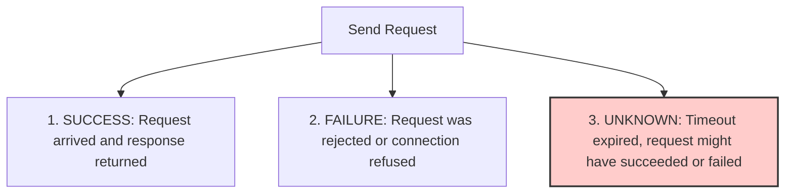
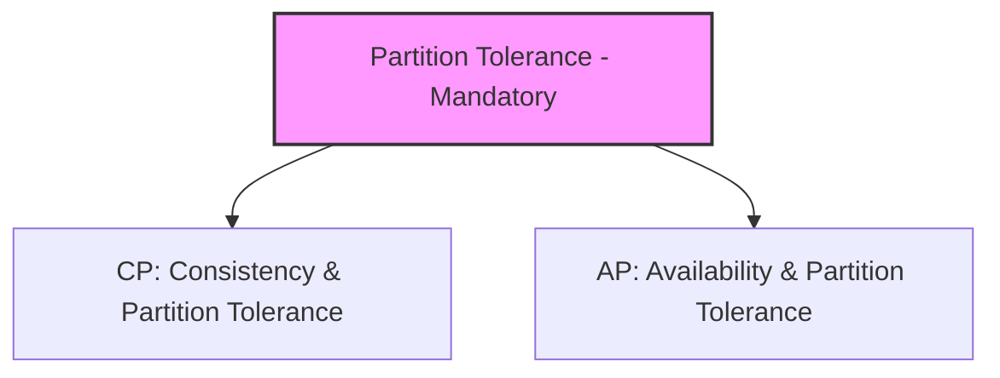

# Distributed Systems Engineering Handbook

This document serves as the core architectural handbook for building, understanding, and operating distributed systems within Govind-OS. It is designed to build a durable mental model of distributed computation, data replication, consensus, and fault tolerance—concepts that sit at the absolute center of modern cloud-native systems (Kubernetes, etcd, Harbor, NATS, and PostgreSQL replication).

Languages, runtimes, and frameworks change. The fundamental challenges of networks, state synchronization, physical time boundaries, and consensus remain permanent.

---

## Purpose

The purpose of distributed systems engineering is to build systems that continue functioning correctly when computation, storage, and communication are spread across multiple physical machines.

Distributed systems exist to solve scale, availability, and fault-tolerance challenges that cannot be resolved on a single node. 

- **The goal is not merely to connect multiple servers.**
- **The goal is to build systems that behave predictably despite network failures, high latency, clock drift, and partial node crashes.**

A distributed system is a collection of independent components that appear to its users as a single coherent system. Achieving this illusion requires rigorous handling of uncertainty.

---

## Core Philosophy

When designing or analyzing a distributed architecture, operate under these core assumptions:

*   **Assume failures are normal:** Hardware degrades, VMs get rescheduled, network switches fail, and disks corrupt. Design systems that expect nodes to die at any moment.
*   **Assume networks are unreliable:** Packets will be dropped, delayed, duplicated, or reordered. Never assume a request succeeded simply because you did not receive a timeout.
*   **Assume latency exists:** Network boundaries impose physical limits speed-wise. Do not treat remote calls like local in-memory function calls.
*   **Assume clocks disagree:** Computers disagree on physical time. Never use a server's wall-clock time to determine the absolute order of events.
*   **Prefer simplicity before distribution:** Avoid distributing components unless physical capacity or reliability constraints force you to. A single, well-optimized database instance is vastly easier to operate than a sharded cluster.
*   **Prefer proven patterns before innovation:** Rely on established protocols (Raft, Paxos, 2PC, Saga) rather than trying to write a custom distributed consensus algorithm.
*   **Design for recovery, not perfection:** Do not attempt to prevent all failures. Instead, prioritize automated self-healing, state reconciliation, and fast recovery paths.

---

## Why Distributed Systems Exist

Single physical machines have immutable physical limits:

*   **Compute (CPU):** A single motherboard can host only a finite number of cores.
*   **Memory (RAM):** Memory channels and hardware chassis limit the maximum addressable RAM.
*   **Storage (I/O):** Drive buses and controllers limit read/write throughput and storage capacity.
*   **Availability:** A single machine is a Single Point of Failure (SPOF). If its power supply dies, the entire system is down.

Distributed systems allow workloads to exceed these physical limitations by scaling out horizontally across multiple nodes.

*Distribution is a mechanism for scaling resources and ensuring reliability; it is never an architectural goal in itself. It is a cost paid to achieve scale.*

---

## Fundamental Realities

Distributed engineering introduces unique challenges that do not exist in local programming environments:

| Challenge | Local Environment | Distributed Environment |
| :--- | :--- | :--- |
| **Memory Access** | Shared memory space, instant access. | Message passing over network packets. |
| **Execution** | Single failure domain (process is either alive or dead). | Partial failure (some nodes are active, some are dead, others are lagging). |
| **Latency** | Nanosecond-level, predictable. | Millisecond-level, highly variable and non-deterministic. |
| **Message Ordering** | Deterministic (sequential code execution). | Arbitrary reordering, loss, and duplication of messages. |
| **Time Sync** | Single system clock source. | Clock drift across nodes (up to hundreds of milliseconds). |

These constraints are not anomalies or edge cases. They are the baseline operating conditions of a distributed system.

---

## System Objectives

Distributed systems seek to optimize for several competing objectives:

1.  **Fault Tolerance:** The ability of the system to continue operating correctly in the presence of node crashes or network disconnections.
2.  **High Availability:** Guaranteeing that the system is responsive and operational from the user's perspective, even during partial failures.
3.  **Horizontal Scalability:** The capacity to increase overall throughput or storage capacity proportionally by adding standard hardware nodes.
4.  **Data Durability:** Ensuring that once data is acknowledged as written, it will not be lost under any combination of power outages or drive failures.
5.  **Operational Simplicity:** Minimizing the cognitive load and complexity required for human operators to deploy, monitor, and debug the system.

---

## Distributed Systems Building Blocks

All distributed systems are constructed from a set of basic components:

*   **Nodes:** The units of compute (containers, VMs, bare metal servers) that execute logic.
*   **Services:** Logical groups of applications running on nodes, exposing API boundaries.
*   **Networks:** The physical or virtual connections that carry messages between nodes.
*   **Queues:** Buffers that temporarily store messages to decouple producers and consumers.
*   **Replicas:** Copies of the same data or state machine maintained across different nodes.
*   **Load Balancers:** Routers that distribute traffic across nodes to prevent saturation.
*   **Consensus Systems:** Specialized engines (like `etcd`) that provide a single, highly available source of truth for cluster state and metadata.

*Understanding how these components coordinate and fail together is the core of distributed systems design.*

---

## Network Thinking

In a distributed system, the network is the ultimate constraint. It is asynchronous, congested, and untrusted.

### The Three-Value Logic of Networks

When you make a network request, there are three possible outcomes:

If a request times out, you cannot tell if:
*   The request never reached the destination server.
*   The destination server crashed while executing the request.
*   The response was sent but got lost on its way back to you.

### Defensive Network Guidelines

*   **Enforce Timeouts:** Never allow a network socket read or write to block indefinitely. Set connection timeouts and read timeouts on every client.
*   **Retry with Exponential Backoff and Jitter:** When retrying failed requests, double the wait time between retries to give the receiving system time to recover. Add random variance (jitter) to prevent all retrying clients from hammering the server at the exact same millisecond (thundering herd).
*   **Utilize Circuit Breakers:** If downstream calls fail consistently, trip the breaker. Fail fast immediately at the caller level to conserve resources and avoid cascading failures.

---

## Consistency Models

Consistency defines the rules for what data values a reader can observe after writes have occurred.

*   **Strong Consistency (Linearizability):** Every read operation must return the value of the most recent write, regardless of which node is queried. It provides the illusion of a single global copy of the data, but requires heavy coordination and increases latency.
*   **Eventual Consistency:** Replicas receive updates asynchronously. If no further writes occur, all replicas will eventually converge to the same value. Writes are fast and available, but readers may observe stale data in the interim.
*   **Read-Your-Writes Consistency:** A subset of eventual consistency where a client is guaranteed to always see their own updates immediately, even if other clients do not see them yet.
*   **Causal Consistency:** Operations that are causally related must be seen in the same order by all nodes. Independent operations can be reordered safely.

*Coordination Rule: Stronger consistency requires more network coordination, which directly increases latency and decreases system availability.*

---

## Availability Thinking

Availability measures the system's ability to respond to user requests. However, **availability is not the same as correctness.**

*   A system can be highly available but return incorrect, empty, or stale data.
*   For example, during a database outage, a web service might return cached user profiles from 24 hours ago. The service is "available," but the data is stale.
*   **Service Availability:** The API responds with success codes (`2xx`).
*   **Data Availability:** The most up-to-date state of a resource is readable and writable.

*When designing for high availability, always determine the acceptable level of data staleness or service degradation during an outage.*

---

## CAP Theorem

The CAP Theorem states that a distributed datastore can simultaneously guarantee at most two of the following three properties:

*   **Consistency (C):** Every read receives the most recent write or an error (equivalent to linearizability).
*   **Availability (A):** Every non-failing node returns a non-error response for every request (no errors or timeouts).
*   **Partition Tolerance (P):** The system continues to operate despite an arbitrary number of messages being dropped or delayed by the network between nodes.

### The CAP Reality Check

You cannot choose "CA." Network partitions (P) are a physical reality of running systems on real networks. Therefore, when a network partition occurs, you must choose between:

*   **Consistency (CP):** Block the request or return an error because you cannot guarantee the local node has the latest cluster state. Choose this for financial data, state orchestration, or configuration systems.
*   **Availability (AP):** Process the request locally and return whatever data is available, accepting that it may be stale or conflict with other nodes. Choose this for social feeds, analytics, or shopping carts.

*CAP is a trade-off framework to help you choose your system's behavior during a network failure. It is not a design blueprint.*

---

## Data Replication

Replication copies data across multiple nodes to ensure durability, high availability, and read performance.

### Replication Topologies

*   **Leader-Follower (Active-Passive):** All writes go to a single designated leader node. The leader records the write and sends it to followers (replicas) via a replication log.
    *   *Pros:* Easy to reason about, prevents write conflicts.
    *   *Cons:* Leader is a write bottleneck and a SPOF during failovers.
*   **Multi-Leader (Active-Active):** Writes can be accepted by multiple leader nodes (often spread across different geographic regions). Leaders synchronize updates asynchronously.
    *   *Pros:* Low write latency across regions, survives regional outages.
    *   *Cons:* Introduces write conflicts that must be resolved (e.g., using CRDTs or Last-Write-Wins).
*   **Leaderless (Dynamo-style):** Writes are sent directly to multiple nodes without a centralized coordinator. Reads query multiple nodes to detect stale data.
    *   *Quorum Rules:* For a cluster of $N$ nodes, if you write to $W$ nodes and read from $R$ nodes, you are guaranteed to read the latest write if $W + R > N$.

---

## Partitioning & Sharding

When a dataset is too large to fit on a single disk or write volume exceeds a single node's throughput, the data must be divided.

*   **Partitioning (Horizontal):** Splitting a table or collection by rows.
*   **Sharding:** Distributing these partitions across multiple physical database nodes.

### Sharding Routing Strategies

*   **Hash-Based Sharding:** Apply a hash function to a shard key (e.g., `hash(user_id) % number_of_shards`) to determine where the data lives.
    *   *Pros:* Distributes data and write load evenly.
    *   *Cons:* Adding or removing shards requires reshuffling data. This is mitigated by using **Consistent Hashing**.
*   **Range-Based Sharding:** Group data by ranges of a key (e.g., `A-D` on shard 1, `E-H` on shard 2).
    *   *Pros:* Highly efficient for range queries.
    *   *Cons:* Can create severe hot spots (e.g., if all new users have IDs starting with the same prefix).

---

## Distributed Transactions

Distributed transactions guarantee ACID properties across multiple independent databases or services.

### Two-Phase Commit (2PC)

A blocking protocol where a coordinator manages participant nodes:
1.  **Prepare Phase:** Coordinator asks all participants if they are ready to commit the transaction. Participants acquire local locks and write to undo/redo logs, replying with `Yes` or `No`.
2.  **Commit Phase:** If all participants reply `Yes`, the coordinator sends a `Commit` command. If any participant replies `No` or times out, the coordinator sends a `Rollback` command.
    *   *Critical Risk:* If the coordinator crashes midway through the commit phase, participants remain blocked, holding local resource locks indefinitely.

### The Saga Pattern

Rather than holding global locks, a Saga decomposes a distributed transaction into a series of local transactions:
*   Each service executes its local transaction and publishes an event.
*   If a step fails, the Saga orchestrator or participants execute **compensating transactions** in reverse order to undo the changes.
*   *Outcome:* Achieves eventual consistency without locking database rows across the entire system.

---

## Consensus Systems

Consensus is the core foundation of distributed state. It allows a cluster of nodes to agree on a sequence of values or state changes, even when some nodes fail or networks partition.

### Raft Consensus Protocol

Raft simplifies consensus by splitting it into three subproblems:

1.  **Leader Election:** The cluster elects a single leader node using randomized timers. Nodes act as Leader, Follower, or Candidate. If followers stop receiving heartbeats from the leader, they initiate a new term and vote.
2.  **Log Replication:** The leader receives client requests, appends them to its log, and replicates them to the followers. The leader commits the log entry only after a majority of followers acknowledge it.
3.  **Safety:** If a node's log is less up-to-date than a majority of the cluster, it cannot be elected leader. This guarantees that committed logs are never overwritten.

### Consensus in Cloud-Native Infrastructure

Consensus systems are not meant to store high-volume application data. They are designed for critical metadata:
*   **etcd:** Uses Raft to back the Kubernetes control plane, storing configuration, secrets, and pod states.
*   **Consul:** Uses Raft for service discovery, configuration lock coordination, and health checks.

*Consensus requires a quorum ($N/2 + 1$). A 3-node cluster can survive 1 failure; a 5-node cluster can survive 2 failures. Even-numbered clusters (like 4 nodes) add complexity without improving fault tolerance.*

---

## Event-Driven Architecture

In Event-Driven Architecture (EDA), services communicate asynchronously by publishing and consuming events representing state transitions.

*   **Loose Coupling:** Publishers require no knowledge of who consumes their events, or how many consumers exist.
*   **Scalability:** Workloads can be deferred and processed asynchronously by downstream workers.
*   **Event Ordering Challenge:** Since events are processed asynchronously, maintaining order is difficult. 
    *   Use **partition keys** (e.g., routing all events for a specific `user_id` to the same queue partition) to guarantee sequential ordering for that resource.

---

## Message Queues

Message queues act as the transport layer for event-driven systems, buffering messages between producers and consumers.

### Major Queue Types

*   **Log-Based (e.g., Apache Kafka):** Messages are appended to an ordered log on disk. Consumers track their own read position (offset). Multiple consumers can read the same stream independently. Excellent for high-throughput analytics and replayability.
*   **Broker-Managed (e.g., RabbitMQ):** The broker routes messages to queues and tracks delivery state. Once a message is acknowledged by a consumer, it is deleted from the queue. Great for task distribution and complex routing.
*   **Lightweight Pub/Sub (e.g., NATS):** Extremely fast, in-memory, lightweight messaging system designed for cloud-native microservices, supporting pub/sub, request-reply, and key-value storage.

### Delivery Guarantees

*   **At-most-once:** Messages may be lost but are never duplicated.
*   **At-least-once:** Messages are guaranteed to be delivered but may be duplicated due to network retries. **This is the industry standard.**
*   **Exactly-once:** Effectively achieved by combining at-least-once delivery with idempotent consumers that deduplicate incoming requests.

---

## Failure Handling

Distributed systems fail partially. Your code must isolate these failures to prevent them from cascading.

*   **Graceful Degradation (Fallback):** If a non-essential service is down, fall back to a default value. For example, if the recommendation system fails, display the top 10 most popular items instead of throwing a `500 Server Error`.
*   **Bulkhead Pattern:** Partition your system's resources (thread pools, memory, sockets) so that a failure in one area does not starve another. The payment thread pool should be isolated from the avatar upload thread pool.
*   **Dead-Letter Queues (DLQ):** If a worker cannot process a message after multiple retries (due to a bad payload or "poison pill"), move the message to a DLQ for manual inspection and resume processing the next message.

---

## Idempotency

Because networks are unreliable, duplicate requests are guaranteed to occur. **All state-modifying operations in a distributed system must be idempotent.**

An operation is idempotent if executing it multiple times has the exact same effect on the system state as executing it a single time.

### Implementing Idempotency

1.  **Idempotency Keys:** Require clients to generate a unique UUID for each logical operation (e.g., `Idempotency-Key: pay_8f9a2b`).
2.  **Deduplication Table:** Store incoming idempotency keys in a database with a unique constraint. If a key is reused:
    *   If the original request is still processing, return a `409 Conflict` or wait.
    *   If the original request completed, return the cached response of the original execution without executing the logic again.
3.  **Conditional Writes:** Use SQL conditions or document version checks (e.g., `UPDATE accounts SET balance = balance - 100 WHERE id = 1 AND version = 5`) to prevent duplicate applications of state transitions.

---

## Time & Ordering

Physical clocks in distributed networks drift due to hardware variance, temperature, and virtualization overhead. **Never rely on physical server timestamps (`time.Now()`) to establish the absolute chronological order of events.**

### Ordering Solutions

*   **Logical Clocks (Lamport Clocks):** A simple counter incremented on every local event and passed with network messages. It establishes a partial order based on causal relations ("Event A happened before Event B").
*   **Vector Clocks:** An array of logical clocks tracked per node. It detects concurrency conflicts where events occurred independently without causal relationships.
*   **Hybrid Logical Clocks (HLC):** Combines physical UTC wall-clock time with logical sequence counters. HLCs keep logical time close to physical time while guaranteeing strict monotonicity, used in distributed databases like CockroachDB and Spanner.

---

## Observability

In a distributed system, you cannot log into a single machine to understand why a request failed. You must trace the request's journey across the entire cluster.

*   **Distributed Tracing:** Every entry point (API gateway, load balancer) must inject a unique trace ID into the request context. This trace ID must be propagated across all downstream HTTP headers, gRPC metadata, queue payloads, and database queries.
*   **Context Propagation:** Use industry standards like W3C Trace Context headers (`traceparent`) to pass correlation keys between independent services.
*   **Structured logs:** Output logs in structured formats (like JSON) containing standardized keys (`trace_id`, `service_name`, `error_code`, `duration_ms`) to allow centralized engines (like Elasticsearch or Grafana Loki) to index and query them efficiently.

---

## Scalability Principles

Scalability is the ability to handle growth in data volume, transaction rates, or concurrency without degrading performance, simply by adding resources.

*   **Amdahl's Law:** The speedup of a program is limited by its serial components. No matter how many nodes you add, the parts of your code that cannot run in parallel (e.g., lock synchronization, global database writes) will bottleneck the system.
*   **Universal Scalability Law (USL):** Extends Amdahl's law by accounting for **coordination overhead** (nodes talking to each other to synchronize state). At a certain point, adding more nodes actually *reduces* total throughput due to the exponential growth of coordination messages.
*   **Shared-Nothing Architecture:** Keep nodes independent. Nodes should not share state, memory, or disk. Coordination should occur exclusively via explicit API or message calls. This is the only topology that scales linearly.

---

## State Management

State is the central challenge of distributed systems. Stateless systems scale easily because any node can handle any request; stateful systems require coordination to ensure nodes agree on the same value.

### Guidelines for Distributed State

*   **Minimize Shared Mutable State:** Wherever possible, design systems to be stateless. Keep persistent state isolated to specialized transactional datastores.
*   **Make Ownership Explicit:** Every piece of data should have a single authoritative owner service. Avoid topologies where multiple services read and write to the same database tables directly.
*   **Replicate State Intentionally:** Understand the trade-offs of synchronous vs. asynchronous replication. Synchronous replication keeps replicas in lockstep but compromises write latency; asynchronous replication is faster but risks data loss during leader crashes.
*   **Understand Where the Source of Truth Lives:** Clearly define which database, service, or consensus engine represents the definitive state. Do not allow caches or transient queues to act as the authoritative source of truth.
*   **Avoid Multiple Authoritative Copies of the Same Data:** Replicating the same writeable records across different databases without consensus protocols leads to write conflicts, split-brain scenarios, and irreconcilable data corruption.

Most distributed systems complexity originates from managing state across machine boundaries.

Why? Because eventually you will realize that:

$$\text{Distributed Systems} = \text{State Management} + \text{Failure Handling} + \text{Coordination}$$

Almost every major CNCF project (e.g., Kubernetes controllers, `etcd` consensus, Harbor registry sync, containerd container states) exists to solve these three fundamental concerns.

---

## Distributed Systems Trade-Offs

Distributed engineering is the management of physical and mathematical trade-offs. You cannot optimize every metric simultaneously.

*   **Latency vs. Durability:** Acknowledging a write as soon as it hits memory is extremely fast (low latency) but risks data loss if the node crashes before syncing to disk (low durability). Requiring confirmation from multiple disk replicas increases durability but increases write latency.
*   **Throughput vs. Coordination:** Batching messages or database writes increases maximum throughput but increases the time it takes for individual messages to be processed (latency).
*   **Simplicity vs. Scalability:** A modular monolith with a single SQL database is simple to deploy and reason about, but has clear scaling limits. A sharded microservice architecture scales out indefinitely but incurs massive operational complexity.

*Every optimization has a cost. If an architecture claims to improve a metric without listing the corresponding trade-off, the trade-off is simply hidden.*

---

## Open Source Distributed Systems

To build strong distributed systems, study the source code and architectures of established open-source projects:

### 1. Kubernetes
*   **Architecture:** Declarative state machine model.
*   **How state is managed:** The entire cluster state is stored in `etcd`.
*   **Reconciliation:** Controllers run continuous loops comparing the *observed state* against the *desired state* and executing changes to align them.

### 2. etcd
*   **Architecture:** Strongly consistent key-value store.
*   **Consensus:** Implements the Raft protocol to coordinate state replication.
*   **Use Case:** Critical configuration, lock management, and leader election.

### 3. Apache Kafka
*   **Architecture:** Distributed, partitioned, append-only commit log.
*   **Data Distribution:** Topics are split into partitions, and partitions are replicated across brokers.
*   **Replayability:** Consumers read from disk offsets, allowing messages to be replayed at any time.

### 4. PostgreSQL Replication
*   **Physical Replication:** Streaming write-ahead logs (WAL) byte-for-byte from primary to standby replicas.
*   **Logical Replication:** Replicating logical data changes (insert, update, delete) based on database schemas. Allows replicating subsets of tables to different targets.

---

## AI-Assisted Distributed Systems Learning

AI tools can act as powerful interactive tutors to help you learn and audit distributed systems:

*   **TLA+ Specifications:** Ask AI to write TLA+ (Temporal Logic of Actions) specifications to verify the correctness of your distributed state machines or lock flows.
*   **Failure Scenario Simulation:** Use AI to walk through step-by-step simulations of complex failures (e.g., "Walk me through what happens in a 5-node Raft cluster during a double network partition").
*   **Code Reviewing:** Use AI to review your network clients, retry loops, and idempotency logic for potential concurrency bugs, missing timeouts, or unhandled exceptions.

*Never use AI to invent custom consensus protocols. Use it to deepen your understanding of established, verified protocols.*

---

## Common Anti-Patterns

Avoid these common distributed systems pitfalls:

*   **Microservice Envy (Premature Distribution):** Breaking a system into multiple microservices before the domain boundaries are mature or the organizational size requires it. You end up with a "distributed monolith" that has all the complexity of microservices and none of the benefits of a monolith.
*   **Distributed Transactions Everywhere:** Relying on two-phase commits across multiple systems for everyday transactions. This binds services together, reduces availability, and increases latency.
*   **Assuming Clock Synchronization:** Using physical timestamps to order transactions in distributed databases or events. Clocks will drift, leading to silent data corruption or out-of-order state.
*   **Silent Failures & Missing Timeouts:** Leaving timeouts at default settings (which are often infinite or extremely long) on network connections. One slow service will consume all threads and take down the entire system.
*   **Ignoring Queue Lag:** Building event-driven architectures without monitoring queue processing lag. A build-up of messages indicates a failing or saturated consumer service.
*   **Over-Engineering for Internet Scale:** Designing a system to handle billions of requests per second when the actual business requirement is a few hundred requests per minute. This introduces massive operational overhead for no business return.

---

## Continuous Improvement

Operating distributed systems requires continuous learning and refinement:

*   **Blameless Post-Mortems:** When an outage occurs, document the root cause, timeline, and remediation items without blaming individuals. Focus on how the system's architecture allowed the failure to propagate.
*   **Chaos Engineering:** Introduce controlled failures into your non-production environments (e.g., terminating pods, injecting network latency, dropping database connections) to verify that your system degrades gracefully and self-heals as designed.
*   **Keep the Handbook Updated:** As your system grows and you encounter real-world failures, update this guide with the lessons learned to ensure they are codified for future engineers.
