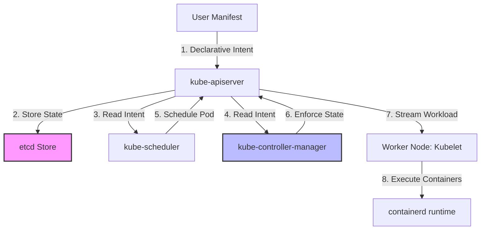
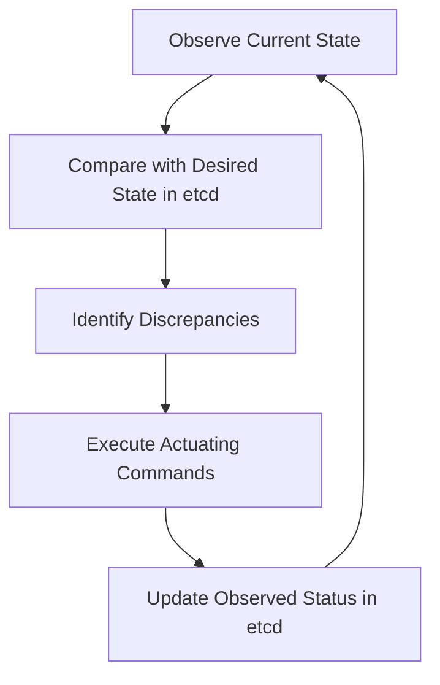
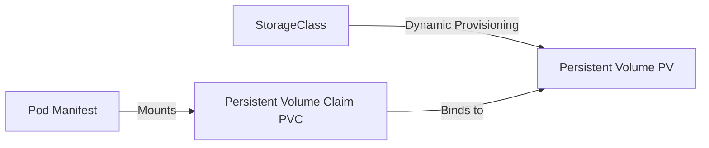

# Kubernetes Engineering Handbook

This document establishes the architectural frameworks, mental models, and operational philosophies for utilizing Kubernetes as a distributed execution platform within Govind-OS. It connects backend systems, database clustering, and cloud-native concepts into a single automated control plane.

Kubernetes is not merely a container orchestrator. It is a distributed control system that continuously reconciles the physical state of infrastructure with declared engineering intent.

---

## Purpose

The primary purpose of Kubernetes is to automate the deployment, scaling, recovery, and lifecycle management of distributed applications.

- **Kubernetes is not a container runtime.**
- **It is a distributed control plane that continuously monitors workloads and adjusts resources to maintain their desired state.**
- **The goal is not container orchestration; the goal is the reliable, self-healing operation of distributed software systems at scale.**

By codifying operational boundaries into declarative configurations, Kubernetes replaces manual infrastructure operations with software-driven reconciliation.

---

## Core Philosophy

When designing workloads or operating clusters in Kubernetes, adhere to these core preferences:

*   **Prefer declarative state over imperative commands:** Define the desired cluster state in manifests. Avoid running imperative `kubectl` commands (like `kubectl run` or `kubectl scale`) in production.
*   **Prefer automation over manual intervention:** All cluster resources—deployments, network policies, ingress routes, and storage claims—must be managed via version-controlled templates and automated deployment pipelines.
*   **Prefer reconciliation over one-time execution:** Rely on continuous reconciliation loops to correct drift. The system should automatically restore desired states when external incidents or manual changes occur.
*   **Prefer self-healing over manual recovery:** Configure health probes (liveness, readiness, startup) to allow Kubernetes to automatically restart, isolate, or reschedule failing workloads.
*   **Prefer platform consistency over custom operational workflows:** Utilize native Kubernetes primitives (Secrets, ConfigMaps, Services) and standard extension patterns (Operators) to manage configurations and lifecycles.
*   **Design for failure:** Assume worker nodes will crash, disks will detach, and network partitions will occur. Workloads must be designed to survive rescheduling and node termination.

---

## Why Kubernetes Exists

Kubernetes emerged to automate the operational overhead of managing containerized distributed systems at scale:

*   **Before Kubernetes:** Scaling required manual provisioning of VMs, updating custom load-balancer configs, writing bash scripts to restart crashed application processes, and routing static host IP addresses.
*   **The Container Explosion:** As monolithic architectures transitioned to distributed microservices, the number of independent running processes increased by orders of magnitude.
*   **The Orchestration Answer:** Kubernetes was built to decouple application code from physical infrastructure, treating a pool of independent worker nodes as a single, unified compute resource and automating resource allocation, network routing, and failure recovery.

---

## Kubernetes Mental Model

Kubernetes operates as a distributed control plane. It does not run container processes directly; instead, it coordinates the agents that do.

At its core, Kubernetes is a database (`etcd`) wrapped in a secure REST API (`kube-apiserver`) with a set of background control loops (`kube-controller-manager` and `kube-scheduler`) that observe state changes and execute convergence commands.

---

## Desired State Management

In Kubernetes, you never tell the system to "start a container." Instead, you declare the desired state of a resource:

*   **You Declare:** "There should be 3 replicas of Pod X running, consuming at most 512MB RAM, with a liveness probe on `/healthz`."
*   **Kubernetes Handles:**
    *   Finding healthy worker nodes with sufficient CPU/RAM capacity.
    *   Instructing the node's container runtime to pull the image and run it.
    *   Configuring local network routing and DNS endpoints.
    *   Monitoring the `/healthz` endpoint.
    *   Restarting or rescheduling the container if it crashes or hangs.

*The engineer manages architectural intent; Kubernetes manages operational execution.*

---

## Control Plane

The Control Plane manages the global state of the cluster, executing decisions, detecting events, and scheduling workloads.

### Control Plane Components

*   **API Server (`kube-apiserver`):** The front-end gatekeeper. Every request (from users, nodes, or internal controllers) is validated and authenticated by the API Server. It is stateless and acts as the sole entry point to the state database.
*   **etcd:** A strongly consistent, distributed key-value store utilizing the Raft consensus protocol. It holds the complete declared and observed state of the cluster. **If etcd loses quorum, the cluster's control plane cannot write updates or make scheduling decisions.**
*   **Scheduler (`kube-scheduler`):** The placement engine. It watches for newly created Pods that have no assigned worker node and selects the optimal node for them based on resource requirements, affinity/anti-affinity rules, taints, and tolerations.
*   **Controller Manager (`kube-controller-manager`):** The engine of control loops. It runs the core reconciliation controllers (Deployment Controller, Node Controller, Namespace Controller) in a single background process.

---

## Reconciliation Architecture

Kubernetes is composed of independent, specialized controllers that execute reconciliation loops. Each controller is responsible for a single resource type.

*   **The Deployment Controller:** Watches for changes in Deployments. If a new image version is declared, it updates the underlying ReplicaSet.
*   **The ReplicaSet Controller:** Watches for Pod counts. If a Pod dies, it requests the API Server to create a new Pod.
*   **The Kubelet (Node Controller):** Watches for Pods scheduled to its specific node, coordinates with the container runtime to run them, and reports container health back to the API Server.

---

## Cluster Architecture

A Kubernetes cluster is divided into two logical domains:

*   **Control Plane Node(s):** Runs the management tools (`kube-apiserver`, `etcd`, `kube-scheduler`, `kube-controller-manager`). Typically deployed in a 3-node HA configuration in production.
*   **Worker Nodes:** Nodes dedicated to executing application containers. Each worker runs:
    *   **Kubelet:** The local node agent that watches the API Server for Pods assigned to its host and coordinates with the runtime.
    *   **Kube-Proxy:** The network agent that manages local routing rules (using iptables or IPVS) to direct traffic sent to Kubernetes Services.
    *   **Container Runtime:** The engine (e.g., `containerd`) that handles image management and executes container processes.

---

## Workloads

Workloads are declared abstractions that define how application pods should be scheduled and executed.

*   **Pod:** The atomic scheduling unit.
*   **Deployment:** The standard abstraction for stateless applications. It manages rolling updates, rollbacks, and ReplicaSets.
*   **StatefulSet:** Used for stateful workloads. Guarantees stable network IDs, ordered deployments, and persistent storage mapping.
*   **DaemonSet:** Runs exactly one Pod instance on every worker node (or a targeted subset). Used for node agents like log forwarders or network monitoring tools.
*   **Job / CronJob:** Runs pods to completion (batch tasks) either immediately or on a recurring chronological schedule.

---

## Pods

The Pod is the smallest deployable unit in Kubernetes. **A Pod is a scheduling unit, not a single container.**

*   **Co-Location:** A Pod groups one or more containers that share the same network namespace, loopback interface, storage volumes, and IPC space.
*   **Sidecar Pattern:** A primary application container (e.g., a Go web server) runs alongside helper containers (e.g., an OpenTelemetry collector or a local database proxy).
*   **Pods are Ephemeral:** Pods are disposable and replaceable. They are assigned temporary IP addresses that are destroyed when the Pod terminates. Never write state to a Pod's local container storage.

---

## Deployments

Deployments provide declarative updates for stateless Pod configurations:

*   **Rolling Updates:** Replaces old Pods with new versions gradually. You can control the rollout speed using:
    *   `maxSurge`: How many Pods can be created above the desired replica count during an upgrade.
    *   `maxUnavailable`: How many Pods can be offline during an upgrade.
*   **Rollbacks:** Kubernetes maintains a history of ReplicaSets, allowing you to instantly roll back a deployment to a previous revision if a new image fails production validation.

---

## Stateful Workloads

Stateful systems require stable network names and persistent disks. Stateless Deployments are not suited for databases.

**StatefulSets** are utilized to run stateful systems (e.g., PostgreSQL, Kafka, Redis clusters):
*   **Stable Network Identifiers:** Pods are named sequentially (e.g., `db-0`, `db-1`, `db-2`) instead of receiving random suffixes. They can be reached via stable DNS addresses (e.g., `db-0.db-service`).
*   **Stable Storage Mapping:** Each Pod index is bound to its own **Persistent Volume**. If `db-1` crashes and is rescheduled on a different worker node, Kubernetes detaches the disk from the old host and reattaches it to the new host, preserving the state.
*   **Ordered Deployments:** Pods are created, updated, and terminated sequentially (`db-0` must be healthy before `db-1` starts).

---

## Services

Since Pods are ephemeral and their IP addresses change constantly, clients cannot connect directly to Pod IPs. **Services provide stable identity and load balancing.**

*   **ClusterIP (Default):** Exposes the Service on an internal IP address within the cluster. Accessible only by other workloads in the cluster.
*   **NodePort:** Exposes the Service on a static port on each worker node's IP address, allowing external access.
*   **LoadBalancer:** Integrates with cloud providers to automatically provision a hardware load balancer that routes traffic to your internal cluster Service.
*   **Headless Service:** A Service with `clusterIP: None`. DNS lookups return the direct IP addresses of all backing Pods rather than a single load-balanced IP. This is crucial for StatefulSets so replicas can find and communicate with each other (e.g., primary finding standby databases).

---

## Networking

Kubernetes enforces a flat network model across the entire cluster:

*   **IP-Per-Pod:** Every Pod gets its own unique, routable IP address. Pods can communicate with all other Pods across different nodes without requiring Network Address Translation (NAT).
*   **Container Network Interface (CNI):** The CNI plugin (e.g., Calico, Cilium, Flannel) implements this network model on the host OS. Cilium, for example, uses eBPF in the Linux kernel to route packets directly without iptables overhead.
*   **CoreDNS:** The internal DNS server that automatically registers Services and resolves them dynamically.
*   **Ingress:** An API object that manages external HTTP/HTTPS access to cluster Services, typically providing TLS termination, path-based routing, and virtual hosting.

---

## Storage

Kubernetes separates physical storage provisioning from application storage requests:

*   **Persistent Volume (PV):** A piece of storage in the cluster that has been provisioned by an administrator or dynamically provisioned via a StorageClass. It outlives the lifecycle of any Pod that mounts it.
*   **Persistent Volume Claim (PVC):** A user's request for storage. It specifies size, storage class, and access modes (e.g., `ReadWriteOnce` for single-node attachments, `ReadWriteMany` for shared volumes).
*   **StorageClass:** Defines the storage provisioner (e.g., AWS EBS, local disk, NFS) and automatically creates a matching PV when a PVC is declared.

---

## Scheduling

The Scheduler determines which worker node executes a Pod:

1.  **Filtering (Predicates):** Filters out nodes that do not satisfy the Pod's resource requests (e.g., insufficient CPU/RAM) or node selectors.
2.  **Scoring (Priorities):** Ranks the remaining nodes to find the optimal host (e.g., prioritizing nodes that spread Pods of the same deployment across different availability zones to prevent single-point-of-failure outages).

### Placement Policies

*   **Resource Requests & Limits:** Requests define the minimum resource allocation required to schedule a Pod. Limits define the absolute maximum resources a Pod is allowed to consume.
*   **Node Affinity:** Constraints that bind Pods to specific nodes based on labels (e.g., "Schedule this pod only on nodes with SSDs").
*   **Pod Anti-Affinity:** Prevents co-locating Pods on the same node (e.g., "Never run two replicas of the PostgreSQL primary on the same physical host").
*   **Taints & Tolerations:** Taints repel Pods from nodes (e.g., marking a node as `dedicated=gpu:NoSchedule`). Pods must have a matching Toleration to be scheduled on that node.

---

## Autoscaling

Kubernetes supports autoscaling at three distinct levels:

*   **Horizontal Pod Autoscaler (HPA):** Adjusts the replica count of a Deployment or StatefulSet based on CPU utilization, memory usage, or custom metrics scraped from Prometheus.
*   **Vertical Pod Autoscaler (VPA):** Analyzes workload resource consumption over time and automatically adjusts the CPU and RAM requests and limits of Pods.
*   **Cluster Autoscaler:** Monitors the cluster for unschedulable Pods (due to resource limits on active nodes) and requests the cloud provider to provision new physical worker nodes.

---

## Configuration Management

To respect the principle of immutability, application configuration must be isolated from the container image.

*   **ConfigMaps:** API objects that store non-sensitive configuration keys and values. They can be injected into containers as environment variables or mounted as configuration files.
*   **Secrets:** API objects that store base64-encoded credentials, keys, or certificates. They are mounted as temporary in-memory files (tmpfs) to prevent sensitive data from being written to physical disks on worker hosts.

---

## Security

Kubernetes security requires a multi-layered defense (the "4C's of Cloud Native Security": Cloud, Cluster, Container, Code):

*   **RBAC (Role-Based Access Control):** Enforces least privilege for cluster API access. Roles declare permissions (verbs like `get`, `list`, `create` on API resources); RoleBindings bind these permissions to users, groups, or ServiceAccounts.
*   **Network Policies:** Pod-level firewalls. By default, Kubernetes allows all Pods to talk to all other Pods. Network Policies restrict traffic, ensuring only frontend Pods can connect to backend Pods, and only backend Pods can connect to the database.
*   **Pod Security Standards:** Policies that restrict container execution behaviors (e.g., preventing containers from running as root, blocking access to host namespaces, and enforcing read-only root filesystems).

---

## Observability

Observability is critical to understand the health of transient workloads in a shared cluster.

*   **Probes:**
    *   **Startup Probe:** Determines if the container has initialized. All other probes are disabled until this succeeds.
    *   **Liveness Probe:** Monitors container health. If it fails, Kubernetes kills the container and triggers a restart.
    *   **Readiness Probe:** Determines if the container is ready to accept network traffic. If it fails, the Pod is removed from Service load balancers.
*   **Metrics Scraping:** Prometheus scrapes cluster metrics (node resource utilization, container memory, API server latency) using metrics endpoints exposed by Kubelet and Kube-State-Metrics.
*   **Log Aggregation:** Fluentbit or Promtail runs on worker nodes to collect container stdout/stderr log streams, shipping them to central engines (Elasticsearch, Grafana Loki).

---

## Operators

The **Operator Pattern** is one of the most powerful extension mechanisms in Kubernetes. It allows engineers to codify domain-specific operational knowledge into software.

An Operator consists of:
1.  **Custom Resource Definition (CRD):** Defines a new API object type inside Kubernetes (e.g., `kind: PostgreSQL`).
2.  **Custom Controller:** A background reconciliation loop that watches changes to this CRD and executes complex domain actions (e.g., bootstrapping replicas, establishing logical replication slots, performing automatic backups, executing failovers).

### Key Production Operators
*   **CloudNativePG:** Automates the lifecycle of highly available PostgreSQL clusters.
*   **Harbor Operator:** Manages Harbor container registry components, certificate renewals, and replication rules.
*   **Cert-Manager:** Automates the retrieval and renewal of Let's Encrypt TLS certificates.

---

## Kubernetes and Distributed Systems

Kubernetes is a complex distributed system designed to run other distributed systems:

*   **etcd Quorum:** Because `etcd` uses Raft consensus, it requires a strict majority to operate ($N/2 + 1$). A split-brain scenario where nodes are partitioned will prevent state writes on the minority partition.
*   **Control Loop Contention:** If too many controllers watch the same resources or thundering herd scenarios occur, the `kube-apiserver` can experience rate-limiting and high CPU saturation.
*   **Network Latency:** Internal cluster overlay networks (like VXLAN or Geneve) introduce encapsulation overhead. Choosing eBPF-based CNI routing (Cilium) minimizes this latency.

---

## Failure Modes

Operating Kubernetes in production requires deep familiarity with how components fail. In a distributed orchestrator, understanding failure modes is significantly more valuable than understanding happy-path behavior.

### 1. Node Failure
*   **Symptom:** A physical host or VM crashes, loses power, or becomes network isolated.
*   **Detection:** The control plane stops receiving heartbeats from the node's Kubelet. The Node controller marks the node status as `NotReady`.
*   **Reconciliation Action:** Stateless Pods scheduled on the dead node are evicted and rescheduled onto remaining healthy nodes after a grace period.
*   **Stateful Workload Impact:** Pods belonging to a StatefulSet are blocked from rescheduling until the volume can be safely detached from the failed host. This prevents split-brain writes where two nodes mount the same network disk simultaneously.

### 2. Control Plane Failure
*   **Symptom:** API Server, Scheduler, or Controller Manager processes crash or become saturated.
*   **Observed Impact:** Read/write operations to the cluster API are disabled. Scheduling of new pods halts, and scaling triggers are ignored.
*   **Resilience Reality:** Already running, healthy Pods continue executing on worker nodes. Existing workload traffic is unaffected because Kube-Proxy maintains routing iptables rules locally on each node.

### 3. etcd Failure
*   **Symptom:** The `etcd` consensus cluster loses quorum (e.g., 2 out of 3 nodes crash) or suffers database corruption.
*   **Observed Impact:** The `kube-apiserver` rejects all write requests. Any attempt to modify cluster state (updating replicas, deploying images, applying configs) fails. The scheduler cannot write node bindings, halting scheduling.
*   **Recovery Path:** Workloads remain running, but recovery requires restoring quorum manually or restoring `etcd` from snapshots.

### 4. Network Partition
*   **Symptom:** Network disconnections split worker nodes from control plane nodes, or split worker nodes into isolated network segments.
*   **Observed Impact:** Controllers may operate with stale state information. A partitioned Kubelet cannot report health, causing the control plane to assume the node is dead and attempt to reschedule its pods elsewhere.
*   **Distributed App Impact:** Stateful distributed databases running inside the cluster (like Patroni or etcd itself) may experience split-brain conditions or degraded quorums, triggering local database failovers.

---

## Kubernetes in Production

Operating Kubernetes in production requires strict adherence to operational guardrails:

*   **Enforce CPU/RAM Requests and Limits:** Never deploy a Pod without declaring requests and limits. Omitting them leads to "Noisy Neighbor" resource starvation, where a single memory-leaking container can crash the shared worker node.
*   **Pod Disruption Budgets (PDBs):** Declares the minimum number of healthy replicas that must remain active during planned node maintenance or upgrades, preventing voluntary outages.
*   **Avoid Using `latest` Image Tags:** Always tag container images with explicit, immutable version hashes or semantic tags (e.g., `image: v1.4.2`). Using `latest` makes it impossible to guarantee which code version is running across different replicas.

---

## AI-Assisted Kubernetes Engineering

AI tools can accelerate manifest generation and cluster troubleshooting:

*   **Manifest Validation:** Pass YAML manifests to AI to check for security vulnerabilities (e.g., running as root), resource omissions, or schema syntax errors.
*   **Troubleshooting Assistance:** Feed kubectl error messages (e.g., `ImagePullBackOff`, `CrashLoopBackOff`, or OOMKilled events) to AI to diagnose root causes and suggest manifest corrections.
*   **Command Generation:** Use AI to generate complex `kubectl` JSONPath filtering commands (e.g., "Write a kubectl command to list all running pods in namespace X sorted by memory consumption").

*AI is a tool for exploration and analysis; human engineers must audit and validate all configurations before applying them to a live cluster.*

---

## Common Anti-Patterns

Avoid these common Kubernetes pitfalls:

*   **Kubernetes for Tiny Workloads (Over-Engineering):** Deploying a simple, low-traffic static website or monolithic database into a multi-master Kubernetes cluster, incurring high financial cost and operational complexity.
*   **Treating Pods as Servers (Pets):** SSH'ing into running Pods to manually update configurations, install debugging utilities, or edit application files. Pods are ephemeral; changes are wiped during rescheduling.
*   **Stateful Workloads without Persistent Storage:** Deploying database pods using standard stateless Deployments without PVCs, resulting in total data loss when Pods restart.
*   **Ignoring Health Probes:** Running application containers without configuring liveness and readiness probes, allowing hung or deadlocked processes to remain in the service routing pool.
*   **Copy-Pasting YAML Manifests:** Applying complex, un-audited manifests from online repositories directly to production clusters, creating severe security vulnerabilities and resource allocation issues.

---

## Continuous Improvement

Kubernetes operations require continuous monitoring and refinement:

*   **Conduct Incident Retrospectives:** When a Pod fails or a node goes offline, analyze the scheduling logs and controller actions. Adjust scheduling rules, anti-affinity settings, or pod disruption budgets to improve resilience.
*   **Run Game Days:** Intentionally delete random pods, simulate node failures, and isolate namespaces in staging environments to verify that the cluster self-heals and workloads fail over seamlessly.
*   **Document Custom Resources:** Maintain clear guides for all CRDs and Operators deployed in your cluster, ensuring that their reconciliation behaviors and failure states are understood by the entire engineering team.
