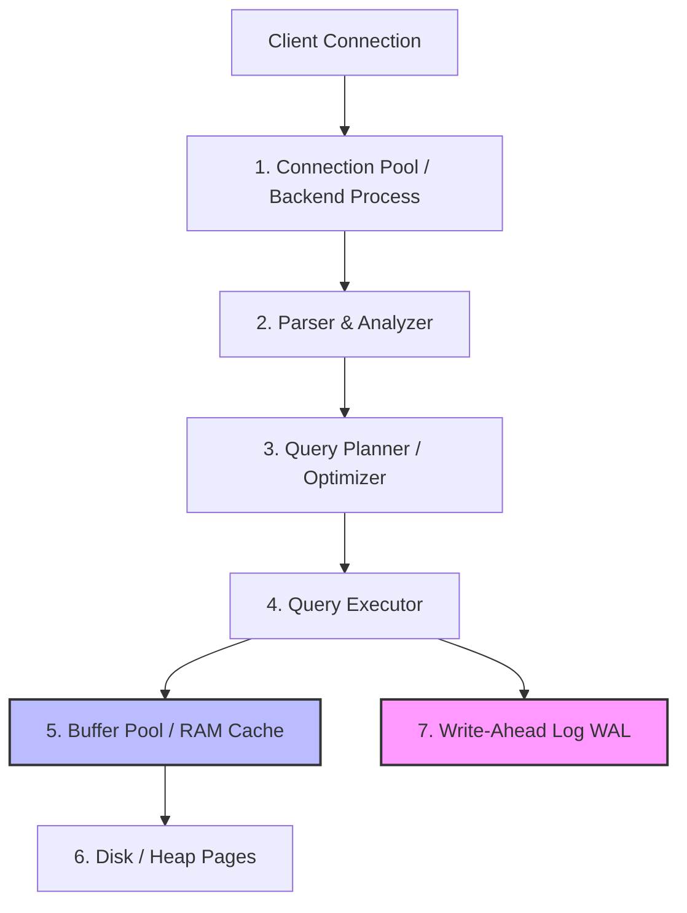
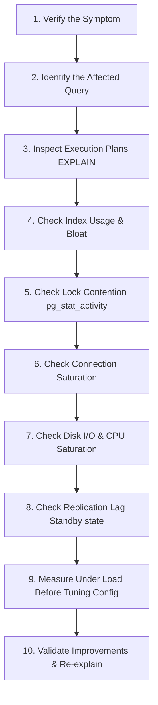

# PostgreSQL Engineering Handbook

This document establishes the architectural guidelines, mental models, performance practices, and operational philosophies for utilizing PostgreSQL within Govind-OS. It is written to cultivate durable database engineering judgment, moving beyond syntax towards understanding how PostgreSQL manages storage, transactions, locks, and queries under production loads.

A database is not a passive storage bucket; it is a complex transactional system. Its design and constraints shape the correctness, speed, and reliability of the entire application stack.

---

## Purpose

The primary purpose of PostgreSQL is to provide reliable, consistent, durable, and observable data storage for software systems.

- **PostgreSQL is not merely a database.**
- **It is a transaction processing system, a consistency engine, and the authoritative source of truth for critical business data.**
- **The goal is not simply to store data; the goal is to preserve data correctness over time despite application bugs, hardware crashes, and concurrency.**

Enforcing invariants at the database layer ensures that even if application logic breaks, data integrity remains intact.

---

## Core Philosophy

When designing databases or writing SQL queries for Govind-OS, apply these core preferences:

*   **Prefer correctness before performance:** A fast query that returns stale, duplicated, or corrupted data is a system failure. Design for data safety and isolation first.
*   **Prefer schema design before query optimization:** A well-normalized, clean schema naturally leads to simple, fast queries. Do not try to write clever SQL to compensate for a broken table design.
*   **Prefer constraints before application-level enforcement:** Application-level validation is easily bypassed by concurrent requests, direct database edits, or bug-ridden deploys. Enforce data rules (`NOT NULL`, `UNIQUE`, `CHECK`, `FOREIGN KEY`) directly in the database.
*   **Prefer observability before tuning:** Never change database configuration parameters or query structures based on guesswork. Analyze explain plans, look at lock activity, and measure disk I/O first.
*   **Prefer transactions before manual consistency management:** Do not attempt to coordinate multi-step state updates in application memory. Delegate atomic execution to PostgreSQL transactions.
*   **Prefer simplicity before distributed complexity:** Scale vertically and optimize queries, indexing, and replication before attempting to shard or migrate to complex distributed databases.

---

## Why PostgreSQL Matters

PostgreSQL sits at the absolute center of production infrastructure:

*   **Source of Truth:** It holds the critical transactional states of application ecosystems.
*   **Infrastructure Engine:** Critical CNCF and cloud-native systems (such as Harbor, SonarQube, Keycloak, and various Kubernetes operators) rely on PostgreSQL as their metadata engine.
*   **Distributed Orchestration:** Tools like **Patroni** pair PostgreSQL streaming replication with distributed consensus stores (like `etcd`) to coordinate automatic failovers.

*A deep, operational understanding of PostgreSQL bridges the gap between backend engineering, systems design, and distributed systems reliability.*

---

## PostgreSQL Mental Model

To query and tune PostgreSQL effectively, you must understand its execution layers:



*   **Process Model:** PostgreSQL forks a new operating system backend process for each client connection. Connections are heavy and consume physical OS memory and scheduling slots.
*   **Heap Pages:** PostgreSQL stores data in physical files on disk, divided into **8KB pages**. Reads and writes operate on these pages.
*   **Buffer Pool:** PostgreSQL caches pages in memory. The query executor reads pages from the buffer pool; if they are missing, it reads them from disk into the buffer pool.
*   **Write-Ahead Log (WAL):** To guarantee durability without sacrificing performance, writes are recorded to an append-only WAL on disk *before* pages are modified in the heap. If the server crashes, the WAL is replayed to restore state.

---

## Data Modeling Principles

Good databases begin with clean models that accurately capture domain semantics:

*   **Model Business Realities, Not UI Layouts:** Tables should match the core domain nouns and verbs. Do not design tables to match a specific dashboard page; UI layouts change, but business models endure.
*   **Define Clear Domain Boundaries:** Each table should be logically owned by a single service boundary. Cross-service joins should be executed via APIs, not direct database queries.
*   **Avoid Duplicate Sources of Truth:** Keep data normalized (up to Third Normal Form) to prevent updates in one table from leaving another table out of sync. Denormalize only for performance when backed by benchmark evidence.

---

## Schema Design

A schema defines the types, naming structures, and boundaries of your data:

*   **Use Precise Types:**
    *   Use `bigint` for surrogate IDs to prevent integer exhaustion (which occurs when `integer` overflows at 2.14 billion rows).
    *   Use `timestamptz` for all timestamps. It stores time in UTC and translates it to client time zones automatically, preventing zone drift bugs.
    *   Use `text` instead of arbitrary size limits like `varchar(255)` unless there is a specific business validation constraint. PostgreSQL handles both identically in terms of storage efficiency.
*   **Adopt Clear Naming Conventions:** Use `snake_case` for tables, columns, indexes, and constraints. Keep names descriptive but concise.

---

## Primary Keys

Every table must have a primary key to guarantee entity identity.

*   **Surrogate Keys (Auto-Increment / UUID):**
    *   **Auto-Increment (`bigint IDENTITY`):** Simple, fast, space-efficient (8 bytes). However, sequential IDs leak business metrics (e.g., total orders placed) in URLs and cannot be generated safely on client nodes.
    *   **UUIDv4:** Globally unique, safe to generate anywhere. However, random UUIDv4 strings cause **B-Tree index fragmentation** and high disk I/O because new inserts hit random pages across the index tree.
    *   **UUIDv7 (Recommended):** Combines a millisecond-precision timestamp prefix with random bits. It preserves global uniqueness while remaining **chronologically sortable**, ensuring new inserts append to the right side of B-Tree indexes, maintaining write performance.

---

## Relationships

Relationships define how tables connect:

*   **Foreign Keys are Mandatory:** Never omit foreign key constraints in production. They prevent orphaned records and enforce referential integrity.
*   **Index Foreign Keys:** PostgreSQL does *not* automatically index foreign key columns. You must add indexes to foreign key columns manually to avoid sequential table scans during joins and lock escalation during deletions.
*   **Configure Deletions Explicitly:** Always specify deletion behaviors:
    *   `ON DELETE RESTRICT` (default): Blocks deletion of parent if children exist.
    *   `ON DELETE CASCADE`: Deletes children automatically (use with caution on large dependency graphs).

---

## Constraints

Constraints are your final line of defense against data corruption. They enforce business rules at the storage layer:

*   **NOT NULL:** Use strictly on every column that does not require an explicit empty state.
*   **UNIQUE:** Enforces uniqueness (e.g., `email`). It automatically creates a underlying unique B-Tree index.
*   **CHECK:** Restricts values using logical expressions.
    ```sql
    ALTER TABLE orders ADD CONSTRAINT check_positive_price CHECK (price_cents > 0);
    ALTER TABLE users ADD CONSTRAINT check_valid_status CHECK (status IN ('active', 'suspended', 'deleted'));
    ```
*   *Application bugs will occur. Enforcing constraints in the database ensures bad code cannot corrupt historical data.*

---

## Transactions

Transactions group multiple database operations into a single logical execution block.

*   **Explicit Boundaries:** Wrap multi-row operations inside `BEGIN` and `COMMIT` or `ROLLBACK` blocks.
*   **Keep Transactions Short:** Avoid putting slow network calls, API requests, or heavy file processing inside a database transaction. Holding transactions open keeps locks active, exhausting connection pools and causing database contention.

---

## ACID Properties

PostgreSQL is designed to strictly guarantee ACID compliance:

*   **Atomicity:** Either all statements within a transaction succeed, or the entire transaction is rolled back. PostgreSQL writes changes to the WAL; if a crash occurs, half-committed states are replayed or discarded.
*   **Consistency:** A transaction can only transition the database from one valid state to another, respecting all constraints, foreign keys, and unique indices.
*   **Isolation:** Concurrent transactions are isolated from each other. PostgreSQL utilizes MVCC to control visibility.
*   **Durability:** Once a transaction commits, its state is guaranteed to persist, even during immediate power loss. PostgreSQL flushes the WAL to disk (`fsync`) before acknowledging the commit to the client.

---

## MVCC (Multi-Version Concurrency Control)

PostgreSQL implements concurrency control using MVCC, ensuring **readers do not block writers, and writers do not block readers.**

### How MVCC Works Under the Hood

Every row tuple in a PostgreSQL page contains hidden transaction metadata:
*   `xmin`: The Transaction ID (txid) of the transaction that inserted the row.
*   `xmax`: The Transaction ID of the transaction that deleted or updated the row (set to 0 if alive).

```
[Row Tuple on Disk]
+----------------------+---------+---------+
| Data: User "Govind"  | xmin: 50| xmax: 0 |  <-- Active Row
+----------------------+---------+---------+

-- An UPDATE of this row occurs in Transaction 60:
-- PostgreSQL marks the old row as dead (xmax=60) and writes a new row (xmin=60):

+----------------------+---------+---------+
| Data: User "Govind"  | xmin: 50| xmax: 60|  <-- Dead Tuple (visible only to older txs)
+----------------------+---------+---------+
| Data: User "Govind-S"| xmin: 60| xmax: 0 |  <-- New Active Tuple
+----------------------+---------+---------+
```

### The Cost of MVCC: Bloat and Vacuuming

Because updates write new rows and deletions simply mark rows as dead, pages accumulate dead tuples over time. This is called **bloat**.
*   **Autovacuum:** PostgreSQL runs a background daemon that scans tables, cleans up dead tuples, and updates statistics.
*   **Wraparound Protection:** Transaction IDs are 32-bit integers. If they wrap around, data can become invisible. Autovacuum performs critical "freeze" operations to prevent this.

*Never disable autovacuum. If write volume is high, tune autovacuum parameters to run more aggressively.*

---

## Isolation Levels

Isolation levels define the degree to which concurrent transactions can interfere with each other.

| Isolation Level | Dirty Read | Non-Repeatable Read | Phantom Read | Serialization Anomaly |
| :--- | :--- | :--- | :--- | :--- |
| **Read Committed** (Default) | Prevented | Allowed | Allowed | Allowed |
| **Repeatable Read** | Prevented | Prevented | Prevented | Allowed |
| **Serializable** | Prevented | Prevented | Prevented | Prevented |

*   **Read Committed:** The default level. Each query in a transaction sees only data committed before *that specific query* started.
*   **Repeatable Read:** A query inside a transaction sees a snapshot of the database taken when the *first query in the transaction* started. If a concurrent transaction commits changes, they are not visible. If write conflicts occur, the transaction fails with a serialization error (`40001`), requiring the application to retry the transaction.
*   **Serializable:** Provides absolute isolation. It behaves as if all transactions executed sequentially. It uses **SSI (Serializable Snapshot Isolation)** to detect dependency cycles. It has high coordination overhead and rejects conflicting transactions, requiring robust retry logic in application code.

---

## Locking

Locks prevent concurrent operations from corrupting the same data.

### Lock Categories

*   **Row-Level Locks:** Automatically acquired during writes (`UPDATE`, `DELETE`). Can be acquired manually during reads using `SELECT ... FOR UPDATE` (blocks writers and other lock seekers) or `SELECT ... FOR SHARE` (blocks writers but allows concurrent readers).
*   **Table-Level Locks:** Acquired during DDL changes (e.g., `ALTER TABLE` requires `ACCESS EXCLUSIVE`, blocking all reads and writes).
*   **Deadlocks:** Occur when Transaction A holds Lock 1 and waits for Lock 2, while Transaction B holds Lock 2 and waits for Lock 1. PostgreSQL automatically detects deadlocks, aborts one transaction, and logs a deadlock error.

*Guideline: Always acquire locks in the same alphabetical or logical order across all transactions to prevent deadlocks.*

---

## Indexing

Indexes improve query speeds but slow down writes and consume disk and buffer memory.

### Index Types

*   **B-Tree (Default):** Balanced tree. Optimized for equality (`=`), range queries (`<`, `>`, `BETWEEN`), and sort operations (`ORDER BY`).
*   **GIN (Generalized Inverted Index):** Inverted index. Best for composite types (Arrays, JSONB documents, full-text search `tsvector`). GIN indexes map values to lists of rows where they appear.
*   **GiST (Generalized Search Tree):** Used for geometric data, geographic points (PostGIS), and range types.
*   **BRIN (Block Range Index):** Extremely small index that tracks min/max values for blocks of pages. Ideal for massive, chronologically sorted log tables.

### Index Best Practices

*   **Partial Indexes:** Index only the rows that match a specific condition to save space.
    ```sql
    CREATE INDEX idx_pending_orders ON orders (user_id) WHERE status = 'pending';
    ```
*   **Expression Indexes:** Index the result of a function rather than the raw column.
    ```sql
    CREATE INDEX idx_lower_email ON users (lower(email));
    ```

---

## Query Planning

PostgreSQL does not execute SQL directly. It parses it, analyzes it, and generates a plan using the Query Planner.

### Reading Plans with EXPLAIN

Use `EXPLAIN` or `EXPLAIN ANALYZE` (which actually runs the query) to audit performance:
```sql
EXPLAIN ANALYZE SELECT * FROM users WHERE email = 'govind@example.com';
```

### Key Query Plan Operators

*   **Seq Scan (Sequential Scan):** Scans the entire table page-by-page. Normal for small tables; bad for large tables (indicates a missing index).
*   **Index Scan:** Traverses the B-Tree index to locate matching pointers, then fetches the rows from the heap.
*   **Index Only Scan:** Retrieves all requested data directly from the index tree without fetching from the heap pages (requires index to include all columns in the `SELECT` clause).
*   **Hash Join / Nested Loop:** Algorithms used to merge tables during `JOIN` queries.

*If the database planner ignores an index you expect it to use, check if table statistics are out of date (run `ANALYZE`) or if the index column is being wrapped in a function in the `WHERE` clause.*

---

## Query Optimization

Optimize queries systematically before modifying configuration settings or upgrading hardware:

*   **Avoid `SELECT *`:** Fetching unnecessary columns increases memory consumption in the buffer pool and network bandwidth overhead. Select only required columns.
*   **Eliminate N+1 Queries:** Do not query records in a loop in your application code. Use `JOIN` queries or subqueries.
*   **Avoid Subqueries with `IN` on Large Sets:** Use `EXISTS` or `JOIN` instead, as `IN` lists can cause the planner to bypass indexes.
*   **Use Prepared Statements:** Prepared statements allow PostgreSQL to parse and plan the query once, reusing the plan across executions, reducing CPU overhead.

---

## PostgreSQL Troubleshooting Workflow

When diagnosing database performance degradation, connection failures, or query timeouts, follow a systematic, evidence-based debugging sequence:



1.  **Verify the Symptom:** Determine if the issue is a slow query (high latency), connection failures, high CPU usage, or replication lag.
2.  **Identify the Affected Query:** Query `pg_stat_activity` to find queries currently in active or lock-waiting states, or read `pg_stat_statements` to identify queries with high cumulative runtimes.
3.  **Inspect Execution Plans:** Use `EXPLAIN ANALYZE` on the target query. Look for sequential table scans (`Seq Scan`), expensive joins, or high disk merge steps.
4.  **Check Index Usage:** Verify if the planner is using the expected index. If not, inspect if the index exists, if table statistics are outdated (run `ANALYZE`), or if the index column is wrapped in an expression that invalidates index traversal.
5.  **Check Lock Contention:** Audit `pg_stat_activity` for transactions blocked in `wait_event_type = 'Lock'`. Identify the blocking query and evaluate if it holds table-level or row-level locks too long.
6.  **Check Connection Utilization:** Measure active vs. idle connections. If connections are near `max_connections`, check if connections are leaking, if PgBouncer is running, or if transactions are hanging.
7.  **Check Disk I/O:** Monitor OS metrics for high disk read/write saturation and check the cache hit ratio. If the cache hit ratio drops below 99%, query buffers are swapping to disk too frequently.
8.  **Check Replication Lag:** If standbys are returning stale data, monitor replication lag via `pg_stat_replication` to determine if Standby WAL replay is bottlenecked.
9.  **Measure Before Changing Configuration:** Never tune `postgresql.conf` parameters (e.g., `shared_buffers`, `work_mem`) based on intuition. Test changes under simulated loads in a staging environment.
10. **Validate Improvements:** Re-run `EXPLAIN ANALYZE` after adding an index or refactoring a query to prove the cost and execution time have decreased.

*Avoid tuning databases based on intuition or guesswork. Always base your optimizations on query plans, server metrics, and structured logs.*

---

## Connection Management

Connection management is a common source of database outages.

*   **Process Overhead:** Because PostgreSQL forks an OS process per connection, having hundreds of idle connections wastes RAM, increases scheduling latency, and degrades performance.
*   **Use PgBouncer:** Implement PgBouncer as a connection proxy. Set it to **Transaction Pooling mode** to multiplex thousands of application connections across a small pool of actual database connections.
*   **Set Explicit Client Timeouts:** Prevent runaway queries from locking resources indefinitely:
    ```sql
    SET statement_timeout = '5s'; -- Abort queries running longer than 5 seconds
    SET idle_in_transaction_session_timeout = '10s'; -- Disconnect sessions that sit idle with open transactions
    ```

---

## Migrations

Schema migrations are risky production operations. A poorly written migration can lock a table, blocking all application traffic.

### Rules for Safe Migrations

*   **Add Indexes Concurrently:** Standard index creation locks the table against writes. Always use `CONCURRENTLY`.
    ```sql
    CREATE INDEX CONCURRENTLY idx_users_created ON users (created_at);
    ```
*   **Set a Short Lock Timeout:** When running DDL changes (e.g., adding a column), set a short timeout so the migration fails quickly instead of queueing up behind active queries and blocking incoming traffic.
    ```sql
    SET lock_timeout = '2s';
    ALTER TABLE users ADD COLUMN age integer;
    ```
*   **Never Make Non-Nullable Columns Without Defaults:** Adding a `NOT NULL` column without a default value will fail on existing rows. Adding it with a default value can trigger a full table rewrite on older PostgreSQL versions.

---

## Replication

Replication distributes data to Standby nodes to ensure high availability and read scalability.

*   **Streaming Replication (Physical):** Standby nodes receive a byte-for-byte WAL stream from the primary node. Replicas are read-only and are exact physical copies of the primary.
    *   *Asynchronous:* The primary acknowledges commits to the client immediately after writing to its local WAL. Fast, but risks minor data loss if the primary crashes before WAL reaches Standby.
    *   *Synchronous:* The primary blocks commit acknowledgment until one or more Standby nodes confirm they received the WAL. Zero data loss, but increases write latency.
*   **Logical Replication:** Replicates individual row modifications (insert, update, delete) based on schemas. Allows replicating subsets of tables to different databases (useful for cross-version upgrades or analytics data lakes).

---

## Backups & Recovery

*   **Logical Backups (`pg_dump`):** Extracts database structure and data into SQL scripts or binary archive formats. Good for small databases, but slow to restore on large systems.
*   **Physical Backups:** Binary copy of the database files.
*   **Continuous Archiving & PITR (Point-in-Time Recovery):** Combines periodic physical base backups with archived WAL files. Allows you to restore the database to its exact state at any arbitrary second in the past.

*A backup is only as good as its last successful recovery test. Always automate restore validations in non-production environments.*

---

## Observability

Monitor these key views and metrics to maintain PostgreSQL health:

*   **`pg_stat_activity`:** Displays active sessions, running queries, connection duration, and lock wait states.
*   **`pg_stat_statements`:** An extension that records execution statistics for all SQL queries. Vital for finding slow, high-frequency, or resource-heavy queries.
*   **Cache Hit Ratio:** Tracks the percentage of page reads served from the buffer pool RAM vs. disk. Target $> 99\%$.
*   **Replication Lag:** Tracks how many bytes or seconds the Standby replicas are lagging behind the primary's WAL position.

---

## Security

*   **Enforce Principle of Least Privilege:** Never connect your application to the database using the `postgres` superuser role. Create dedicated application users with restricted permissions (`SELECT`, `INSERT`, `UPDATE`, `DELETE`) on specific tables.
*   **Row-Level Security (RLS):** Apply security policies directly to tables to filter which rows are visible to the active database user context.
*   **Secure Network Paths:** Require TLS/SSL encryption for all database connections. Protect the database server behind a private subnet.

---

## PostgreSQL in Distributed Systems

PostgreSQL behaves as a **CP system** under the CAP theorem. Writes go to a single primary coordinator to guarantee strong consistency.
*   **Change Data Capture (CDC):** Write-ahead logs can be streamed using logical replication slots to feed message brokers (like Kafka or NATS) via tools like Debezium, enabling reliable event-driven state updates across microservices.
*   **High Availability Orchestration:** Use **Patroni** to manage PostgreSQL clusters. Patroni uses distributed consensus engines (like `etcd`) to perform leader elections, handle automatic failovers, and rewrite IP routing.

---

## Common Anti-Patterns

Avoid these common database design and querying mistakes:

*   **Resume-Driven Database Choice:** Choosing NoSQL databases (like MongoDB or Cassandra) under the assumption that relational databases cannot scale, when a single properly indexed PostgreSQL instance can handle millions of daily active users.
*   **Missing Constraints (Application-Only Validation):** Relying solely on application code to check for null values, unique fields, or valid enums, leading to dirty data when bugs or manual updates occur.
*   **SELECT * in Production Code:** Fetching every column increases network overhead, prevents Index-Only scans, and breaks code when columns are added or removed.
*   **Application Connection Exhaustion:** Connecting applications directly to PostgreSQL without connection pooling, exhausting database backend processes and crashing the server under minor traffic spikes.
*   **N+1 Queries in Loops:** Fetching parent records and issuing separate SELECT calls inside a code loop to fetch children, generating hundreds of database round-trips instead of a single `JOIN` query.
*   **Unindexed Foreign Keys:** Forgetting to index foreign key columns, causing slow joins and table-level lock escalations during delete operations.

---

## Continuous Improvement

Maintaining database health requires continuous refinement:

*   **Review slow logs weekly:** Set `log_min_duration_statement` to log queries running longer than 200ms. Analyze and index them.
*   **Tune autovacuum settings:** On tables with high write volumes, decrease `autovacuum_vacuum_scale_factor` and increase worker limits to ensure dead tuples are cleaned up rapidly.
*   **Document Schema Evolution:** Treat database migrations with the same rigor as application code. Review and test DDL changes in staging environments before running them in production.
