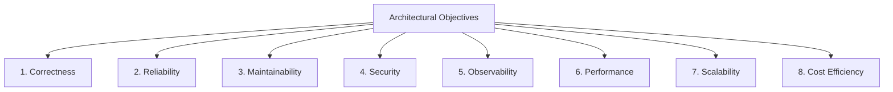
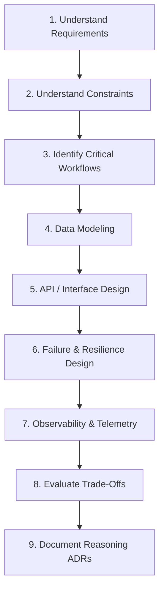
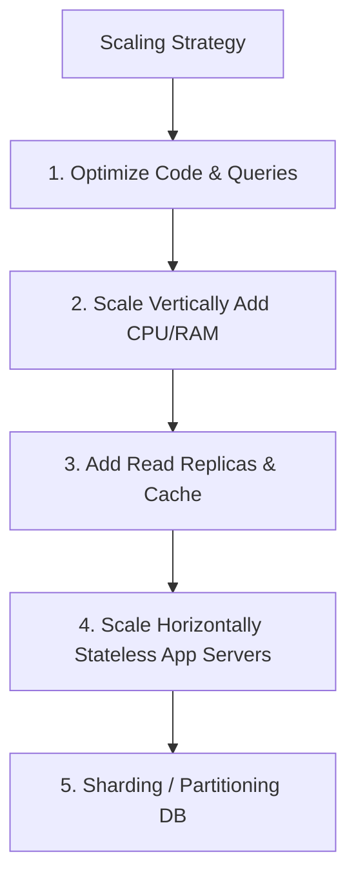
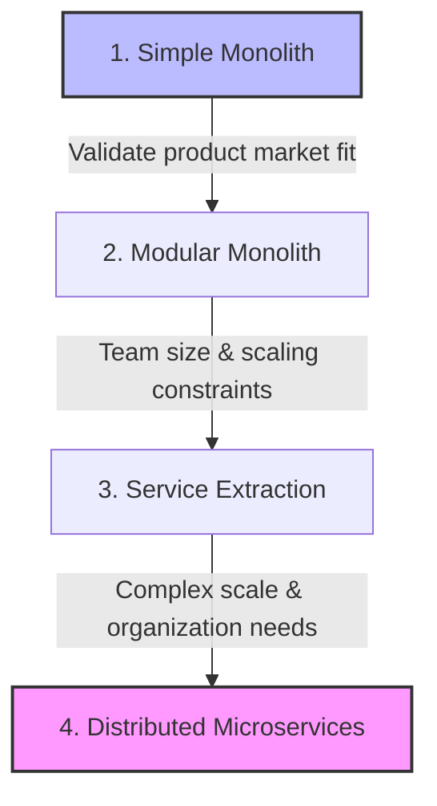

# System Design Guide

This document establishes the architectural frameworks, processes, and design philosophies for creating software systems within Govind-OS. Rather than list fleeting scalability tricks or teach system design interview hacks, this handbook outlines **how to design real-world, sustainable, production-ready systems** that balance requirements, constraints, and operational complexity.

System design is not about selecting the most complex architecture or the trendiest technology stack. It is the process of making deliberate, informed trade-offs under constraints to achieve business goals.

---

## Purpose

The primary purpose of system design is to create architectures that satisfy functional requirements while balancing reliability, scalability, maintainability, security, and operational complexity.

- **System design is the process of making informed trade-offs under constraints.**
- **There is no single "perfect" architecture.**
- **There are only architectures that are appropriate for a given set of requirements, constraints, and time horizons.**

Every architecture has a cost. A great systems designer understands the direct and indirect expenses—operational overhead, developer velocity, hardware cost, and complexity—of every line they draw on a diagram.

---

## Core Philosophy

When designing systems for Govind-OS, adhere to these guiding principles:

*   **Prefer understanding requirements before selecting technologies:** Never choose a database, programming language, or framework because it is popular. Align the technology choice with the system's access patterns and constraints.
*   **Prefer simplicity before sophistication:** A simple system is easier to build, test, debug, scale, and maintain. If a modular monolith can handle the load, do not design a microservices cluster.
*   **Prefer evidence before assumptions:** Base architectural scale decisions on back-of-the-envelope calculations, profiling data, and load-test results, not on hypothetical projections.
*   **Prefer reliability before scale:** Ensure a system degrades gracefully and operates correctly under standard load before investing in massive horizontal distribution.
*   **Prefer maintainability before optimization:** Write clean, modular, self-documenting code and clear architectures. Do not optimize performance at the expense of maintainability unless profiling proves it necessary.
*   **Prefer evolutionary architectures over premature complexity:** Design systems to be simple today, but structured in a way that allows them to evolve as requirements and scale grow.
*   **Design for change:** Establish clean boundaries, abstract interfaces, and explicit schemas so components can be modified or replaced without cascading side-effects.

---

## What Is System Design?

System design is the engineering practice of:

1.  **Defining requirements:** Establishing exactly what the system must do and how well it must perform.
2.  **Understanding constraints:** Aligning the architecture with physical, financial, organizational, and regulatory boundaries.
3.  **Designing components:** Breaking the system down into logical modules with clear, single responsibilities.
4.  **Defining interactions:** Specifying API contracts, data flows, and communication protocols between components.
5.  **Managing trade-offs:** Accepting degradation in one dimension (e.g., latency) to achieve a target in another (e.g., consistency).

*The goal of system design is not to build the most complex, bulletproof architecture. The goal is to build the simplest architecture that satisfies the defined requirements under the active constraints.*

---

## System Design Objectives

Every architecture should optimize for the following objectives:

1.  **Correctness:** The system must process business rules accurately and maintain state integrity under all conditions.
2.  **Reliability:** The system must remain operational and degrade gracefully in the face of partial hardware, software, or network failures.
3.  **Maintainability:** The architecture must have a low cognitive load, allowing new engineers to understand, debug, and extend it.
4.  **Security:** The system must enforce authentication, authorization, least-privilege access, and data encryption at all boundaries.
5.  **Observability:** The system must emit logs, metrics, and traces that explain its internal state in production without requiring local access.
6.  **Performance:** The system must operate within defined latency limits and utilize hardware resources efficiently.
7.  **Scalability:** The system must be capable of handling increased load (data volume, traffic, concurrency) by adding resources.
8.  **Cost Efficiency:** The infrastructure footprint must scale logically with the business value generated, preventing waste.

---

## First Principles Design Process

When designing a new system or major feature, follow this structured process:

*Technology selection (e.g., choosing PostgreSQL, Kafka, or Redis) should occur only after Step 5. Choosing tools before modeling the data and defining interfaces is an engineering anti-pattern.*

---

## Requirements Gathering

Many design failures occur because the system was built to solve the wrong problem. Always split requirements into:

### 1. Functional Requirements
These define the core capabilities of the system. What must it do?
*   *Example:* "Users must be able to upload images, write posts, and view their friends' timelines."
*   *Example:* "The system must process payments and issue invoice PDFs."

### 2. Non-Functional Requirements (NFRs)
These define the quality attributes of the system. How well must it perform?
*   **Latency:** What is the maximum acceptable response time? (e.g., P99 latency < 200ms).
*   **Availability:** What is the target uptime? (e.g., 99.9% availability, allowing ~8.76 hours of downtime per year).
*   **Durability:** What is the tolerance for data loss? (e.g., Zero data loss for financial transactions).
*   **Throughput:** What volume of requests must the system support? (e.g., 5,000 writes/sec peak).

*Write requirements down as explicit, measurable targets. Avoid vague statements like "the system must be fast."*

---

## Constraint Analysis

Constraints shape system architecture more than technology preferences. You must design within the real-world limits of your environment:

*   **Time:** When does the system need to go live? A tight deadline favors simple, pre-existing solutions over custom, optimized systems.
*   **Budget:** What is the limit on infrastructure spend? High-availability multi-region active-active clusters may be too expensive.
*   **Team Size & Expertise:** Can the team operate the technology? Selecting a database or language that no one on the team knows introduces massive delivery and operational risk.
*   **Infrastructure:** What are the cloud provider or bare-metal environment limitations?
*   **Compliance & Compliance:** Are there legal requirements (GDPR, HIPAA, SOC 2, PCI-DSS) governing where data is stored, how it is encrypted, and who can access it?

---

## Capacity Estimation

Capacity estimation (back-of-the-envelope calculations) helps rule out inappropriate architectures early. It determines if your scale fits on a single machine or requires distributed coordination.

### Key Dimensions to Estimate

*   **Read/Write Ratios:** Is the workload read-heavy (e.g., social feed) or write-heavy (e.g., IoT metrics)?
*   **Requests Per Second (RPS):** Calculate average RPS and peak RPS (often $2\times$ to $5\times$ average).
    $$\text{Average RPS} = \frac{\text{Total Requests per Day}}{86,400\text{ seconds}}$$
*   **Storage Growth:** How much disk space will be consumed over 1 year, 3 years, and 5 years?
    $$\text{Storage/Year} = \text{Average write size} \times \text{Writes/second} \times 31.5 \text{ million seconds/year}$$
*   **Network Bandwidth:** What is the inbound and outbound network data rate?
    $$\text{Bandwidth} = \text{Average request payload size} \times \text{Peak RPS}$$
*   **Memory Footprint:** If caching, what size is needed to store the hot path? (Often calculated using the Pareto Principle: 20% of the data generates 80% of the traffic).

*Rough estimates are sufficient to choose between vertical scaling, standard database replicas, or sharding. Precise estimations are rarely possible early in a project.*

---

## Data Modeling

Your data model determines the long-term agility of your system. If the data model is poorly designed, code changes will be complex and slow.

*   **Model Business Concepts:** Use the naming, relations, and lifecycles defined by the business domain.
*   **Establish Domain Ownership:** Ensure each database table or document collection has a single logical owner service. Avoid direct cross-service database access.
*   **Enforce Schema Integrity:** Utilize foreign keys, check constraints, and unique indices to protect data quality at the database layer.
*   **Keep Models Monotonic:** Prefer adding new tables/fields or soft-deleting columns over changing historical schemas.

---

## API Design

APIs are the contracts that bind your system to its consumers. Once published, breaking API changes are incredibly expensive.

*   **Expose Domain Models, Not DB Schemas:** API payloads should reflect business actions and domain states. Never return database rows directly to the client.
*   **Enforce Versioning:** Use URL prefixes (e.g., `/v1/`), headers, or content types to allow the API to evolve without breaking existing clients.
*   **Standardize Responses:** Use standard HTTP status codes, structured JSON error envelopes, and consistent pagination models.

---

## Storage Selection

Do not choose databases based on popularity or trend-driven architecture. Match the storage engine with the access patterns and consistency requirements of the data:

| Storage Type | Characteristics | Key Use Case | Technology Examples |
| :--- | :--- | :--- | :--- |
| **Relational (RDBMS)** | Strong ACID transactions, complex JOINs, structured schema. | Financial ledgers, user accounts, transactional state. | PostgreSQL, MySQL |
| **Key-Value** | Ultra-low latency, simple reads/writes, transient state. | Session caching, token storage, locks. | Redis, Memcached |
| **Document** | Semi-structured data, flexible schemas, JSON storage. | Content management, catalog metadata, user profiles. | MongoDB, CouchDB |
| **Object Storage** | Infinite scale for flat files, cold storage, write-once/read-many. | User avatars, video files, database backups, PDFs. | Amazon S3, MinIO |
| **Time-Series** | High write throughput for append-only timestamped records. | System metrics, application logs, IoT sensor data. | Prometheus, InfluxDB |
| **Columnar (OLAP)** | Highly compressed data, rapid aggregation over billions of rows. | Analytics, BI reporting, data warehousing. | ClickHouse, Snowflake |

---

## Communication Patterns

Components must communicate to execute workflows. The choice between synchronous and asynchronous communication affects coupling and reliability.

### Synchronous Communication
Direct, blocking calls (e.g., HTTP/REST, gRPC).
*   *Use when:* The caller requires an immediate response to proceed (e.g., validating a credit card payment during checkout).
*   *Trade-off:* High coupling. If the downstream service fails or is slow, the caller fails or slows down (cascading latency).

### Asynchronous Communication
Non-blocking, decoupled calls via queues or event brokers (e.g., Kafka, NATS, RabbitMQ).
*   *Use when:* The task is slow, independent, or can be processed eventually (e.g., sending an invoice email, updating analytics, generating reports).
*   *Trade-off:* Eventual consistency. The system is highly available and decoupled, but code becomes more complex because state updates are not instantaneous.

---

## Scalability Thinking

Scalability is the system's ability to handle growing load by adding hardware resources. **Scale should be driven by evidence, not speculation.**

### Scaling Hierarchy

1.  **Optimize Code & DB Queries:** Fix inefficient code, remove N+1 queries, and add database indices before changing infrastructure.
2.  **Scale Vertically:** Increase the size of the server (more CPU, RAM, faster disks). This is the cheapest scaling option in terms of developer hours.
3.  **Implement Caching & Replicas:** Offload read queries from the primary database using read replicas and Redis caches.
4.  **Scale Horizontally:** Keep application servers stateless so load balancers can distribute HTTP requests across $N$ instances.
5.  **Shard the Database:** Partition the database physically across multiple machines only when write load or total data volume exceeds the limits of a single machine.

---

## Reliability Thinking

Reliability means the system continues to function correctly even when things go wrong. Assume failures are normal.

*   **Remove Single Points of Failure (SPOFs):** Ensure every component (web servers, databases, load balancers, DNS, caches) is deployed in a redundant configuration (e.g., multi-AZ, primary-standby failover).
*   **Design for Circuit Breaking & Timeouts:** Set connection and read timeouts on every network call. Use circuit breakers to stop sending traffic to failing downstream dependencies.
*   **Rate Limit Boundaries:** Protect your system from accidental or malicious denial-of-service attacks by enforcing rate limits at the API gateway level.
*   **Degrade Gracefully:** Provide fallbacks. If the user recommendation engine fails, return a list of popular items rather than a server error.

---

## Security Thinking

Security must be designed into the architecture from day one. It is not a feature you add right before production.

*   **Enforce Zero Trust Boundaries:** Never trust input coming across a network boundary (even from internal services). Validate all inputs, request headers, and payloads against strict schemas.
*   **Secure Authentication & Authorization:** Establish a centralized, secure system for identity verification (AuthN) and enforce fine-grained access control (AuthR) on every API endpoint.
*   **Encrypt Data at Rest and in Transit:** Force TLS 1.3 for all internal and external network communication. Encrypt databases, cache storage, backups, and file systems.
*   **Secret Management:** Never commit passwords, API tokens, or encryption keys to version control. Use secure configuration systems (Vault, Kubernetes Secrets) to inject credentials at runtime.

---

## Observability Thinking

A system is observable if you can understand its internal state solely by looking at its external telemetry outputs. Observability is a day-one design requirement.

*   **Context Propagation (Correlation IDs):** Inject a unique correlation ID at the edge load balancer. Propagate this ID through all network calls, queues, and databases to reconstruct the entire request path in your log aggregator.
*   **The RED Method for APIs:** Monitor **R**ate (requests/sec), **E**rrors (failures/sec), and **D**uration (latency distribution, e.g., p95, p99).
*   **The USE Method for Infrastructure:** Monitor **U**tilization (percent busy), **S**aturation (queue backups), and **E**rrors for hardware resources (CPU, RAM, Disks, Network).
*   **Actionable Alerts:** Alerts should only fire when a metric indicates user impact (e.g., high HTTP 5xx error rate or queue lag building up). Do not wake operators up for transient CPU spikes.

---

## Trade-Off Analysis

System design is trade-off management. For every architectural choice you make, you must document the cost, benefit, risk, and alternative options.

### Classic Architectural Trade-Offs

*   **Consistency vs. Availability (CAP):** During a network partition, do you return errors to preserve consistency, or return stale data to preserve availability?
*   **Latency vs. Durability:** Do you acknowledge writes when they hit RAM (very fast, but risks data loss on power cuts) or only after they are synced to multiple disk replicas (slower, but highly durable)?
*   **Flexibility vs. Simplicity:** Do you build a highly generic, pluggable framework (allows easy future modification, but increases cognitive overhead) or a simple, concrete implementation?
*   **Cost vs. Reliability:** Do you run a multi-region active-active deployment to survive cloud-provider outages (highly reliable, double infrastructure cost) or a single-region active-passive setup (tolerable downtime, lower cost)?

---

## Architecture Decision Records (ADRs)

Significant architectural decisions should be formally documented. An Architecture Decision Record (ADR) is a short text document that captures a design decision, its context, and its consequences.

The objective of an ADR is not documentation for its own sake. The objective is to preserve the architectural reasoning, trade-offs, and design context for future engineers and future versions of the system.

### Structure of an ADR

Every ADR should be structured around these core sections:

*   **Title:** A clear, numbered title (e.g., `ADR-003: Use Redis for Distributed Locking`).
*   **Status:** The state of the decision (`Proposed`, `Accepted`, `Rejected`, `Deprecated`, `Superseded`).
*   **Context:** The technical, business, or operational situation that requires a decision. What is the problem we are trying to solve?
*   **Constraints:** The physical or organizational bounds (budget, time, team experience, compliance) limiting our choices.
*   **Alternatives Considered:** A brief summary of the other approaches evaluated, including why they were rejected.
*   **Decision:** The specific architecture, tool, or pattern selected and the justification for the choice.
*   **Trade-offs:** The costs, complexities, or risks accepted to achieve this decision's benefits.
*   **Consequences:** The impact of this decision on the system, teams, and future development (e.g., "Developers must now use idempotency keys for all payment requests").

*Store ADRs directly in the source code repository under a dedicated folder (e.g., `/docs/adr/`). This keeps architectural documentation versioned alongside the code it describes.*

---

## Architecture Evolution

Architectures should evolve with the scale and needs of the organization. **Do not start with microservices.** Earn your complexity.

1.  **Simple Monolith:** Build a single application deployment backed by a single SQL database. This optimizes for developer speed, deployment simplicity, and rapid iteration.
2.  **Modular Monolith:** As the codebase grows, organize it into logical modules with clear boundaries. Do not allow modules to query each other's databases directly.
3.  **Service Extraction:** If a specific module has heavy CPU/memory scaling requirements or is owned by a separate, dedicated team, extract it into a separate service.
4.  **Distributed Microservices:** Transition to a fully distributed, event-driven architecture only when the monolith becomes a bottleneck for team deployment velocity or physical server capacities.

---

## Open Source System Design

Studying open-source codebases is the most effective way to learn system design. When analyzing open-source architectures:

*   **Don't just look at diagrams:** Read the issues, PR reviews, and post-mortems. Focus on **why** decisions were made and what alternatives were rejected.
*   **Trace the Bootstrapping Process:** Understand how the system initializes, reads config, warms caches, and connects to dependencies.
*   **Audit Failure Boundaries:** Find out what happens when a dependency is unreachable. Does the open-source library block forever, crash, or retry?

---

## AI-Assisted System Design

AI is a powerful brainstorming partner, but it cannot take responsibility for your production systems.

*   **How to leverage AI:** Use AI to review your design documents, suggest alternative patterns, brainstorm failure scenarios, audit security boundaries, and write initial draft ADRs.
*   **What to avoid:** Never allow AI to make final architectural decisions. Ensure that human judgment reviews, tests, and validates all designs before implementation.

---

## Common Design Anti-Patterns

Avoid these common architectural traps:

*   **Resume-Driven Development (RDD):** Choosing complex technologies (e.g., Kubernetes, Kafka, Cassandra) simply because you want to add them to your resume, despite the project requiring only a simple CRUD server and a single PostgreSQL database.
*   **The Distributed Monolith:** Splitting a monolith into microservices but keeping them tightly coupled via synchronous HTTP calls. If one service fails, the entire application crashes, resulting in the worst of both worlds.
*   **Happy-Path Architecture:** Designing systems assuming networks are fast, nodes never crash, and database queries are always instantaneous. This leads to cascading outages under real load.
*   **Over-Engineering for Imaginary Scale:** Building a system to handle billions of operations per second when the actual business requirement is a few hundred operations per day. This wastes engineering time and business capital.
*   **Ignoring Observability:** Building complex distributed architectures without distributed tracing or structured logging, making it impossible to diagnose production issues.

---

## Design Review Framework

Before finalizing any design or architectural change, run it through this checklist:

1.  **Requirements:** Are the functional requirements and NFR metrics (availability, latency targets) clearly defined?
2.  **Complexity:** Is there a simpler solution that achieves the same business goal? Can we solve this with a database query optimization rather than adding a cache or queue?
3.  **Failure Modes:** What happens if the database crashes, the network partitions, or an external API times out? Does the system degrade gracefully?
4.  **Observability:** How will we know if this system is failing in production? Are correlation IDs, metrics, and alerts included?
5.  **State Management:** Where is the source of truth? Is the data model structured to prevent write conflicts?
6.  **Evolution:** Does this design lock us into a specific architecture, or can we refactor and adapt it as scale grows?
7.  **Trade-offs:** Are the trade-offs (e.g., consistency vs. latency) explicitly documented and aligned with business goals?

---

## Continuous Improvement

Architectural design is an iterative process. Maintain a feedback loop to compound your engineering judgment:

*   **Conduct Incident Reviews:** When production outages occur, write a blameless post-mortem. Trace the design failure that allowed the issue to propagate and identify architectural adjustments to prevent it.
*   **Update the Guidelines:** As your systems grow and you discover new bottlenecks or operational realities, update this guide. Ensure that the collective experience of building Govind-OS is compiled and maintained.
