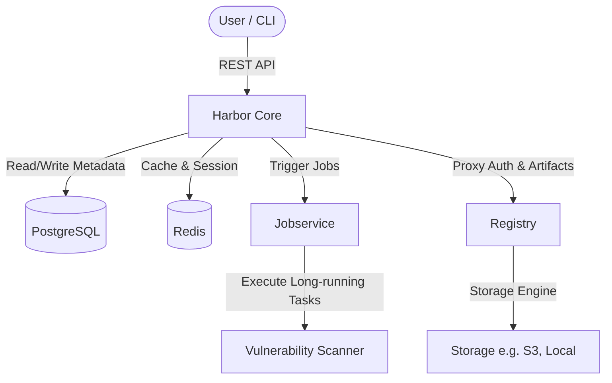

# Harbor Engineering Journal

## Purpose
The purpose of this journal is to capture the architectural, codebase, and engineering insights gained from contributing to CNCF Harbor and Harbor CLI. As my first serious engagement with a production-grade CNCF codebase, this serves to document design choices, codebase navigations, and review feedback.

---

## Harbor Overview
Harbor is an open-source trusted cloud native registry project that stores, signs, and scans content. It extends the open-source Docker Distribution by adding the functionalities usually required by users such as security, identity, and management.

---

## Architecture Notes

### Harbor Components
- **Core:** The main API server handling authentication, authorization (RBAC), configuration, webhook dispatching, and orchestration.
- **Jobservice:** An asynchronous job execution engine used for running tasks such as replication, scanning, garbage collection, and webhook deliveries.
- **Registry:** The standard OCI registry (based on Docker Distribution) that handles actual image/artifact storage, uploads, and downloads.
- **Database:** PostgreSQL database storing metadata about users, projects, repositories, tags, and jobs.
- **Redis:** Used for session management, caching, and job queuing.
- **Harbor CLI:** The command-line client facilitating terminal-based management of Harbor projects, users, configurations, and registries.

### Component Interactions


_Notes on interaction patterns, authentication flows, and token generation:_

---

## Codebase Map
*Use this section to outline directories, entry points, and where key logic lives in the codebase.*

- `/cmd`: Command-line interface entry points.
- `/pkg`: Core logic, reusable client libraries, and helper packages.
- `/api`: API definitions, routing, and Swagger schemas.
- `/src`: Legacy code or core server implementation paths depending on the exact repository (CLI vs. Core).

---

## Command Map
*Visual reference of Harbor CLI subcommands.*

```
harbor
├── project
├── registry
├── replication
├── artifact
└── ...
```

---

## Frequently Touched Files
*Onboarding reference for files frequently modified.*

- **File:** `pkg/api/client.go`
  - **Purpose:** Handles upstream HTTP request dispatching.
  - **Common Patterns:** Custom RoundTripper configurations.
  - **Important Caveats:** Ensure responses are always fully read and closed to prevent socket leaks.

- **File:** `cmd/project/list.go`
  - **Purpose:** Command definition and output rendering for projects.
  - **Common Patterns:** cobra.Command construction, Viper configuration retrieval.
  - **Important Caveats:** Keep cobra validation flags within the command PreRun hook.

---

## Important Components
- **HTTP Client Wrapper:** Wraps the Harbor REST API with custom Go transports.
- **Authentication/Session Store:** Manages auth tokens, persistent configs, and credential storage.
- **Output Handlers:** Manages format options (`json`, `yaml`, table output) for command responses.

---

## Contribution Timeline
*Keep a chronological list of issues explored, PRs submitted, and features worked on.*

- **Date:** 
- **Milestone:** 

---

## PR Lessons

### PR Template
- **PR:** 
- **Problem:** 
- **Solution:** 
- **Review Feedback:** 
- **What I Missed:** 
- **What I Learned:** 

---

## Review Lessons
*Notes from reviews I have performed on other contributors' PRs.*

---

## Maintainer Lessons

### Maintainer Observation Template
- **Maintainer:** 
- **Observation:** 
- **What They Value:** 
- **Lesson:** 

---

## Technical Lessons
*Log patterns related to system design, Go architecture, performance, or concurrency.*

---

## Go Lessons
*Log Go-specific optimizations, syntax patterns, interface usage, and testing methodologies.*

---

## CLI Design Lessons
*Log rules for build flags, command structures, configuration patterns, interactive shell prompts, and error outputs.*

---

## Open Source Lessons
*Observations on upstream cooperation, release cadences, issue triage, and community dynamics.*

---

## Mistakes
*Detail code-level or design-level mistakes made during contribution.*

---

## Wins
*Document milestones, positive maintainer feedback, and successful feature implementations.*

---

## PR Backlog
*Actionable queue of future pull requests.*

- **Priority:** (High / Medium / Low)
- **Problem:** 
- **Impact:** 
- **Estimated Difficulty:** (Easy / Medium / Hard)
- **Relevant Files:** 

---

## Key Takeaways
*Summarize high-level conclusions about Harbor engineering standards.*
