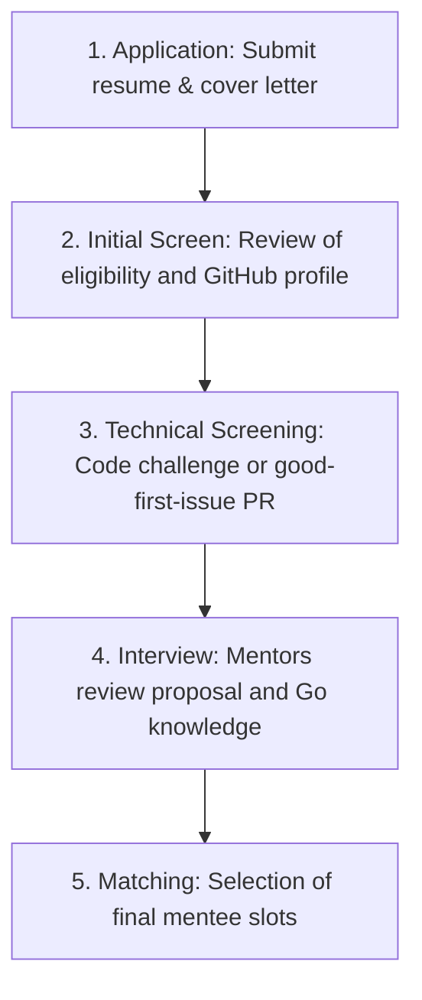

# LFX Mentorship 2026

This document serves as the living journal, decision record, and learning repository for the LFX Mentorship journey in 2026. It is updated continuously as events occur, capturing real-time insights, code reviews, and architectural lessons before they fade.

---

## Purpose

The purpose of this document is to capture lessons, observations, decisions, mistakes, and achievements throughout the LFX Mentorship journey.

- **Memory is unreliable:** Insights captured immediately in the heat of debugging or code review are far more valuable than retrospective recollections months later.
- **A dual-purpose asset:** This document serves as both an active learning journal for personal accountability and a future playbook for subsequent open-source contributions.

---

## Program Overview

- **Host Organization:** Cloud Native Computing Foundation (CNCF)
- **Project:** Harbor CLI
- **Mentorship Term:** Spring/Summer 2026
- **Mentors:** _[List mentor names here]_
- **Primary Technologies:**
  - Go (Golang)
  - CNCF Harbor Registry
  - GitHub Actions / CI/CD
  - CLI Design Patterns (e.g., Cobra, Viper)
- **Program Goals:**
  - Deliver key CLI features as defined in the project roadmap.
  - Establish robust testing coverage (unit, integration, and CLI mock tests).
  - Align the CLI design with CNCF standards and Harbor API evolution.

---

## Why I Applied

### Strategic Goals:

- **Improve Go Engineering Skills:** Work on highly concurrent, production-grade Go architectures.
- **Learn Large Codebase Navigation:** Develop the ability to quickly locate, read, and refactor modules across multi-component repositories.
- **Gain Maintainer Review Experience:** Learn from the feedback, standards, and design demands of seasoned CNCF maintainers.
- **Build CNCF Credibility:** Establish a public track record of contributions to core cloud-native infrastructure.
- **Leverage Future Applications:** Translate LFX success into a strong signal for subsequent program applications (e.g., GSoC, Summer of Bitcoin, and industry internships).

### Expected Outcomes:

- [ ] Multiple feature-complete PRs merged into upstream Harbor CLI.
- [ ] Deep understanding of OCI registry specifications and API integrations.
- [ ] Durable professional relationships with Harbor maintainers.

---

## Application Timeline

Track your progression through the selection funnel:

| Phase                  | Milestone                        | Target / Actual Date |
| :--------------------- | :------------------------------- | :------------------- |
| **Application Window** | Applications Open                | YYYY-MM-DD           |
| **Submission**         | Application & Proposal Submitted | YYYY-MM-DD           |
| **Interview**          | Technical / Behavioral Interview | YYYY-MM-DD           |
| **Decision**           | Official Acceptance Notification | YYYY-MM-DD           |
| **Coding Period**      | Official Program Start           | YYYY-MM-DD           |
| **Evaluations**        | Midterm Evaluation               | YYYY-MM-DD           |
| **Completion**         | Final Evaluation & Program End   | YYYY-MM-DD           |

---

## Selection Process

Document the specific screening steps, code tests, or introductory PRs required for selection:

_Notes on selection challenges and prep:_

- _[Log specific prep questions or coding tasks here]_

---

## Expectations

Establish your commitments and communication channels with mentors before coding begins:

- **Time Commitment:** 20-30 hours per week of dedicated research, building, and community engagement.
- **Sync Frequency:** Weekly status meetings on Zoom/Slack.
- **Async Communication:** Updates and design debates in GitHub issues and `#harbor-cli` on CNCF Slack.
- **Deliverable Cadence:** Pull requests submitted in small, reviewable chunks at least twice per week.

---

## Weekly Journal

Duplicate this template for every week of the mentorship coding period:

### Week 1

- **Goals:**
  - [ ] Set up local Harbor registry stack using Docker Compose.
  - [ ] Compile Harbor CLI locally and run the existing test suite.
  - [ ] Merge a minor documentation or setup PR to verify the workflow.
- **Work Completed:**
  - _Example: Configured dev environment, cloned repository, resolved build warnings._
- **Mentor Feedback:**
  - _Example: Mentor advised checking OCI distribution specs before writing registry tests._
- **Challenges:**
  - _Example: Faced Docker port conflicts during local Harbor database setup._
- **Lessons:**
  - _Example: Read config files carefully; understand database environment variables before launching containers._
- **Weekly Metrics:**
  - PRs Opened: 0
  - PRs Merged: 0
  - Reviews Received: 0
  - Reviews Given: 0
  - Meetings Attended: 0
  - Hours Invested: 0
- **Next Week:**
  - _Example: Start implementing basic Harbor login subcommands._

---

## Mentor Interactions

Log significant feedback, suggestions, and insights received from mentors:

| Date       | Context        | Question / Obstacle                                  | Response / Advice                                                   | Core Lesson                                                          |
| :--------- | :------------- | :--------------------------------------------------- | :------------------------------------------------------------------ | :------------------------------------------------------------------- |
| YYYY-MM-DD | PR #123 Review | How to handle configuration paths across OS systems? | "Use standard OS-agnostic library paths like `os.UserConfigDir()`." | Portability is a core requirement; avoid hardcoding UNIX home paths. |

---

## Technical Lessons

Document deep technical insights gained while building:

### 1. Go Error Propagation

- **Context:** Handling HTTP client failures when communicating with the Harbor API.
- **Lesson:** Wrap errors with structured context using `%w` in `fmt.Errorf` rather than swallowing the stack trace or logging inside subpackages.
- **Application:** Refactored the CLI client wrapper to return wrapped errors to the execution boundary, where Cobra handles logging.

### 2. CLI Design Patterns

- **Context:** Creating modular command hierarchies with Cobra.
- **Lesson:** Keep the command declaration (`*cobra.Command`) distinct from the execution logic. Write tests directly against the execution function by passing mock writers.
- **Application:** Separated CLI output printing from business logic, allowing unit testing via custom `bytes.Buffer` writers.

---

## Open Source Lessons

Lessons about community development and workflow mechanics:

- **Small PRs Review Faster:** Submitting a 100-line PR targeting a single file gets reviewed within 24 hours. A 1,000-line PR gets delayed for weeks.
- **Maintainer Trust Compounds:** Your first PR will receive extensive scrutiny. Respond politely, apply changes rapidly, and show respect for their standards. Subsequent PRs will merge with less friction.
- **Understanding Matters More Than Writing:** Spend 80% of your time reading issue histories, existing code paths, and OCI specifications. Spend only 20% writing the code.
- **Review Quality Matters:** Helping review other contributors' PRs builds your credibility and exposes you to different parts of the codebase.

---

## Communication Lessons

- **Write Descriptive PR Summaries:** Explain the _Why_, the _How_, and include step-by-step reproduction commands or terminal screenshots. This saves maintainers from guessing and reduces review latency.
- **Ask Specific Questions:** Instead of asking _"Why doesn't this work?"_, ask: _"I noticed this function fails with X error when passed Y payload. I have verified Z configuration. Could this be related to how the API expects headers?"_
- **Provide Full Context:** Always attach CLI output logs, environment details, and branch links when reporting issues.

---

## Mistakes

Convert errors into durable, systemic improvements:

### Mistake 1

- **What Happened:** Merged a broken integration test that failed on macOS runners in GitHub Actions.
- **Root Cause:** Hardcoded a Linux-specific `/tmp` path helper instead of using Go's `os.TempDir()`.
- **Lesson:** Never assume file system paths are consistent across OS environments.
- **System Change:** Added a local pre-commit hook that runs `go test -v ./...` on my local environment, and configured testing to use Go's native OS-agnostic helpers.

---

## Wins

Record milestones, positive feedback, and major breakthroughs:

- **Milestone 1:** Merged first feature PR introducing Harbor CLI configuration file initialization.
- **Feedback:** Received positive review from core maintainer regarding unit test coverage and clean error wrapping.
- **Breakthrough:** Successfully decoupled the mock API server, reducing integration test runtimes from 45 seconds to 3 seconds.

---

## Key Contributions

Track every pull request submitted:

### PR #1: Initial Configuration Setup

- **PR Link:** _[GitHub PR Link]_
- **Problem:** Harbor CLI lacked an automated command to generate a default configuration file, forcing manual edits.
- **Solution:** Implemented the `harbor config init` command using Viper to generate a template file.
- **Review Feedback:** Maintainer requested adding a check to prevent overwriting existing files without a `--force` flag.
- **Lesson:** Protect user data by defaulting to non-destructive actions.

---

## Metrics

Track your quantitative outputs throughout the mentorship:

- **PRs Opened:** 0
- **PRs Merged:** 0
- **Reviews Received:** 0
- **Meetings Attended:** 0
- **Issues Resolved:** 0
- **Major Lessons Documented:** 0

_Update these metrics weekly during your review._

---

## Review Feedback Archive
*Document constructive critiques from PR reviews. This is where deep learning occurs.*

### Theme: Testing
- **Examples:**
  - *[Link to PR review comment]*
- **Lesson:** 

### Theme: Error Handling
- **Examples:**
  - *[Link to PR review comment]*
- **Lesson:** 

### Theme: CLI UX
- **Examples:**
  - *[Link to PR review comment]*
- **Lesson:** 

---

## Relationships Built
*Networking outcomes from syncs, Slack interactions, and reviews.*

- **Name:** 
  - **Role:** 
  - **How We Interacted:** 
  - **Lessons:** 
  - **Future Follow-Up:** 

------

## End-of-Program Retrospective

_To be completed after final evaluations:_

- **What exceeded expectations?** _[Write here]_
- **What disappointed me?** _[Write here]_
- **What created the most growth?** _[Write here]_
- **What would I do differently?** _[Write here]_
- **Would I apply again / continue contributing?** _[Write here]_

---

## Advice To Future Applicants

### What I Wish I Knew Before Applying:

- _[Log advice here]_

### What Actually Matters:

- **Merged Code:** Proving capability in the codebase before applications close outweigh any cover letter.
- **Consistent Activity:** Mentors watch how you handle feedback on your initial issues.

### What Doesn't Matter:

- **Perfect Proposals:** A polished PDF with zero code contributions will not secure a slot.

### How To Stand Out:

- Help review other applicants' PRs constructively and help triage issues in the Slack channel.

### How To Work With Mentors:

- Show up to syncs with clear lists of what was built, what is blocked, and what design options exist. Present choices, not just problems.
