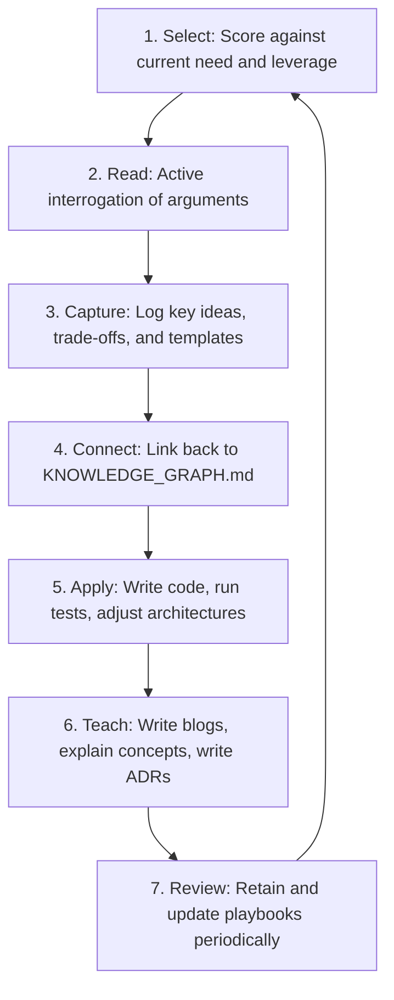
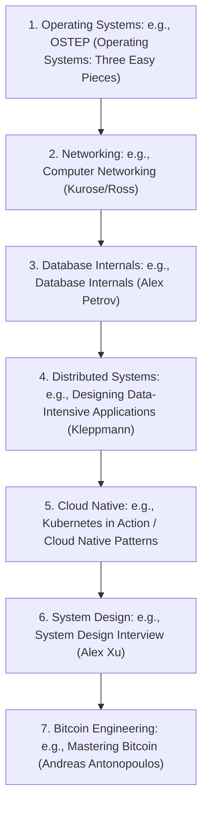

# Book Notes System

This document establishes the knowledge extraction engine of Govind-OS. It defines the reading pipelines, note-taking frameworks, selection scoring matrices, and review templates required to convert systems engineering reading into usable capability.

---

## Purpose

The purpose of reading is not to finish books. The purpose of reading is to acquire durable insights that improve capability, decision making, and execution.

*   **A finished book that changes nothing is low value.**
*   **A partially read book that changes behavior or system architecture is high value.**
*   *The objective is to transform raw written ideas into usable engineering capability.*

---

## Core Philosophy

*   **Prefer understanding over completion:** Never rush to finish a chapter if you haven't grasped the core technical mechanism.
*   **Prefer insight extraction over page count:** Focus on identifying the high-leverage principles that directly improve your system design.
*   **Prefer application over consumption:** Validate what you read by implementing it in code, benchmark pipelines, or design specs.
*   **Prefer quality books over quantity:** Read the core canonical textbooks repeatedly rather than skimming dozens of pop-technology publications.
*   **Prefer rereading valuable material over constantly seeking novelty:** Return to foundational papers and systems books to deepen your mental models.
*   **Prefer connected knowledge over isolated notes:** Integrate book highlights back into the Govind-OS KNOWLEDGE_GRAPH.md.

---

## Reading Objectives

Before starting any book, clearly define your objective by answering: **"Why am I reading this?"**

### Common Reading Objectives:
1.  **Learn a New Domain:** Acclimatize to an unfamiliar stack (e.g., distributed databases).
2.  **Deepen Existing Knowledge:** Master internals and edge cases (e.g., PostgreSQL query optimization).
3.  **Solve a Current Problem:** Find solutions for an active repository blocker or bug.
4.  **Improve Decision Making:** Build heuristics for evaluating architectural trade-offs.
5.  **Gain Historical Context:** Understand *why* certain designs succeeded and others failed.
6.  **Build Mental Models:** Extract core reusable abstractions that scale across systems domains.

> [!IMPORTANT]
> **Never read without an objective.** Reading without a goal turns active study into passive entertainment.

---

## Information vs. Knowledge

Compounding technical skill requires converting raw data into wisdom:

```
Information (Facts & details) ➔ Knowledge (Connected understanding) ➔ Wisdom (Correct application) ➔ Capability (Execution output)
```

| State | Definition | Example |
| :--- | :--- | :--- |
| **Information** | Raw facts, parameters, and details. | *"PostgreSQL uses a Write-Ahead Log (WAL) to guarantee durability."* |
| **Knowledge** | Connected understanding of underlying mechanics. | *"WAL is an append-only log. Writing sequentially prevents disk head seeks, making disk writes extremely fast compared to random table page writes."* |
| **Wisdom** | Knowing when and how to apply the mechanics under constraints. | *"To optimize write-heavy ingestion pipelines, we can bundle transactions to maximize sequential WAL flushes and reduce disk fsync calls."* |
| **Capability** | Implementing the wisdom to deliver stable, high-performance systems. | *Refactoring the database layer to utilize bulk insert pipelines, reducing batch runtimes by 40% (see POSTGRESQL.md).* |

---

## The Reading Pipeline

Most readers stop immediately after consumption. The Book Notes System mandates a complete conversion loop:



---

## Book Selection Framework

Before starting a book, evaluate and score it out of 50 points using the **Selection Matrix** (cross-reference with PROJECT_SELECTION.md):

| Criterion | Scoring Focus | Score |
| :--- | :--- | :--- |
| **Relevance** | Does this directly align with my active systems engineering roadmap? | /10 |
| **Leverage** | Will this book improve my ability to contribute to target CNCF/Bitcoin projects? | /10 |
| **Reusability** | Does it cover foundational abstractions that apply across multiple systems domains? | /10 |
| **Current Need** | Does it help me solve a concrete bottleneck in my active project queue? | /10 |
| **Recommendation** | Is the book recommended by respected systems maintainers or canonical roadmaps? | /10 |

#### Total Score: /50

*Threshold:* Start the book only if it scores **35/50 or higher**. Otherwise, place it in your reading backlog.

---

## Active Reading Framework

Never read passively. Interrogate the author's arguments continuously by asking:
*   *What problem does this chapter or system solve?*
*   *Why does this design work under load, and what are its scaling limits?*
*   *What technical assumptions does the author make (e.g., network reliability, disk performance)?*
*   *What are the core engineering trade-offs (e.g., consistency vs. availability, read vs. write latency)?*
*   *How does this connect to my existing playbooks and repositories?*

---

## Note-Taking Framework

Avoid writing comprehensive chapter summaries. **Nobody rereads them.** Focus exclusively on capturing:
*   **Key Ideas:** Core principles and paradigm shifts.
*   **Mental Models:** Abstractions that explain system behavior.
*   **Important Trade-Offs:** Quantitative performance parameters (time vs. memory complexity, write vs. read amplification).
*   **Mistakes to Avoid:** Antipatterns, concurrency pitfalls, and security bugs.
*   **Actionable Applications:** Code adjustments or architectural designs you can implement.

---

## Technical Book Framework

For books covering databases, distributed systems, operating systems, networking, and cloud-native architectures, capture notes using this template:

```markdown
### [Target Concept Name]

- **Problem / Context:** What engineering limitation makes this concept necessary?
- **The Solution:** How does the mechanism work theoretically?
- **Trade-Offs:** What are the drawbacks (e.g., CPU overhead, write amplification, memory footprint)?
- **Real-World Examples:** Where is this implemented (e.g., LevelDB memtables, etcd Raft log)?
- **Related Technologies:** Adjacent tools or protocols.
- **Open Source Connections:** How does this apply to my CNCF, Harbor, or Bitcoin Core contributions?
```

---

## Non-Technical Book Framework

For books covering productivity, communication, engineering management, and strategy, capture notes using this template:

```markdown
### [Core Idea / Heuristic]

- **Why It Matters:** The value it brings to engineering execution or decision making.
- **Where It Applies:** Specific scenarios in your career, code reviews, or team coordination.
- **Evidence / Rationale:** The arguments supporting this idea.
- **Limitations:** Boundaries where this heuristic fails or introduces overhead.
```

---

## Insight Extraction Framework

When you encounter a paradigm-shifting insight, extract it using this format:

```markdown
- **The Insight:** [Clear, single-sentence summary of the principle]
- **Why It Matters:** [Underlying systems explanation]
- **How It Changes My Thinking:** [Which assumptions were disproven?]
- **Where I Can Apply It:** [Specific project, PR, or architectural decision]
```

---

## Connection Framework

Knowledge compounds only through connections (cross-reference with KNOWLEDGE_GRAPH.md). For every new insight, document:
1.  **Prerequisites:** What prerequisite concept explains why this mechanism works? (e.g., *Understanding B-Trees explains why database indexing speeds up SELECT queries*).
2.  **Dependencies:** What future systems or architectures build on top of this concept? (e.g., *Understanding container namespaces supports learning Kubernetes Pod isolation*).
3.  **Domain Links:** How does this concept bridge different engineering domains? (e.g., *Goroutine scheduling connects concurrency structures to OS kernel scheduler states*).

---

## Application Framework

The ultimate test of reading is transfer of capability. If nothing changes in your execution, reading was merely entertainment.

After completing a technical book, define:
*   *What coding habits or design patterns will I implement differently?*
*   *Which side-project module will be refactored using this knowledge?*
*   *What open-source contribution will leverage this system design?*
*   *Which architectural decision ADR will be improved by these trade-offs?*

---

## Reading Artifact Rule

Every major technical book should produce at least one artifact.

### Possible Artifacts:
- **Open source contribution:** Code changes, test suites, or documentation in public repositories.
- **Side project:** A prototype or functioning tool demonstrating a complex systems protocol.
- **Technical blog:** An architectural postmortem or explanation of a system component.
- **Design document:** A detailed Architecture Decision Record (ADR) explaining design choices.
- **Benchmark report:** Performance metrics comparing workloads under load.
- **Architecture review:** A critique and analysis of an existing system design or RFC.
- **Internal playbook update:** New guides or enhancements documented inside Govind-OS.

*Reading that produces artifacts compounds significantly faster than reading that remains private.*

```
Book ➔ Artifact ➔ Portfolio ➔ Career Leverage
```

### Why It Matters:
- **Proof of capability:** Artifacts act as a publicly auditable track record of what you can build.
- **Portfolio value:** Visually aggregates your technical depth in public platforms (e.g. GitHub).
- **Better retention:** Active building forces your brain to grapple with real edge cases and bugs.
- **Future reference material:** Serves as a persistent personal playbook you can refer back to when writing code.

---

## Teaching Framework

Teaching is the highest-retention feedback loop. Validate your understanding by checking:
*   **Can I explain this?** Explain the concept to a peer or an AI assistant in simple terms without using jargon.
*   **Can I write about this?** Document the concept in a public blog or personal playbook (like Govind-OS) clearly.
*   **Can I build a minimal proof-of-concept?** Write a 100-line code prototype that demonstrates the core mechanism.

---

## Book Review Template

```markdown
### [Book Title]

- **Author:** [Name]
- **Date Completed:** [YYYY-MM-DD]
- **Rating:** [X/5 Stars]
- **The Core Thesis:** [1-2 sentences summarizing the book]
- **Most Valuable Ideas:**
  1. [Idea 1]
  2. [Idea 2]
- **Key Mental Models:**
  * [Model 1]
- **Concrete Applications:**
  * [List PRs, projects, or refactors influenced by this book]
- **Knowledge Graph Connections:**
  * [Links to KNOWLEDGE_GRAPH.md nodes]
- **Recommendation Status:** [Yes/No - Why?]
```

---

## Engineering Reading Path

Guide your learning investments using this curated reading path:



---

## Common Reading Failure Modes

Identify and debug your reading bottlenecks:

### 1. Completion Obsession
*   **Symptoms:** Rushing through pages to hit a reading goal; ignoring confusion.
*   **Why It Happens:** Gamifying book counts rather than measuring capability gains.
*   **How to Fix It:** Focus on depth. Give yourself permission to pause, close the book, and spend three days building a prototype based on a single page.

### 2. Highlight Addiction
*   **Symptoms:** Yellow-highlighting half the book, but never returning to review or edit.
*   **Why It Happens:** Highlighting feels like active effort but is actually passive.
*   **How to Fix It:** Stop highlighting. Instead, write down the idea in your own words in your playbook.

### 3. Passive Reading
*   **Symptoms:** Reading code examples like novels, without compiling or running them.
*   **Why It Happens:** Setting up code blocks and debugging compiler errors is hard work.
*   **How to Fix It:** Treat code blocks as active tasks. Clone the book's repository, run benchmarks, and break assertions.

### 4. No Application / Transfer
*   **Symptoms:** Finishing a book on databases, but writing the exact same SQL queries as before.
*   **Why It Happens:** Applying new designs requires changing established routines.
*   **How to Fix It:** Set a rule: Every completed book must lead to at least one codebase PR or refactor.

---

## Reading Metrics

Measure outcomes, not inputs:

*   **Avoid Tracking (Input Metrics):**
    *   Books completed per year.
    *   Pages read per day.
*   **Track (Output Metrics):**
    *   Insights successfully applied to production-like projects.
    *   Open-source code refactors or features influenced by book systems.
    *   Technical design documents (ADRs) authored.
    *   Concepts taught or written about publicly.

---

## Continuous Improvement

*   **Refactor the Path:** Add or remove books from your Engineering Reading Path based on feedback from maintainer reviews.
*   **Optimize the Notes:** Regularly review your BOOK_NOTES.md reviews to ensure the Captured Applications are actually executed.
