# Knowledge Graph

This document serves as the conceptual map of Govind-OS. It defines the dependencies, nodes, edges, and pathways that connect isolated engineering concepts into a coherent systems engineering mental model.

---

## Purpose

The purpose of the knowledge graph is to connect isolated concepts into a coherent engineering mental model.

*   **Knowledge compounds when connections are understood.**
*   **The goal is not merely to know individual technologies (e.g., Docker, PostgreSQL, Kubernetes).**
*   **The goal is to understand how these systems interact, how their abstractions are constructed, and what dependencies support them.**

---

## Core Philosophy

*   **Prefer connected knowledge over isolated facts:** Frame every new concept in terms of how it affects and integrates with existing systems.
*   **Prefer mental models over memorized details:** Master the structural diagrams and flow constraints rather than syntax sheets or CLI flags.
*   **Prefer understanding dependencies before learning advanced abstractions:** Never skip the fundamentals to learn advanced configurations (e.g., master Linux namespace isolation before writing Kubernetes Operators).
*   **Prefer systems thinking over technology thinking:** Focus on the permanent problems of computer science (concurrency, state, serialization, networks) rather than temporary tool brands.
*   **Prefer relationships between concepts over lists of concepts:** Define nodes by their edges and prerequisites.

---

## The Engineering Knowledge Tree

The high-level mapping of foundational abstractions to advanced systems architecture:

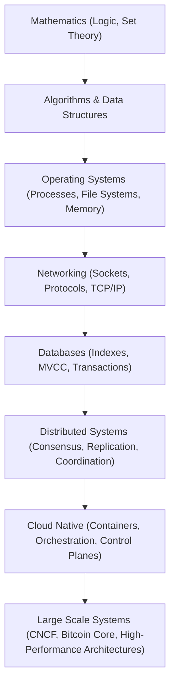

---

## Foundation Dependencies

You cannot master advanced abstractions without solidifying their baseline dependencies:

### 1. Open Source Workflow
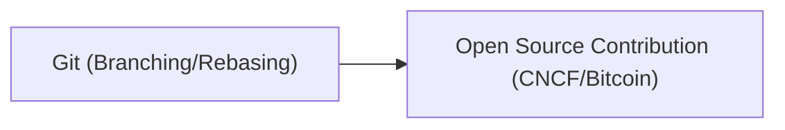

### 2. Processes to Containers
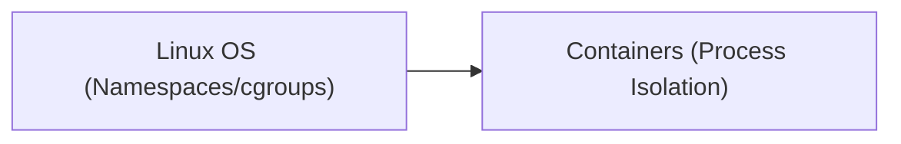

### 3. Network Interfaces to RPCs
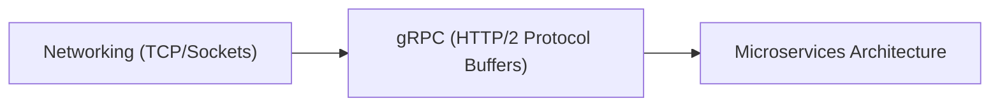

### 4. OS Abstractions to Cloud Orchestration
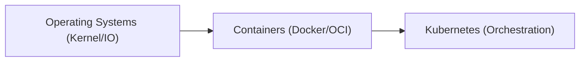

---

## Backend Systems Map

Developing backend architectures requires bridging transport protocols and internal execution primitives:

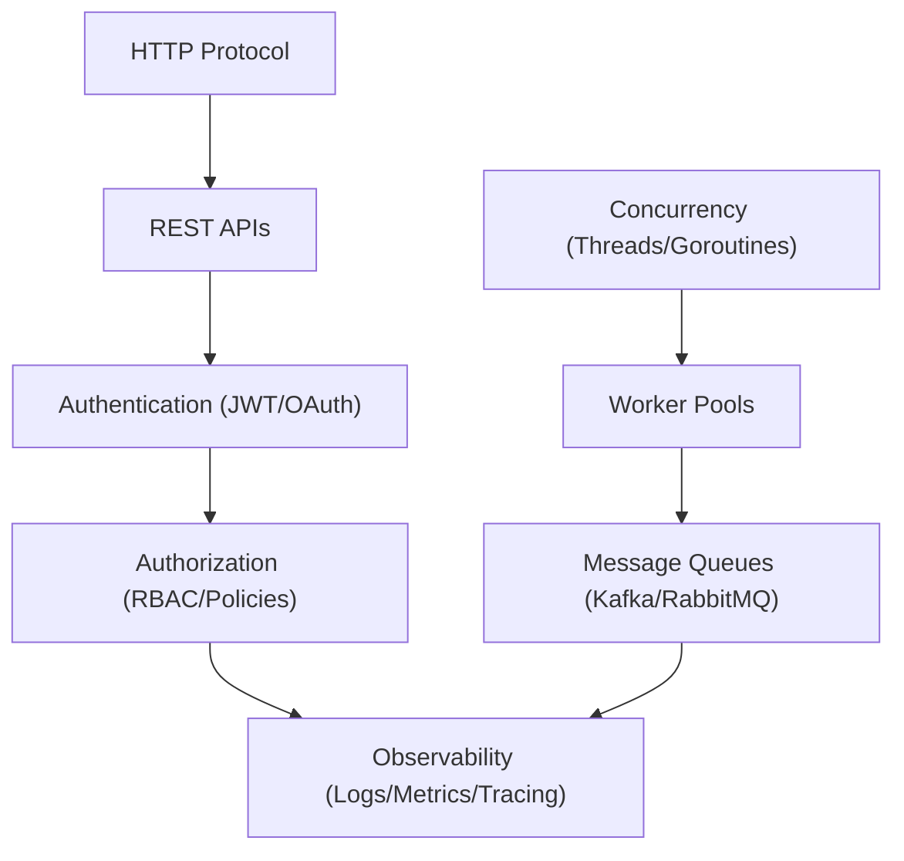

---

## Database Systems Map

Database engines sit at the intersection of data structures and concurrency safety (cross-reference with POSTGRESQL.md):

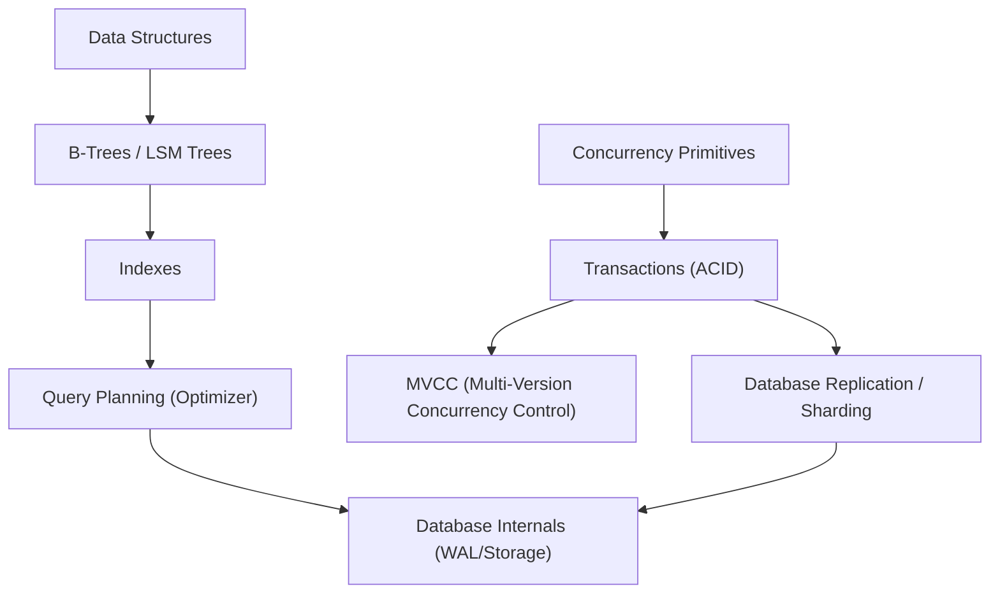

---

## Distributed Systems Map

Distributed architectures coordinate independent machines over unreliable networks (cross-reference with DISTRIBUTED_SYSTEMS.md):

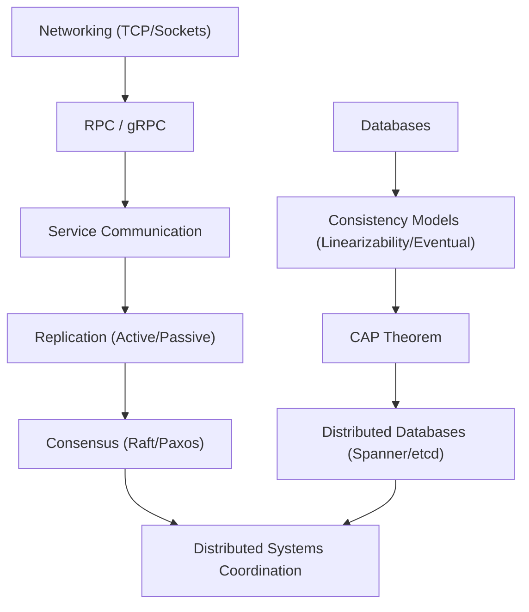

---

## Cloud Native Systems Map

Cloud-native engineering builds scheduling control planes on top of isolated host processes (cross-reference with KUBERNETES.md):

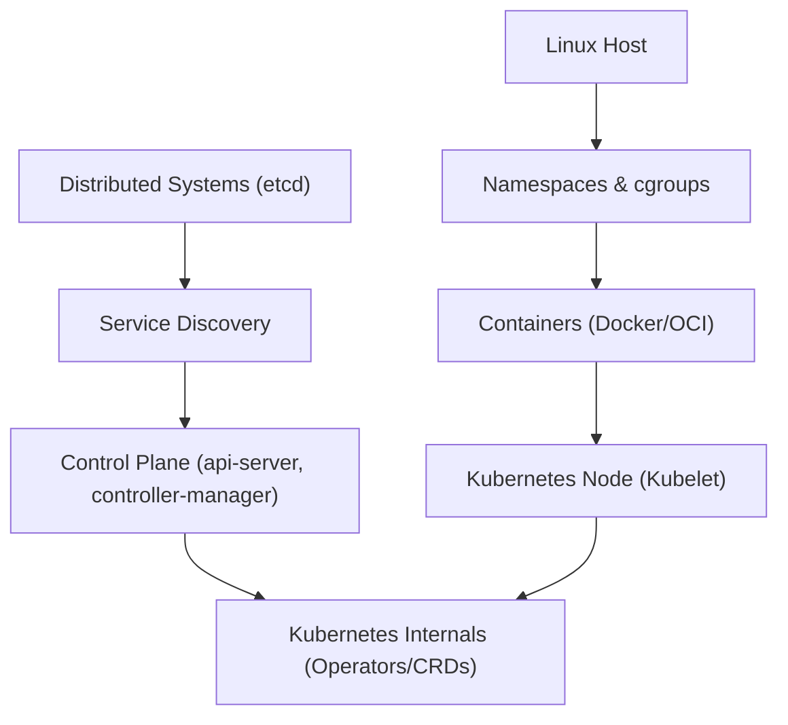

---

## Open Source Knowledge Map

Navigating open source is a progression from command line mechanics to community leadership (cross-reference with CONTRIBUTION_WORKFLOW.md and MAINTAINER_INTERACTION.md):

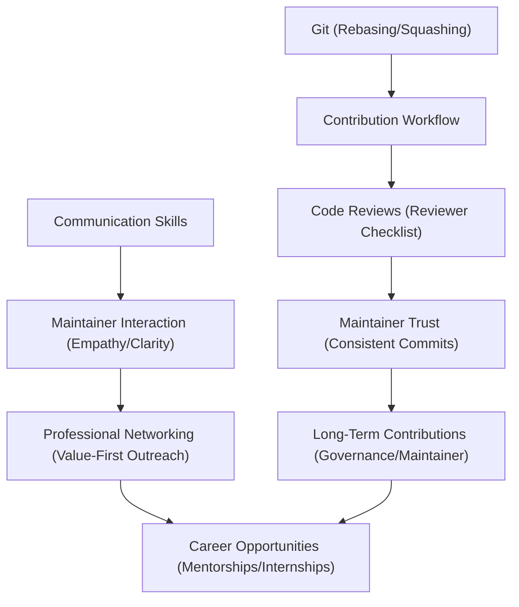

---

## Bitcoin Knowledge Map

Bitcoin engineering layers cryptographic transaction models onto decentralized peer-to-peer networks (cross-reference with SUMMER_OF_BITCOIN.md):

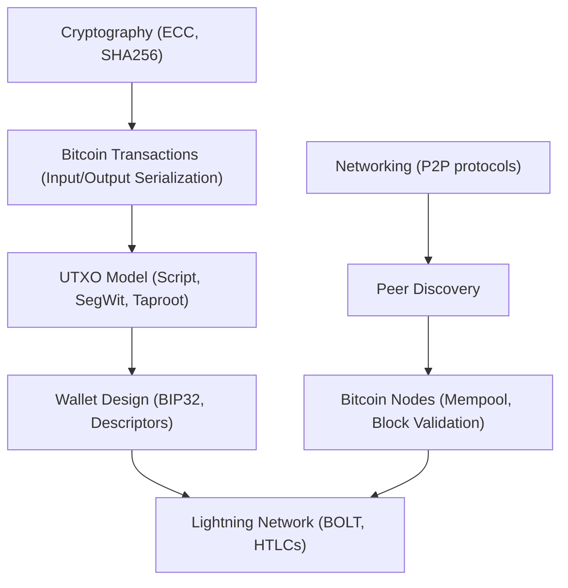

---

## AI-Assisted Engineering Map

Maximizing AI collaboration requires structuring requirements and constraints before writing code (cross-reference with AI_COLLABORATION.md):

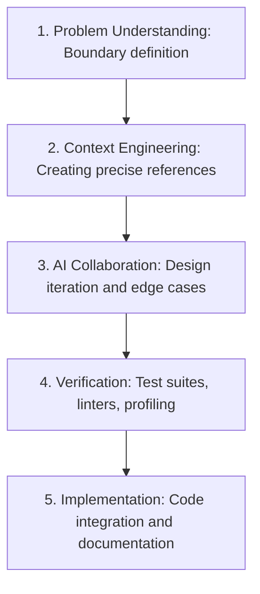

---

## CNCF Knowledge Path

For cloud-native and systems engineering roles, this path represents your primary roadmap:

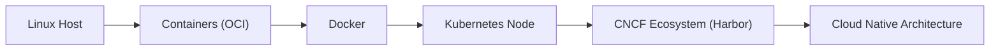

*Focusing on Harbor development within the LFX context requires a solid command of each prerequisite in this path.*

---

## Cross-Domain Connections

Systems do not operate in a vacuum. Analyze how complex architectures connect multiple underlying domains:

### 1. PostgreSQL Internals
```
PostgreSQL = OS (Page cache, I/O) + Data Structures (B-Trees) + Concurrency (Locks, MVCC) + Storage (WAL) + Network (Wire protocol)
```
*Prerequisite checklist before modifying database layers: Master thread-safety, transaction isolation, and file system indexing.*

### 2. Kubernetes
```
Kubernetes = Linux Host (cgroups, namespaces) + Networking (CNI, iptables) + Distributed Systems (etcd consensus) + REST APIs (API server)
```
*Prerequisite checklist before writing K8s operators: Understand reconcile loops, container process signals, and distributed key-value storage.*

### 3. CNCF Harbor
```
Harbor = Go (Concurrency) + Containers (Docker Registry/OCI spec) + Kubernetes (Helm/Operators) + Distributed Systems (Database, Redis caching)
```
*Prerequisite checklist before diving into Harbor replica replication: Master concurrent worker patterns and OCI registry distribution specs.*

### 4. Bitcoin Core
```
Bitcoin Core = Cryptography (ECDSA, Schnorr) + Networking (P2P message serialization) + Distributed Systems (Proof of Work consensus) + Storage (LevelDB UTXO database) + Security (Adversarial inputs)
```
*Prerequisite checklist before protocol changes: Understand scripting limits, signature aggregation, and block validation networking rules.*

---

## Knowledge Transfer Paths

Knowledge is highly transferable between systems domains. Mastering a core abstraction in one area accelerates your learning in adjacent domains.

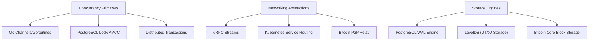

### Key Reusable Abstractions:
- **Concurrency:** Understanding mutexes, race conditions, and synchronization in Go directly translates to understanding MVCC transaction isolations in PostgreSQL and consensus states in Distributed Systems.
- **Networking:** Mastering raw TCP sockets and serialization protocols directly accelerates building with gRPC in microservices, debugging Kubernetes service proxies (kube-proxy), and understanding Bitcoin P2P message relay.
- **Storage Engines:** Learning Write-Ahead Logging (WAL) and index page management in PostgreSQL prepares you for studying LevelDB (used for Bitcoin Core's UTXO set) and custom transaction logs.

*Always search for reusable mental models and protocol concepts rather than treating each new tool as an isolated set of facts.*

---

## Learning Dependency Rules

To prevent cognitive overload and "abstraction shell shock," adhere to the following dependency boundaries:

> [!WARNING]
> **Do Not Attempt to Learn:**
> *   **Kubernetes** before understanding Linux host isolation (namespaces, cgroups), basic container builds, and basic networking (routing, ports).
> *   **Distributed Consensus (Raft/Paxos)** before understanding database replication models, socket message loss, and network partition failures.
> *   **Lightning Network Contracts** before understanding Layer 1 Bitcoin transactions, Script evaluation, and locktime conditions (CLTV/CSV).
> *   **Advanced Database Tuning** before understanding B-Trees, transaction isolation boundaries, and WAL logging.

---

## Knowledge Gap Detection

Whenever you experience persistent confusion, repeated debugging failures, or slow progress on a task, it is highly likely that a prerequisite node in the knowledge graph is missing.

Diagnose your gaps using this template:

```markdown
- **Topic:** [Target concept where friction occurred]
- **Symptom / Confusion:** [What error, log, or system behavior was confusing?]
- **Likely Missing Dependency:** [Prerequisite abstraction that explains the mechanics]
- **Action Plan:** [Targeted study of the dependency before resuming work]
```

---

## Updating The Graph

Every time you learn a new systems concept or tool:
1.  **Identify Prerequisites:** Find the node that supports this new tool.
2.  **Draw Edges:** Map how it connects to other domains (e.g., Go concurrent pools connecting to Redis caching queues).
3.  **Insert link references:** Keep the graph updated with links to new internals playbooks as you author them.

---

## Continuous Improvement

*   **Refactor Constraints:** As your understanding of systems internals deepens, update the dependency rules to capture new prerequisite insights.
*   **Refine the Paths:** Modify target pathways (like the CNCF path or Bitcoin path) based on feedback from active PR reviews and program selection.
