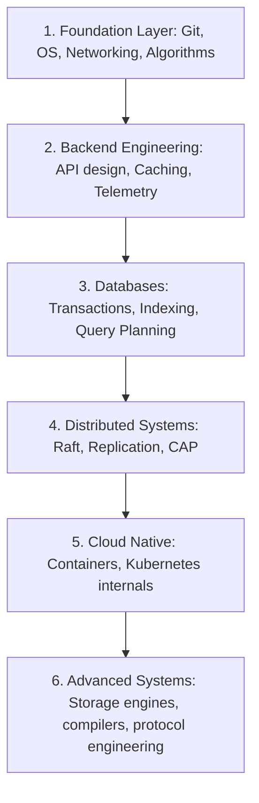
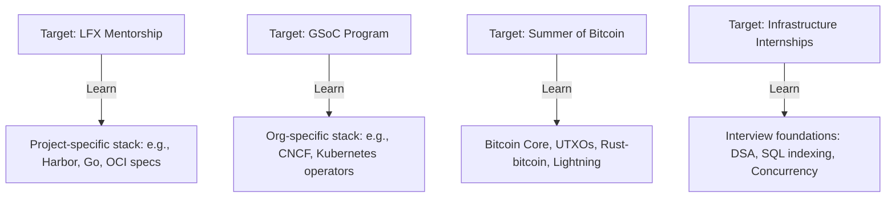

# Learning Backlog

This document serves as the prioritization engine for Govind-OS. It defines the strategic roadmaps, scoring frameworks, active queues, and parking lots required to align study hours with target mentorships, internships, and deep systems engineering capabilities.

---

## Purpose

The purpose of the learning backlog is to prioritize learning efforts according to long-term engineering goals.

*   **The backlog is not a wishlist.**
*   **It is a strategic queue of high-leverage skills, concepts, and domains.**
*   *It answers the question: "Given my limited time, what deserves my next 100 hours of deep work?"*

---

## Core Philosophy

*   **Prefer fundamentals over trends:** Focus on core protocols, algorithms, and systems architectures rather than ephemeral frameworks or syntax.
*   **Prefer leverage over novelty:** Learn skills that amplify your ability to contribute to systems repositories (e.g., database query planning, P2P networking).
*   **Prefer depth over breadth:** Deeply understand a single module or architecture (e.g., PostgreSQL storage internals) rather than skimming ten general developer tools.
*   **Prefer reusable skills over niche skills:** Prioritize abstractions that apply across multiple platforms and domains (e.g., concurrency models, socket interfaces).
*   **Prefer engineering capability over certification accumulation:** Measure progress by what you can design and build, not by passive credentials.

---

## Prioritization Framework

Before promoting any skill or topic to your active learning queue, evaluate and score it out of 50 points using the **Leverage Matrix**:

| Criteria | Scoring Focus | Score |
| :--- | :--- | :--- |
| **Career Leverage** | Does this skill directly support securing a premium mentorship (LFX/GSoC/SoB) or internship role? | /10 |
| **Open Source Relevance** | Can I immediately use this skill to solve issues or review PRs in target CNCF/Bitcoin repositories? | /10 |
| **Engineering Depth** | Does this teach me first-principles systems concepts (concurrency, networking layers, database engines)? | /10 |
| **Reusability** | How often will this skill be reused across different domains and architectures over my career? | /10 |
| **Personal Interest** | Am I highly motivated to explore this technical domain? | /10 |

#### Total Score: /50

> [!TIP]
> **Priority Threshold:** Only topics scoring **35/50 or higher** should be promoted from the Parking Lot into the Active Learning Queue.

---

## Learning Roadmap

Our strategic learning progression flows from foundational systems mastery up to advanced cloud-native and protocol engineering:



---

## Foundation Layer

Must master to achieve baseline systems independence.

| Core Skill | Focus Areas | Status | Reference Guide |
| :--- | :--- | :--- | :--- |
| **Git & Version Control** | Branching, rebasing, squashing, cherry-picking, signing commits. | **Strong** | CONTRIBUTION_WORKFLOW.md |
| **Linux/CLI Systems** | Process management, shell scripting, environment configuration, build pipelines. | **Applied** | WORKFLOWS.md |
| **Networking Fundamentals** | TCP/IP model, socket programming, DNS, HTTP/1.x vs. HTTP/2 protocol. | **Learning** | SYSTEM_DESIGN.md |
| **Operating Systems** | Processes, threads, memory management (virtual memory, stack vs. heap), file systems. | **Learning** | LANGUAGE_AGNOSTIC_ENGINEERING.md |
| **Data Structures & Algorithms** | Dynamic arrays, HashMaps, B-Trees, graphs, DFS/BFS, sorting algorithms. | **Strong** | INTERNSHIPS.md |
| **Concurrency Basics** | Mutexes, race conditions, deadlocks, channel communication, worker pools. | **Applied** | BACKEND.md |
| **Testing Fundamentals** | Unit testing, mock interfaces, integration tests, benchmark tests. | **Strong** | REVIEW_GUIDELINES.md |

*Status key: Not Started ➔ Learning ➔ Applied ➔ Strong*

---

## Backend Engineering Layer

Focused on designing scalable, observable APIs and high-performance execution patterns.

*   **REST APIs & gRPC:** API definition, Protocol Buffers, HTTP/2 serialization, streaming endpoints. (Status: **Applied**)
*   **Authentication & Authorization:** JWTs, OAuth2, RBAC (Role-Based Access Control) models. (Status: **Applied**)
*   **Caching & Message Queues:** Redis caching policies, Pub/Sub channels, Kafka/RabbitMQ queue mechanics. (Status: **Applied**)
*   **API Design & Observability:** Clean interface boundaries, structured logging, tracing (OpenTelemetry), and metrics collection (Prometheus). (Status: **Learning**)

---

## Databases Layer

Mastering state management internals (cross-reference with POSTGRESQL.md).

*   **PostgreSQL Internals:** Storage layouts (pages, tuples), Write-Ahead Logging (WAL) mechanics. (Status: **Learning**)
*   **Query Planning & Indexing:** Executing EXPLAIN ANALYZE, B-Tree indexes, Hash indexes, index scan types. (Status: **Learning**)
*   **Transactions & Isolation Levels:** ACID properties, Read Committed, Repeatable Read, Serializable, MVCC mechanics. (Status: **Applied**)
*   **Scale Architectures:** Read replication, connection pooling (PgBouncer), database sharding, and partitioning. (Status: **Not Started**)

---

## Distributed Systems Layer

Designing robust systems that span nodes (cross-reference with DISTRIBUTED_SYSTEMS.md).

*   **Consensus & Raft:** Protocol states (leader, follower, candidate), log replication, heartbeats, split-brain mitigation. (Status: **Learning**)
*   **CAP Theorem & Replication:** Trade-offs between Consistency, Availability, and Partition Tolerance; active-passive replication. (Status: **Applied**)
*   **Discovery & Coordination:** Service discovery mechanisms, key-value stores (etcd, Consul), leader election. (Status: **Learning**)
*   **Distributed Transactions:** Eventual consistency patterns, Saga pattern, Outbox pattern, 2PC (Two-Phase Commit). (Status: **Not Started**)

---

## Cloud Native Layer

Container orchestration and infrastructure patterns (cross-reference with KUBERNETES.md).

*   **Containers & Docker:** Processes isolation (namespaces, cgroups), image serialization, layering optimizations. (Status: **Applied**)
*   **Kubernetes Architecture:** Control plane components (api-server, controller-manager, scheduler, etcd), kubelet reconciliation. (Status: **Learning**)
*   **Operators & Extensibility:** Custom Resource Definitions (CRDs), writing controllers/operators (reconcile loop). (Status: **Not Started**)
*   **CNCF Tooling:** Helm chart packaging, service meshes (Istio/Linkerd), and Prometheus/Grafana stacks. (Status: **Learning**)

---

## Open Source Layer

Collaboration dynamics and codebase execution skills.

*   **Large Codebase Navigation:** Tracing execution paths, analyzing interfaces, searching symbols in large codebases. (Status: **Strong**)
*   **Code Reviewing:** Evaluating design, correctness, and style standards (cross-reference with REVIEW_GUIDELINES.md). (Status: **Strong**)
*   **Maintainer Communication:** Asynchronous public communication (IRC, Slack, mailing lists) matching MAINTAINER_INTERACTION.md. (Status: **Strong**)
*   **CI/CD & Pipelines:** GitHub Actions workflows, lint rules, container building pipelines. (Status: **Applied**)

---

## Systems Engineering Layer

Low-level development, performance optimizations, and core system building.

*   **Storage Engines:** LSM trees vs. B-Trees, MemTable flushing, SSTable compaction algorithms. (Status: **Not Started**)
*   **Networking Internals:** Socket state machines, epoll/kqueue event loops, TCP handshake optimization. (Status: **Not Started**)
*   **Performance Engineering:** CPU caches, profiling (pprof, perf), memory allocation optimization, zero-copy networking. (Status: **Learning**)

---

## Bitcoin Engineering Layer

Specific to Summer of Bitcoin and protocol development (cross-reference with SUMMER_OF_BITCOIN.md).

*   **Bitcoin Fundamentals:** UTXO transaction mechanics, Script types, SegWit, Taproot spend validation. (Status: **Learning**)
*   **Lightning Network:** Hashed Timelock Contracts (HTLCs), payment channels, onion routing. (Status: **Not Started**)
*   **Wallet Infrastructure:** BIP32 hierarchical derivation, descriptor wallets, coin selection. (Status: **Not Started**)

---

## AI-Assisted Engineering Layer

Human-AI collaborative loops (cross-reference with AI_COLLABORATION.md).

*   **Context Engineering:** Curating precise markdown references to maximize AI assistant precision. (Status: **Strong**)
*   **AI Code Review & Debuging:** Iterative diagnostic cycles to check variable bounds, concurrency anomalies, and leaks. (Status: **Strong**)

---

## Opportunity-Aligned Learning

Strategic alignment ensures that your learning targets match the requirements of active selection windows:



*Prioritize the stack associated with the nearest application deadline.*

---

## Active Learning Queue

To prevent cognitive overload and learning fragmentation, **limit yourself to a maximum of 3 active topics at any time**.

### Current Queue:
1.  **PostgreSQL Internals:** Storage layout, MVCC, and execution plan optimization (Target: 40 Hours).
2.  **Kubernetes Controller Mechanics:** CRDs and writing custom reconcile loops in Go (Target: 30 Hours).
3.  **Bitcoin Transactions (UTXO Model):** BIP32 derivation and Taproot spends (Target: 30 Hours).

---

## Learning Debt

Learning debt accumulates when gaps in your knowledge directly block active execution. Some of the best learning opportunities come from actual weaknesses encountered in real tasks, rather than planned roadmaps.

### Triggers for Learning Debt:
- **Active Project Blockers:** A project requires domain knowledge you currently lack.
- **PR Review Feedback:** A maintainer's review exposes an architectural or logical weak area.
- **Mentor Input:** A mentor highlights a missing concept or toolchain standard.
- **Interview/Triage Gaps:** An interview or diagnostic failure reveals a specific knowledge gap.

### Debt Capture Template:
```markdown
- **Topic:** [Target concept or tool gap]
- **Why It Matters:** [Impact on capability or project output]
- **Where It Appeared:** [Specific issue link, PR, or diagnostic event]
- **Priority (High/Med/Low):** [High if blocking current queue, Med/Low otherwise]
- **Target Completion:** [Specific target week or date]
```

---

## Parking Lot

Topics worth studying later. Kept here to prevent constant priority switching and context drift:

*   **eBPF (Extended Berkeley Packet Filter):** Kernel networking telemetry and tracing.
*   **Rust Language Internals:** Memory safety lifespans, macro generation, and async runtime execution.
*   **LSM Storage Engines:** Writing a minimal key-value database from scratch.
*   **Compiler Design:** Authoring a custom parser and interpreter for a simplified scripting language.

---

## Quarterly Review Process

Every three months, execute a backlog audit:
1.  **Promote/Demote:** Move topics between the Parking Lot and Active Learning Queue based on upcoming opportunities.
2.  **Re-Rank:** Grade new targets using the Prioritization Framework.
3.  **Archive:** Document completed skills under your personal portfolio assets.
4.  **Remove:** Discontinue topics that no longer align with your long-term career goals.

---

## Continuous Improvement

*   **Refactor Your Estimates:** Compare estimated study times against actual hours spent to improve backlog predictions.
*   **Align with Merged Code:** Periodically verify that your active queue topics match the technical requirements of your recently merged open-source PRs.
