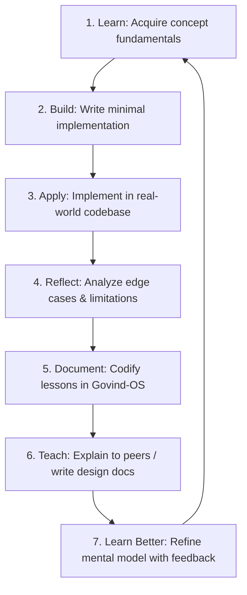
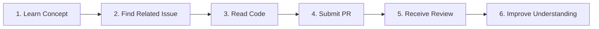
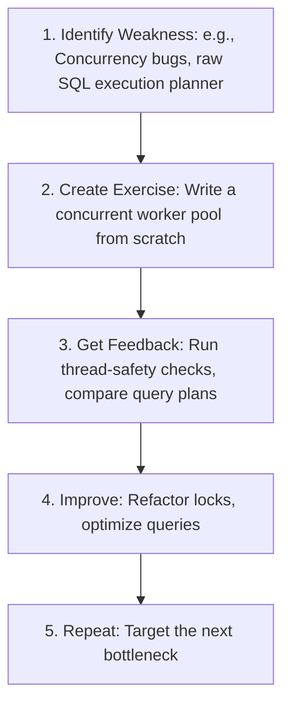

# Learning System

This document establishes the operational learning engine of Govind-OS. It defines the structured cycles, cognitive models, deliberate practice loops, and prioritization filters required to transform raw information into production-grade systems engineering capability.

---

## Purpose

The purpose of learning is not information accumulation. The purpose of learning is capability acquisition.

*   **Knowledge only becomes valuable when it improves reasoning, decision making, communication, or execution.**
*   *The objective is to transform raw information into usable, production-grade engineering capability.*

---

## Core Philosophy

→ See [core/ENGINEERING_PRINCIPLES.md](../core/ENGINEERING_PRINCIPLES.md) for universal principles.

*   **Prefer building over passive consumption:** Write code, run tests, and spin up prototypes rather than just watching tutorials.
*   **Prefer depth over superficial breadth:** Deeply master core abstractions rather than skimming hot frameworks.
*   **Prefer fundamentals over tools:** Learn permanent abstractions (concurrency, socket programming, B-trees) over ephemeral tooling.
*   **Prefer compounding knowledge:** Acquire skills that build on one another and retain value over decades.

---

## Learning Objectives

Every learning activity should directly contribute to your capability stack. Evaluate target subjects by asking:

> **"Will this make me a stronger engineer?"**

Specifically, learning must measurably improve:
1.  **Engineering Capability:** The complexity of systems you can build, optimize, and maintain.
2.  **Problem-Solving Ability:** The efficiency and correctness with which you triage bugs, isolate root causes, and resolve bottlenecks.
3.  **System Design Reasoning:** Your ability to analyze design choices and trade-offs quantitatively (e.g., latency, throughput, consistency).
4.  **Technical Communication:** The clarity of your design documents, PR reviews, and architectural discussions.
5.  **Open-Source Effectiveness:** Your speed and precision in contributing to large, complex external codebases.
6.  **Career Leverage:** The value and demand of your technical skills in premium mentorship programs, internships, and industry roles.

---

## The Learning Flywheel

Every completed loop strengthens your technical foundation and creates durable capability:



---

## Learn → Build → Teach → Apply

Learning is incomplete until it is actively applied. Move systematically through the progression:

1.  **Learn the Concept:** Grasp the core mechanics and RFCs (e.g., how the Raft consensus protocol handles leader election).
2.  **Build a Small Implementation:** Write a simplified, local version of the concept from scratch (e.g., a single-file, in-memory implementation of Raft).
3.  **Explain the Concept (Teach):** Write a blog post, explain it to a peer, or create a mock Architecture Decision Record (ADR). This exposes gaps in your mental model.
4.  **Apply in a Real Project:** Implement the pattern in a production-like side project or submit a contribution to an upstream repository.
5.  **Reflect on Lessons:** Document the challenges, bugs, and performance characteristics encountered (cross-reference with WORKFLOWS.md).

> [!IMPORTANT]
> **Do not stop at understanding.** Convert understanding into capability through execution.

---

## First-Principles Learning

Before learning a specific tool, compiler, or library, decompose it into its foundational problems:

| Modern Tool | Foundational Problem | First-Principles Core |
| :--- | :--- | :--- |
| **Kubernetes** | Distributed System Orchestration | Desired state reconciliation, consensus, service discovery, container scheduling. |
| **PostgreSQL** | ACID-Compliant State Management | Write-Ahead Logging (WAL), B-Trees, transaction isolation levels, query optimization. |
| **Docker** | Process Isolation & Deployment | Linux namespaces, cgroups, copy-on-write union file systems. |
| **gRPC** | Efficient Inter-Process Communication | Protocol Buffers serialization, HTTP/2 multiplexing, streaming RPCs. |

### First-Principles Questions to Ask:
*   *What problem exists that made this tool necessary?*
*   *Why was this tool created instead of using existing alternatives?*
*   *What are the core technical constraints and trade-offs of its design?*

---

## Project-Based Learning

Projects transform dry theory into permanent engineering skills:

*   **Integrate Concepts:** Every major systems concept you study (e.g., write-ahead logging, TCP socket pools, rate limiters) should eventually be implemented in a prototype.
*   **Adversarial Environment:** Build projects that handle network latency, file system failures, and concurrent race conditions.
*   **The Litmus Test:** Ask yourself: *"Can I build a working version of this concept from scratch without referring to step-by-step tutorials?"*

---

## Learning Portfolio

Every significant learning effort should eventually produce an artifact.

### Possible Artifacts:
- **Open source contribution:** A merged pull request, bug fix, or test suite addition.
- **Side project:** A prototype or functioning tool demonstrating a complex systems protocol.
- **Design document:** A detailed Architecture Decision Record (ADR) explaining design selections.
- **Technical blog:** A postmortem or architectural breakdown explaining a system component.
- **Benchmark report:** Performance statistics comparing database workloads, memory allocations, or networking protocols.
- **Architecture review:** A critique and analysis of an existing design pattern or protocol spec.
- **Presentation:** A technical talk, slideshow, or tutorial explaining a concept to peers.
- **Internal notes:** Clean, queryable, markdown-formatted reference assets cataloged in Govind-OS.

*Learning that produces public or written artifacts compounds significantly faster than learning that remains private.*

```
Learning ➔ Visible Output ➔ Career Leverage
```

### Why Artifacts Matter:
- **Proof of capability:** Artifacts act as a publicly auditable track record of what you can build.
- **Resume content:** Directly provides STAR-based points for your resume profile (see RESUME_RULES.md).
- **Discussion material:** Gives mentors, recruiters, and maintainers a technical asset to evaluate.
- **Networking opportunities:** Attracts other engineers and builds reputation capital naturally.
- **Future reference material:** Serves as a persistent personal playbook you can refer back to when writing code.

---

## Open Source Learning

Open source accelerates learning by placing you in contact with real-world engineering constraints (cross-reference with CONTRIBUTION_WORKFLOW.md):

*   **Real Codebases:** Navigating, reading, and editing large production codebases built by teams over years.
*   **Real Users:** Your changes affect real systems, exposing you to strict backward compatibility requirements.
*   **Real Reviews:** Senior maintainers critique your logic, style, and testing, providing free mentorship.
*   **Real Constraints:** Working within pre-existing CI/CD pipelines, lint settings, and architectural patterns.

---

## Open Source Accelerated Learning

This loop exposes you directly to real-world edge cases and feedback:



Instead of building simple toy apps in isolation, reading core project PRs (e.g., in Harbor or LDK) and solving open issues forces you to learn how production systems handle logging, security, concurrency, and validation.

---

## Knowledge Retention System

Information decays rapidly if not systematically stored and reviewed. Do not rely on memory to retain complex systems concepts.

### What to Capture:
*   **Hard Lessons:** How a database deadlock was resolved or why a concurrent memory bug occurred.
*   **Code Review Feedback:** Critiques from maintainers about error handling, performance patterns, or structure.
*   **Architectural Trade-offs:** The reasons behind selecting an index type, replication scheme, or telemetry model.
*   **Systems Internals:** Explanations of how compiler optimizers, kernel page caches, or networking stacks operate.

---

## Knowledge Capture Framework

Whenever you encounter a valuable insight, resolve a complex bug, or study a protocol, log it using this template:

```markdown
### [Topic Title]

- **Problem / Context:** What was the issue or target mechanism?
- **Key Insight:** What was the breakthrough or core technical detail?
- **Code / Architecture Example:**
  [Insert minimal, clean code block or architectural block]
- **When To Use:** Specific scenarios where this pattern/tool excels.
- **When Not To Use:** Trade-offs and cases where this introduces anti-patterns.
- **Related Concepts:** Links to other files, BIPs, or RFCs in Govind-OS.
```

---

## Deliberate Practice Framework

Deliberate practice is different from passive learning; it targets your technical weaknesses:



---

## Learning Prioritization Framework

Before spending hours researching a new framework, language, or tool, grade it against the **Leverage Matrix**:

1.  **Engineering Capability:** Will this help me build higher-performance, scalable systems?
2.  **Open Source Utility:** Is this stack active in my target communities (e.g., CNCF, Bitcoin Core, database engines)?
3.  **Project Quality:** Will this make my side projects more robust and production-like?
4.  **Career Leverage:** Is this skill highly valued in premium mentorship programs (LFX/GSoC/SoB) and infrastructure firms?

*Prioritize skills that score high in long-term reuse, technical depth, and community alignment (e.g., learning socket programming over learning a new JS framework).*

---

## Skill Acquisition Framework

Track your progression through these five developmental stages:

1.  **Awareness:** You know the concept exists (e.g., *"I've heard of LSM Trees"*).
2.  **Understanding:** You can explain how the concept works theoretically (e.g., *"LSM trees write to MemTables and flush to SSTables"*).
3.  **Implementation:** You can build a basic version of it locally (e.g., *"I wrote a minimal LSM storage engine in Go"*).
4.  **Application:** You can deploy, monitor, and debug the system under load (e.g., *"I integrated my LSM database into a log aggregator"*).
5.  **Mastery:** You can optimize internals, write custom compilers, or author protocol patches (e.g., *"I contributed an index compaction fix to an upstream database"*).

> [!WARNING]
> Most developers get stuck at **Understanding** (Tutorial Hell). Real engineering begins at **Implementation** and **Application**.

---

## Learning Metrics

Measure your progress by **tangible outputs** rather than inputs:

*   **Input Metrics (Avoid using as success):**
    *   Hours spent watching tutorials.
    *   Number of chapters read.
    *   Passive course completion certificates.
*   **Output Metrics (Use as success):**
    *   Number of systems projects built from scratch.
    *   Pull requests merged in upstream open-source repositories.
    *   In-depth design docs (ADRs) authored.
    *   Protocol bugs isolated and solved.

---

## Avoiding Learning Traps

Identify and escape common cognitive bottlenecks:

### 1. Tutorial Hell
*   **Symptoms:** Watching hours of walkthroughs, but unable to write code without a guide.
*   **Why It Happens:** Fear of failure or blank-editor anxiety; consumption feels like progress.
*   **How to Escape:** Shut down the video. Open your editor and write a simplified version of the code from scratch, deliberately making changes.

### 2. Course & Book Hoarding
*   **Symptoms:** Collecting dozens of online courses and textbooks without completing or applying them.
*   **Why It Happens:** The act of purchasing or downloading creates a false sense of accomplishment.
*   **How to Escape:** Limit yourself to **one** active book/course. Do not start another until you have built a project applying the current material.

### 3. Passive Consumption
*   **Symptoms:** Reading codebases or architecture blogs without running, modifying, or benchmarking the code.
*   **Why It Happens:** Passive reading requires less cognitive effort than setting up environments and compiling.
*   **How to Escape:** Keep your editor and terminal open while reading. Clone repositories, run benchmarks, and break dependencies to see what fails.

### 4. Framework Chasing
*   **Symptoms:** Switching to a new framework or library every week.
*   **Why It Happens:** The desire to stay on the cutting edge of tech trends.
*   **How to Escape:** Focus on core systems concepts (networking, consensus, filesystems) which remain stable over decades.

---

## Quarterly Learning Review

Every three months, audit your learning system (cross-reference with WORKFLOWS.md):
*   **Skills Assessment:** Which core technical skills improved? Which remain weak?
*   **Application Audit:** What did I actually *build* or *contribute* with the knowledge I acquired?
*   **Leverage Evaluation:** Did my chosen learning targets provide career or open-source leverage?
*   **Next Horizon:** What are the next 1–2 fundamental engineering topics I must study?

---

## Continuous Improvement

*   **Refactor the Method:** If a specific study approach (e.g., passive video watching) yields low output metrics, discontinue it.
*   **Optimize the Environment:** Track when you do your best deep work (cross-reference with WORKFLOWS.md) and protect that time block.
*   **Tighten the Loop:** Continually shorten the time between consuming a concept and building its minimal implementation.
