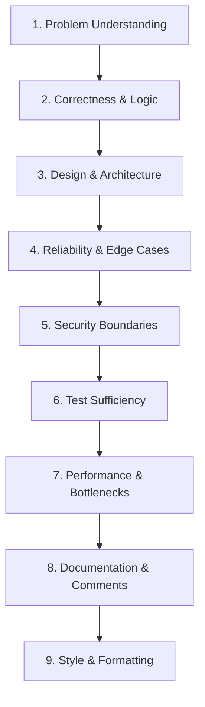

# Code Review Guidelines

This document establishes the code review frameworks, execution models, and communication principles for Govind-OS. It is written to train engineers to think like reviewers—moving beyond basic coding syntax toward evaluating system design, security boundaries, and maintainability.

Writing code makes you a contributor; reviewing code makes you an architect. Fostering a high-quality review culture reduces bugs, shares system context, and compounds team-wide engineering judgment.

---

## Purpose

The purpose of code review is to improve code quality, reduce system defects, share architectural knowledge, and protect the long-term health of the codebase.

- **Code review is not a gatekeeping or policing activity.**
- **It is a collaborative engineering process designed to refine software systems.**
- **The ultimate goal is not to find fault with the contributor; the goal is to ensure the merged code can be safely operated, debugged, and maintained for years.**

---

## Core Philosophy

→ See [core/ENGINEERING_PRINCIPLES.md](../core/ENGINEERING_PRINCIPLES.md) for universal principles.

*   **Focus on systems, not personalities:** Address reviews to the code itself, not the author.
*   **Prefer evidence over opinion:** Base design feedback on codebase consistency, benchmarks, or established patterns.
*   **Improve the code, not your ego:** The review is about refining the system.

---

## Why Code Reviews Matter

Every line of code merged into a repository is a liability. Code reviews act as the primary gate to manage that liability:

*   **Defect Reduction:** Catch logical errors, race conditions, edge-case omissions, and resource leaks before they reach staging or production.
*   **Consistency Maintenance:** Enforce project-wide directory structures, naming conventions, and programming patterns.
*   **Architectural Alignment:** Ensure new components fit cleanly into the existing system design, preventing coupling drift.
*   **Context Propagation:** Distribute system understanding across multiple engineers. If only one person understands a module, it represents a single point of failure (SPOF) for the team.
*   **Developer Growth:** Reviewing and receiving feedback is the fastest mechanism for developers to improve their technical depth and code quality.

---

## Reviewer Responsibilities

A reviewer acts as a custodian of the project's codebase.

### What a Reviewer Is Responsible For
*   **Protecting Correctness:** Verifying that the code satisfies the declared functional requirements.
*   **Protecting Maintainability:** Guarding the code against unnecessary complexity, obfuscation, and tech debt.
*   **Protecting Conventions:** Enforcing lint standards, language idioms, and testing frameworks.
*   **Protecting Future Maintainers:** Ensuring the code is easily understandable by any engineer who reads it in the future.

### What a Reviewer Is NOT Responsible For
*   **Rewriting the Author's Solution:** If the author's solution is correct, performant, and clean, do not force them to rewrite it just to match your personal style.
*   **Enforcing Unwritten Rules:** Never block a PR based on arbitrary rules that are not documented in the style guide or guidelines. If a rule is important, document it first.
*   **Winning Arguments:** The goal is to merge clean code. Be willing to compromise on non-critical design preferences.

---

## Review Mental Model

When reviewing a pull request, operate under this core mental model:

> *"Imagine you will be paged at 3:00 AM to debug an outage caused by this code five years from now, long after the author has left the project. Would you be able to trace this logic, locate the failure point, and deploy a fix safely?"*

### Key Questions to Ask
*   Could a new contributor understand this code block without external documentation?
*   Does this implementation introduce new, unnecessary abstractions, or does it leverage existing structures?
*   What is the failure domain of this change? If this function fails, what downstream services crash?

---

## Review Order

Most inexperienced reviewers read a PR from top to bottom, immediately focusing on formatting, typos, and minor style issues. This wastes review bandwidth. Instead, execute reviews in this logical order:



*If the design or correctness of a PR is fundamentally flawed, there is no point in commenting on typos. Focus on the core system decisions first.*

---

## Correctness Review

*   **Requirement Verification:** Does the code actually implement the requested feature or fix the target bug?
*   **Input Validation:** Are parameters checked for boundary limits, null states, or empty formats at the public API entry points?
*   **Error Handling:** Are errors checked at every execution boundary? Are they wrapped with context before being returned up the stack, or are they swallowed?
*   **Logical Edge Cases:** What happens if array inputs are empty, files are missing, or database lookups return no rows?

---

## Design Review

*   **Simplicity:** Is this the simplest possible design that solves the problem? Have we over-engineered abstract interfaces where a simple function would suffice?
*   **Coupling and Cohesion:** Does the change introduce cyclical dependencies between packages? Do functions have a single, focused responsibility?
*   **Pattern Consistency:** Does the new code follow the design patterns already established in similar modules of the codebase?

---

## Maintainability Review

*   **Readability:** Are variables, functions, and files named descriptively? (e.g., avoid `d` or `data` when `uncompressed_payload_bytes` is more descriptive).
*   **Complexity:** Look for deeply nested loops, massive `switch` blocks, or long conditional statements. Can these be refactored into smaller helper functions?
*   **Dead Code:** Ensure debug prints, commented-out code blocks, and unused import variables are removed.

---

## Testing Review

Code is not complete until it is verified by automated tests.

*   **Edge Case Coverage:** Do tests cover failure states, null inputs, and empty arrays, or do they only test the "happy path"?
*   **Brittle Tests:** Ensure tests assert on public outputs and behaviors, not on private functions or local structure implementations that might change during refactoring.
*   **Test Isolation:** Verify that unit tests do not make actual network requests or write to shared databases without setup/teardown encapsulation. Utilize test fixtures or local container environments.

---

## Security Review

Security is a blocking review concern. If you are uncertain about a security boundary, escalate the review to a senior maintainer.

*   **Input Sanitization:** Look for potential SQL Injection (SQLi), Cross-Site Scripting (XSS), or Command Injection vectors. Are parameterized queries utilized?
*   **Authorization Check:** Does the endpoint verify that the authenticated client has permission to read/write this specific resource index (ID-level auth checks)?
*   **Secret Handling:** Ensure passwords, API tokens, and certificates are never hardcoded or committed to version control.

---

## Performance Review

*   **Avoid Premature Optimization:** Do not request complex performance rewrites unless you have profiling evidence proving the block is a primary bottleneck.
*   **Resource Allocation:** Watch for memory allocations in tight loops, infinite channel buffers, or missing database index lookups.
*   **Bounded I/O:** Ensure all network calls and database queries have explicit timeouts and limits (e.g., paginating database select queries).

---

## Reliability Review

*   **Context Propagation:** In languages like Go, is the `context.Context` propagated correctly to handle timeouts and cancellations across network boundaries?
*   **Resource Leaks:** Ensure file descriptors, database connections, and HTTP response bodies are explicitly closed via `defer` or cleanup blocks.
*   **Concurrency Safety:** Audit locks, mutexes, and channels for potential deadlocks or race conditions. Ensure shared variables are protected under concurrent access.

---

## Documentation Review

*   **Public API Docs:** Are new public functions, classes, or configurations documented with clear comments explaining their usage?
*   **Stale Comments:** Ensure existing comments are updated if the surrounding code logic has changed. Stale comments are worse than no comments.
*   **Migration Guides:** If the schema or configuration schema changes, verify that clear migration instructions are documented.

---

## Open Source Reviewing

Reviewing contributions in open-source projects requires high communication empathy:

*   **Respect Contributor Effort:** Acknowledge the developer's time. Start reviews with positive feedback for clean code or good tests.
*   **Teach, Don't Just Reject:** Explain the architectural reason behind your request. Use reviews to educate contributors on project conventions.
*   **Link to Code Precedents:** If you request a change to follow a convention, link to a file in the repository where that pattern is implemented.

*   **Bad Feedback:**
    > *"Needs changes. Incorrect error handling."*
*   **Good Feedback:**
    > *"This project typically propagates errors up to the CLI execution boundary rather than calling log.Fatalf() inside subpackages. Could we update this function to return an error, following the pattern used elsewhere in the command execution layer?"*

---

## Giving Feedback

When writing review comments, structure your feedback to be constructive and actionable:

```
[Observation] -> I noticed X is occurring in this code block.
[Concern]     -> This might cause Y (performance issue/security risk/race condition).
[Suggestion]  -> Can we refactor this to use Z instead? [Link to code example]
```

### Example
> *"I noticed this query is executed inside a loop for each user ID. Under load, this will generate N+1 database calls, saturating our connection pool. Could we batch the lookups using an IN clause or JOIN query instead, similar to how we retrieve user groups in user_repository.go?"*

---

## Receiving Feedback

How you handle code reviews defines your professional maturity as an engineer.

*   **Assume Positive Intent:** Trust that the reviewer wants to help you merge clean, reliable code.
*   **Do Not Get Defensive:** Your code is not you. Separating your identity from your source code allows you to evaluate feedback objectively.
*   **Clarify Before Coding:** If a comment is confusing or you disagree with the suggestion, discuss it in the thread before spending hours rewriting code.

---

## AI-Assisted Reviews

AI tools can scale your review bandwidth:

*   **Use AI to Find:** Edge cases, missing unit tests, lint violations, and syntax errors.
*   **Do Not Outsource:** High-level architectural validation, security design approvals, and final validation accountability. AI cannot own production failures; the human reviewer does.

---

## Common Review Anti-Patterns

*   **Style Nitpicking:** Blocking a PR over spaces, braces, or minor formatting issues that should be handled automatically by a linter or formatter.
*   **Rubber-Stamping:** Approving a PR instantly without actually reading the code or verifying the tests ("Looks Good To Me" - LGTM).
*   **Vague Comments:** Leaving comments like *"This looks weird"* or *"Refactor this"* without explaining *why* or suggesting an alternative.
*   **Design-by-Opinion:** Demanding design updates based on personal preferences rather than project patterns or empirical evidence.

---

## Review Severity Levels

To prevent review bottlenecks and distinguish between critical blocks and optional polish, label your comments with severity tags:

*   **[BLOCKER]:** Critical defects that must be resolved before merging.
    *   *Examples:* Logical bugs, data corruption risks, security vulnerabilities, or missing tests.
*   **[MAJOR]:** Important structural issues that should be addressed.
    *   *Examples:* Significant maintainability concerns, poor naming, or redundant logic.
*   **[MINOR]:** Non-blocking improvement suggestions.
    *   *Examples:* Small refactoring ideas, minor performance tips, or doc improvements.
*   **[NIT]:** Optional polish or style preferences.
    *   *Examples:* Minor formatting suggestions or typos.

---

## Review Checklist

Before clicking "Approve" on a pull request, verify that you have checked:

- [ ] **Problem:** Do I fully understand the problem this PR is trying to solve?
- [ ] **Correctness:** Has the code been verified to solve the problem correctly?
- [ ] **Edge Cases:** Have empty states, invalid inputs, and error paths been handled?
- [ ] **Tests:** Are the automated unit/integration tests sufficient and stable?
- [ ] **Security:** Have inputs been sanitized, and are authorization checks in place?
- [ ] **Reliability:** Are connections closed, timeouts set, and concurrency structures safe?
- [ ] **Maintainability:** Is the code simple, readable, and consistent with the codebase?
- [ ] **Documentation:** Have inline comments and external README files been updated?
- [ ] **Severity:** Have all blocker comments been resolved by the author?

---

## Continuous Improvement

*   **Audit Past Reviews:** Periodically review merged PRs to see if bugs slipped through your reviews. Evaluate how to adjust your checklist to catch similar defects earlier.
*   **Study Senior Maintainers:** Read PR reviews written by lead maintainers in projects like Kubernetes, containerd, and Harbor. Pay attention to how they ask questions, frame constraints, and guide contributors.
*   **Iterate on the Guidelines:** Update this guide as the team discovers new code patterns, database rules, or deployment requirements.
