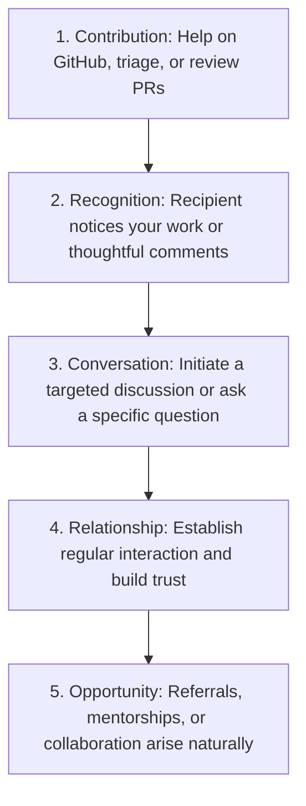

# Cold Outreach Playbook

## Purpose
The purpose of outreach is to begin professional relationships through respectful, relevant, and thoughtful communication. Outreach is not about asking strangers for favors; it is about creating opportunities for meaningful interaction and building mutual trust over time.

---

## Core Philosophy
- **Prefer relationships over transactions:** Focus on connection, not what you can get out of it immediately.
- **Prefer specificity over generic messages:** Never copy-paste generic templates without custom context.
- **Prefer curiosity over self-promotion:** Ask questions that show interest in their work rather than listing your accomplishments.
- **Prefer contribution before requests:** If possible, help with issues, documentation, or reviews before reaching out.
- **Prefer long-term trust over short-term gains:** A connection built slowly is more resilient than a one-time request.
- **Respect the recipient's time:** Keep messages concise and easy to read.

---

## Outreach Hierarchy
Outreach should progress naturally through these phases. Never skip steps to ask for favors directly.



*Do not attempt to leap from Message straight to Referral/Opportunity.*

---

## Before Sending Any Message
Verify your readiness with this self-check:
- [ ] Have I thoroughly researched the person (GitHub, blog, presentations, Twitter)?
- [ ] Do I know exactly why I am contacting *this specific person* instead of someone else?
- [ ] Is my message tailored and highly specific?
- [ ] Have I demonstrated effort (e.g., read their articles, tried debugging the issue, looked up docs)?
- [ ] Is my query worth their valuable time?

---

## Outreach Framework
A universal structure for cold communication:

```
Context  ⟶  Specific Interest  ⟶  Relevant Question  ⟶  Gratitude
```

### Generic Template
```markdown
Hi [Name],

I came across your work on [Project/Article/Talk].

I was particularly interested in [Specific Detail/Decision/Implementation].

I had a question regarding [Specific Question that shows prior research].

Thank you for your time.
```

---

## Maintainer Outreach
*For core developers of Harbor, CNCF, Kubernetes, or other open-source codebases.*

### Template
```markdown
Hi [Name],

While working through [Issue/PR/Feature], I noticed [Specific Observation/Code pattern].

I reviewed [Relevant File/Discussion] and wanted to better understand the reasoning behind [Specific Design Decision].

Could you point me toward any relevant discussions or context?

Thank you.
```

---

## Mentor Outreach
*For guidance from professionals in targeted roles/organizations.*

### Template
```markdown
Hi [Name],

I have been following your work on [Project/Domain].

I'm currently learning [Topic] and found your approach to [Specific Area] particularly interesting.

Do you have any recommendations for learning resources or areas I should focus on?

Thank you for your time.
```

---

## Contributor Outreach
*For peers and contributors active in a codebase.*

### Template
```markdown
Hi [Name],

I noticed your contributions to [Project].

I'm currently exploring that codebase and found your work around [Area] helpful.

I wanted to ask about [Specific Question].

Thanks for any guidance.
```

---

## Internship Outreach

> [!IMPORTANT]
> **Outreach Rule:** Seek Advice Before Seeking Opportunities. Asking directly for a job or referral is transactional and usually ignored. Asking for advice builds a connection.

### Template
```markdown
Hi [Name],

I noticed your experience at [Company/Team].

I'm currently building experience in backend and cloud-native systems through open-source contributions.

I was curious what skills or experiences you found most valuable when preparing for internships in this area.

Thank you.
```

---

## Conference Outreach
*For speakers or attendees after a tech conference or meetup.*

### Template
```markdown
Hi [Name],

I attended your session on [Topic] at [Conference].

One insight that stood out was [Specific Insight].

I'd love to learn more about [Related Topic/Follow-up Question].

Thank you for sharing your experience.
```

---

## Follow-Up Framework
*Only send a follow-up if it is genuinely appropriate.*

- **Rule 1:** Wait 5 to 10 days before checking in.
- **Rule 2:** Send exactly one follow-up. 
- **Rule 3:** Do not spam or express frustration. Keep it low-pressure.

### Template
```markdown
Hi [Name],

Following up on my previous message in case it was missed.

No worries if you're busy.

Thank you.
```

---

## Response Handling
Not every message will receive a response. Silence is not rejection; people are often busy.

### Positive Response
- Continue the conversation naturally.
- Ask thoughtful follow-up questions.
- Respect their time.

### No Response
- Send one follow-up after 5–10 days (using the template above).
- If there is still no response, move on.

### Negative Response
- Remain professional.
- Thank them for their time.
- Do not argue, pressure, or try to convince them.

---

## Thank You Framework
*Expressing gratitude is underused, powerful, and completes the feedback loop.*

### Template
```markdown
Hi [Name],

Thank you for your advice regarding [Topic].

Your suggestion about [Specific Point] was particularly helpful because [Explain why/how you applied it].

I appreciate your time.
```

---

## Asking For Advice

### Bad Example
> "How do I learn Kubernetes?"
> *Reason: Too broad. Shows no effort, research, or specificity. Puts the burden of work on the recipient.*

### Better Example
> "I understand Pods and Services, and I'm trying to understand why EndpointSlices were introduced to replace Endpoints. I'm trying to find resources on the scaling limitations of the older approach. Do you have any recommended reading or articles on this?"
> *Reason: Specific, researched, and focused. Demonstrates existing knowledge and a clear request.*

---

## Asking For Referrals

> [!IMPORTANT]
> **Referral Rule:** Trust First, Referral Second. A referral is a recommendation of character and capability. Maintainers or peers cannot refer you without first knowing your work.

### Referral Checklist
Verify all conditions before asking for a referral:
- [ ] A professional relationship already exists.
- [ ] The recipient is familiar with my work (e.g., reviewed my PRs, worked on a project together).
- [ ] A relevant opportunity exists for which I am qualified.
- [ ] The request is reasonable and gives them an easy out.

---

## Common Failure Modes
- **Generic messages:** Sending copy-pasted messages to 50 people without editing.
- **Asking for jobs immediately:** Treating the contact as a job portal.
- **No prior research:** Asking questions that are easily answered by a quick search.
- **Long walls of text:** Sending 1,000-word biographies that require too much effort to read.
- **No clear question:** Rambling without a clear call-to-action or query.
- **Mass messaging:** Spamming multiple people at the same company/project.
- **Following up excessively:** Messaging repeatedly within a short window.
- **Transactional mindset:** Abandoning the connection once you get or fail to get what you want.

---

## Outreach Checklist
Run this check right before clicking "Send":
- [ ] Researched recipient's background and contributions.
- [ ] Message is highly personalized.
- [ ] Clear reason for outreach is established.
- [ ] A single, specific question is included.
- [ ] Respectful and concise (under 150-200 words).
- [ ] No obvious or hidden asks for unearned favors.
- [ ] Easy and low-friction for them to respond to.
