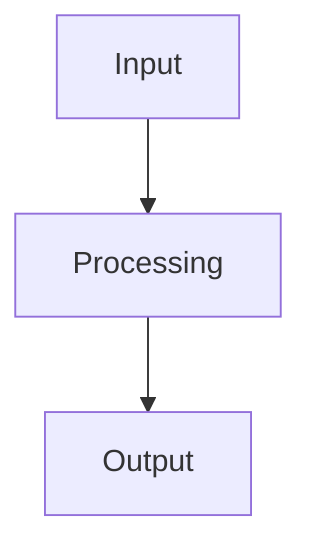

# Technical Writeup Template

> [!NOTE]
> **Purpose of a Technical Writeup:**
> The purpose of a technical writeup is to transform engineering work, research, debugging, learning, or open-source contributions into reusable knowledge. It should explain what problem existed, why it mattered, how it was investigated, what solution was chosen, and what lessons were learned. The goal is knowledge transfer, not documentation for its own sake.

---

## Core Philosophy
- **Prefer clarity over complexity:** Explain concepts in simple terms without unnecessary jargon.
- **Prefer teaching over impressing:** Write to help others understand, not to show off.
- **Prefer reasoning over conclusions alone:** Explain *why* a design or fix works, not just *what* was done.
- **Prefer trade-offs over absolutes:** Acknowledge the downsides of the chosen solution.
- **Prefer evidence over opinions:** Rely on benchmarks, profiles, logs, and facts.
- **Prefer reusable lessons over isolated observations:** Connect specific bugs or features to broader engineering principles.

---

## Audience
*Define who this writeup is intended for to tailer the complexity.*

- **Target Audience:** (e.g., Beginners, Contributors, Maintainers, Systems/Backend/CNCF Engineers, Future Me)
- **Prerequisites:** 
- **Expected Technical Background:** 

---

## Executive Summary
*A reader should be able to grasp the entire writeup in under one minute.*

- **Problem:** 
- **Solution:** 
- **Outcome:** 
- **Key Lesson:** 

---

## Metadata
- **Date:** YYYY-MM-DD
- **Author:** [Name]
- **Category:**
  - [ ] Open Source
  - [ ] Architecture
  - [ ] Learning
  - [ ] Debugging
  - [ ] Performance
  - [ ] Research
- **Status:**
  - [ ] Draft
  - [ ] In Review
  - [ ] Published
- **Related Projects:** 
- **Related Issues/PRs:** 

---

## Problem
- **What problem existed?** 
- **Who was affected?** 
- **Why did it matter?** 
- **How was it discovered?** 

---

## Background
- **Relevant Systems:** 
- **Relevant Architecture:** 
- **Important Concepts:** 
- **Prior Behavior:** 
- **Constraints:** 

---

## Investigation
*Capture the process of discovery, not just the final result.*

- **Initial Assumptions:** 
- **Evidence Gathered:** (e.g., CPU/memory profiles, execution logs, packet traces)
- **Files Reviewed:** 
- **Experiments Performed:** 
- **Dead Ends:** (What did you try that *didn't* work?)
- **Root Cause:** 

---

## Key Concepts
*Deep-dive definitions of underlying concepts.*

### Concept A: [Name]
- **Definition:** 
- **Why It Matters:** 
- **Application:** 

---

## Solution
- **Overview:** 
- **Design Decisions:** 
- **Implementation Approach:** 
- **Why This Approach Was Chosen:** 

---

## Trade-Off Analysis
*Strong engineering requires discussing trade-offs.*

### Option A: [Name]
- **Pros:**
  - 
- **Cons:**
  - 

### Option B: [Name]
- **Pros:**
  - 
- **Cons:**
  - 

- **Chosen Option:** 
- **Reasoning:** 

---

## Implementation Details
- **Relevant Files:** 
- **Key Changes:** 
- **Execution Flow:** 
- **Testing Approach:** 

### Design Diagram


---

## Results
- **Before:** 
- **After:** 
- **Observed Improvements:** (e.g., 20% latency reduction, no more resource leaks)
- **Evidence:** (Paste benchmark metrics or logs)
- **Remaining Limitations:** 

---

## Lessons Learned
*The high-value output of the process.*

- **Technical Lessons:** 
- **Open Source Lessons:** 
- **Communication Lessons:** 
- **Process/Workflow Lessons:** 

---

## Related Concepts
*Connect this writeup to your broader knowledge base (referencing `KNOWLEDGE_GRAPH.md`).*

- **Prerequisites:** 
- **Related Technologies:** 
- **Related Systems:** 
- **Future Topics:** 

---

## Further Reading
- **Documentation:** 
- **Articles:** 
- **Issues/PRs:** 
- **Source Code:** 

---

## Future Work
- **Known Limitations:** 
- **Potential Improvements:** 
- **Open Questions:** 

---

> [!TIP]
> **Artifact Rule:** Every major learning effort should produce at least one artifact (e.g., Technical writeup, design document, architecture review, open source contribution, blog post, benchmark report). Knowledge compounds faster when converted into reusable artifacts.

---

# Specialized Variants
*Depending on the writeup type, copy and use one of these condensed structures:*

## Variant 1: Open Source Contribution Writeup
```markdown
### Problem
[Describe the bug or feature request]

### Root Cause
[Why did it fail in the codebase?]

### Solution
[How you fixed it]

### Review Feedback
[Main feedback received from maintainers during the PR lifecycle]

### Lessons Learned
[Core open-source or codebase lessons]
```

## Variant 2: Architecture Writeup
```markdown
### System Overview
[High-level architecture summary]

### Requirements
[Functional and non-functional requirements]

### Design
[How components interact, database models, API specs]

### Trade-Offs
[Why this design won over alternatives]

### Failure Modes
[How the system handles network splits, database outages, or memory exhaustion]

### Scaling Considerations
[How the system scales under heavy write/read volume]
```

## Variant 3: Learning Writeup
```markdown
### What I Learned
[Summary of the technology or concept]

### Why It Matters
[The utility and context of this concept]

### Connections
[How it relates to other concepts I already know]

### Applications
[Where and how I can apply this knowledge]

### Next Steps
[What to learn next in this path]
```
